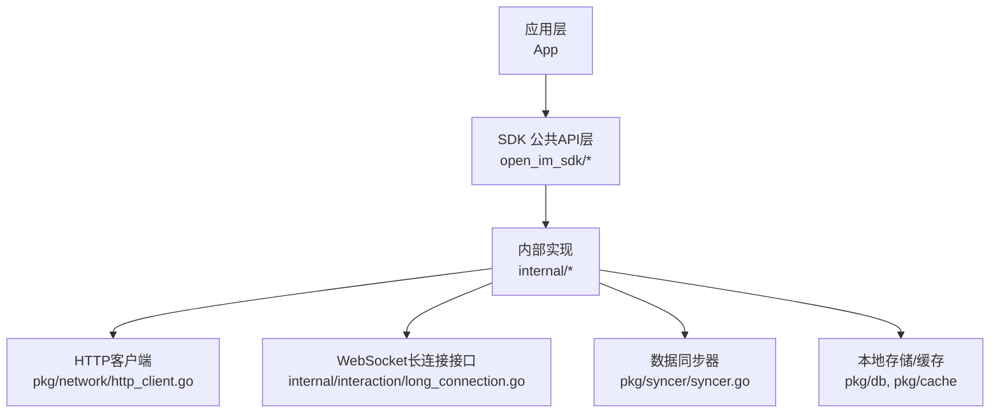
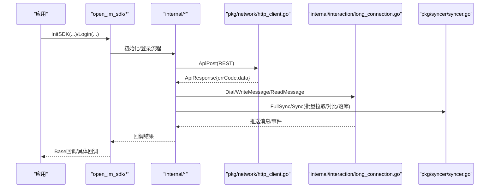
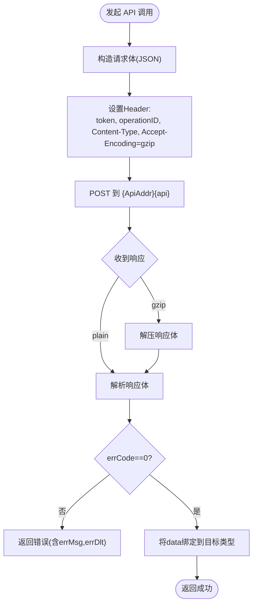
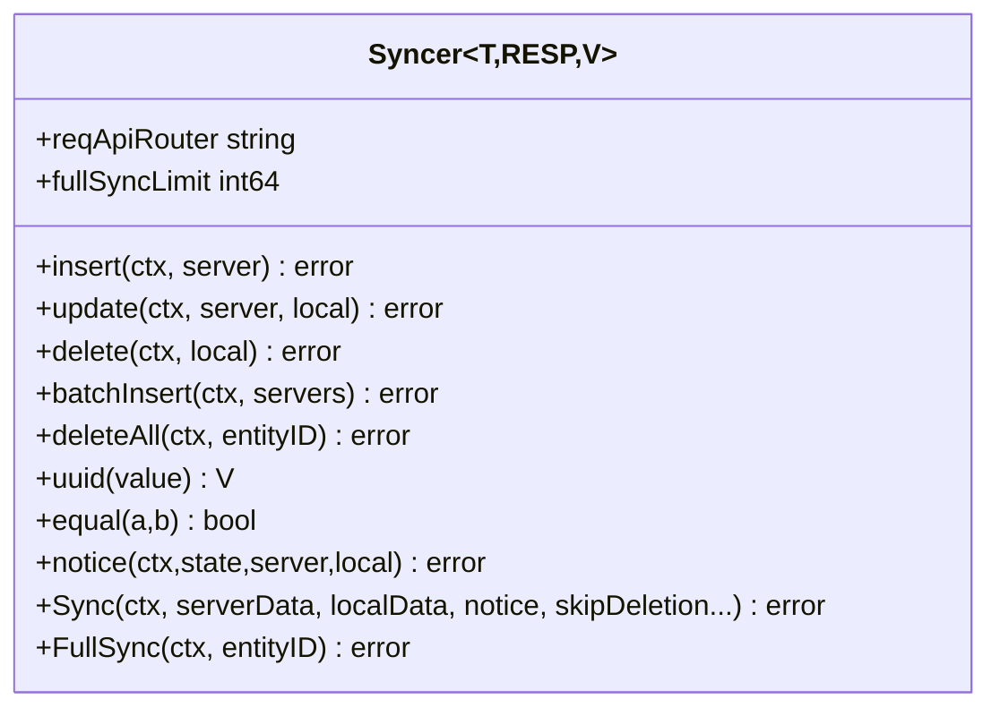
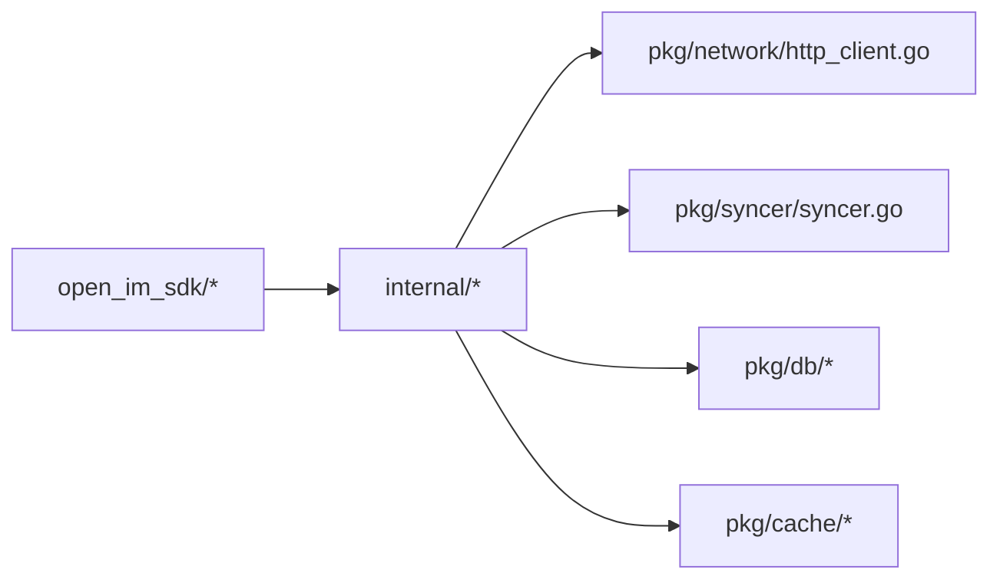

# API 参考文档

<cite>
**本文引用的文件**   
- [README.md](file://README.md)
- [go.mod](file://go.mod)
- [open_im_sdk/em.go](file://open_im_sdk/em.go)
- [open_im_sdk/init_login.go](file://open_im_sdk/init_login.go)
- [open_im_sdk/conversation_msg.go](file://open_im_sdk/conversation_msg.go)
- [open_im_sdk/group.go](file://open_im_sdk/group.go)
- [open_im_sdk/relation.go](file://open_im_sdk/relation.go)
- [open_im_sdk/user.go](file://open_im_sdk/user.go)
- [pkg/network/http_client.go](file://pkg/network/http_client.go)
- [internal/interaction/long_connection.go](file://internal/interaction/long_connection.go)
- [pkg/syncer/syncer.go](file://pkg/syncer/syncer.go)
</cite>

## 目录
1. [简介](#简介)
2. [项目结构](#项目结构)
3. [核心组件](#核心组件)
4. [架构总览](#架构总览)
5. [详细组件分析](#详细组件分析)
6. [依赖分析](#依赖分析)
7. [性能考虑](#性能考虑)
8. [故障排查指南](#故障排查指南)
9. [结论](#结论)
10. [附录](#附录)

## 简介
本文件为 OpenIM SDK Core 的 API 参考文档，面向开发者提供公共接口的规范、参数与返回值说明，涵盖：
- HTTP RESTful API 的调用方式、请求响应格式与认证头
- WebSocket 长连接接口、消息类型与事件回调
- 错误码定义、异常处理与调试技巧
- 版本管理与兼容性建议

OpenIM SDK Core 是跨平台 IM SDK 的核心层（Go），所有开源 SDK（除 mini web）均基于此构建，支持 iOS/Android/PC/Web(WASM)。模块路径为 github.com/openimsdk/openim-sdk-core/v3，Go 1.24+，依赖 openimsdk/protocol 与 openimsdk/tools。

章节来源
- [README.md:1-189](file://README.md#L1-L189)
- [go.mod:1-41](file://go.mod#L1-L41)

## 项目结构
- open_im_sdk/：对外暴露的公共 API 层（初始化登录、会话消息、群组、关系、用户等）
- internal/：内部业务实现（交互、同步、第三方能力等）
- pkg/：通用能力（网络、缓存、数据库、分页、错误码、版本管理等）
- wasm/：WebAssembly 平台适配层，通过 wasm_wrapper 将核心能力暴露给 JS 调用

图表来源
- [open_im_sdk/init_login.go:1-139](file://open_im_sdk/init_login.go#L1-L139)
- [pkg/network/http_client.go:1-306](file://pkg/network/http_client.go#L1-L306)
- [internal/interaction/long_connection.go:1-62](file://internal/interaction/long_connection.go#L1-L62)
- [pkg/syncer/syncer.go:1-380](file://pkg/syncer/syncer.go#L1-L380)

章节来源
- [README.md:1-189](file://README.md#L1-L189)

## 核心组件
本节概述对外暴露的主要 API 分组及职责：
- 初始化与登录：InitSDK、Login、Logout、GetLoginStatus、SetAppBackgroundStatus、NetworkStatusChanged
- 会话与消息：创建各类消息、发送消息、历史消息查询、撤回/删除、已读回执、输入状态、草稿、隐藏会话等
- 群组：创建/加入/退出/解散、成员管理、禁言、申请审批、搜索、全量/增量同步检查
- 好友关系：好友列表/分页/搜索、添加/删除、申请审批、黑名单
- 用户信息：获取他人信息、设置/获取自身信息、客户端配置
- 回调监听：空实现监听器用于默认行为，上层可替换为自定义监听

章节来源
- [open_im_sdk/init_login.go:1-139](file://open_im_sdk/init_login.go#L1-L139)
- [open_im_sdk/conversation_msg.go:1-251](file://open_im_sdk/conversation_msg.go#L1-L251)
- [open_im_sdk/group.go:1-134](file://open_im_sdk/group.go#L1-L134)
- [open_im_sdk/relation.go:1-82](file://open_im_sdk/relation.go#L1-L82)
- [open_im_sdk/user.go:1-38](file://open_im_sdk/user.go#L1-L38)
- [open_im_sdk/em.go:1-245](file://open_im_sdk/em.go#L1-L245)

## 架构总览
SDK 采用“公共 API 层 + 内部实现 + 网络/同步基础设施”的分层设计：
- 公共 API 层负责参数校验、上下文传递与回调封装
- 内部实现负责业务编排、数据转换与持久化
- 网络层统一封装 HTTP 与 WebSocket 通信
- 同步器提供通用的全量/增量同步框架

图表来源
- [open_im_sdk/init_login.go:1-139](file://open_im_sdk/init_login.go#L1-L139)
- [pkg/network/http_client.go:1-306](file://pkg/network/http_client.go#L1-L306)
- [internal/interaction/long_connection.go:1-62](file://internal/interaction/long_connection.go#L1-L62)
- [pkg/syncer/syncer.go:1-380](file://pkg/syncer/syncer.go#L1-L380)

## 详细组件分析

### 初始化与登录 API
- 初始化
  - 方法：InitSDK(listener, operationID, config)
  - 作用：初始化日志、校验配置、建立全局上下文并启动 SDK
  - 关键参数：listener（连接回调）、operationID（操作标识）、config（JSON 字符串，包含平台、日志、API/WS 地址等）
  - 返回：布尔值表示是否成功
- 登录/登出
  - 方法：Login(callback, operationID, userID, token)、Logout(callback, operationID)
  - 作用：完成鉴权、建立长连接、触发首次同步
- 其他
  - GetSdkVersion()：获取 SDK 版本
  - SetAppBackgroundStatus(isBackground)：切换前台/后台状态
  - NetworkStatusChanged()：网络变化时主动关闭长连接以触发重连
  - GetLoginStatus()：获取当前登录态

章节来源
- [open_im_sdk/init_login.go:1-139](file://open_im_sdk/init_login.go#L1-L139)

### 会话与消息 API
- 会话管理
  - GetAllConversationList / GetConversationListSplit / GetOneConversation / GetMultipleConversation
  - SetConversation / HideConversation / SetConversationDraft
  - GetTotalUnreadMsgCount / SearchConversation
- 消息创建
  - 文本/At/引用/卡片/表情/合并转发/位置/自定义等
  - 媒体类：图片/视频/音频/文件（支持从路径或 URL 创建）
- 消息收发
  - SendMessage / SendMessageNotOss（是否走 OSS）
  - FindMessageList / GetAdvancedHistoryMessageList / Reverse
  - RevokeMessage / DeleteMessage / DeleteAll...
  - MarkConversationMessageAsRead / MarkAll... / MarkMessagesAsReadByMsgID
  - TypingStatusUpdate / ChangeInputStates / GetInputStates
  - InsertSingleMessageToLocalStorage / InsertGroupMessageToLocalStorage
  - SearchLocalMessages / SetMessageLocalEx

章节来源
- [open_im_sdk/conversation_msg.go:1-251](file://open_im_sdk/conversation_msg.go#L1-L251)

### 群组 API
- 基础操作：CreateGroup / JoinGroup / QuitGroup / DismissGroup
- 权限与成员：ChangeGroupMute / ChangeGroupMemberMute / TransferGroupOwner / KickGroupMember
- 信息管理：SetGroupInfo / SetGroupMemberInfo
- 查询：GetJoinedGroupList / Page / GetSpecifiedGroupsInfo / SearchGroups
- 成员查询：GetGroupMemberOwnerAndAdmin / GetGroupMemberList / ByJoinTimeFilter / GetSpecifiedGroupMembersInfo / SearchGroupMembers / IsJoinGroup / GetUsersInGroup
- 申请审批：GetGroupApplicationListAsRecipient/Applicant / AcceptGroupApplication / RefuseGroupApplication / GetGroupApplicationUnhandledCount
- 同步检查：CheckLocalGroupFullSync / CheckGroupMemberFullSync

章节来源
- [open_im_sdk/group.go:1-134](file://open_im_sdk/group.go#L1-L134)

### 好友关系 API
- 查询：GetSpecifiedFriendsInfo / GetFriendList / Page / SearchFriends / CheckFriend
- 变更：AddFriend / UpdateFriends / DeleteFriend
- 申请审批：GetFriendApplicationListAsRecipient/Applicant / AcceptFriendApplication / RefuseFriendApplication / GetFriendApplicationUnhandledCount
- 黑名单：AddBlack / GetBlackList / RemoveBlack

章节来源
- [open_im_sdk/relation.go:1-82](file://open_im_sdk/relation.go#L1-L82)

### 用户信息 API
- GetUsersInfo(userIDs)
- SetSelfInfo(userInfo)
- GetSelfUserInfo()
- GetUserClientConfig()

章节来源
- [open_im_sdk/user.go:1-38](file://open_im_sdk/user.go#L1-L38)

### 回调监听器（空实现）
- 群组、好友、会话、高级消息、用户、自定义业务等监听器的空实现，便于上层按需覆盖
- 未实现的回调会记录警告日志，避免崩溃

章节来源
- [open_im_sdk/em.go:1-245](file://open_im_sdk/em.go#L1-L245)

### HTTP RESTful API 规范
- 请求方式
  - 统一使用 POST 提交 JSON 请求体
- 认证与追踪
  - Header：token（鉴权）、operationID（链路追踪）
  - 请求体：业务请求对象（由上层构造）
- 响应格式
  - 标准包装：ApiResponse{errCode, errMsg, errDlt, data}
  - errCode=0 表示成功；非零则视为服务端错误
  - data 为 json.RawMessage，按目标类型反序列化
- 压缩
  - 支持 gzip 响应体自动解压
- 分页
  - 提供通用分页工具，自动翻页直至拉完或达到上限
- 典型调用链
  - 上层业务 -> network.CallApi/ApiPost -> 解析响应 -> 业务处理

图表来源
- [pkg/network/http_client.go:1-306](file://pkg/network/http_client.go#L1-L306)

章节来源
- [pkg/network/http_client.go:1-306](file://pkg/network/http_client.go#L1-L306)

### WebSocket 长连接 API
- 连接生命周期
  - Dial(urlStr, requestHeader)：建立连接，urlStr 需包含鉴权参数，requestHeader 可控制压缩等
  - WriteMessage(messageType, message)：发送二进制或文本消息
  - ReadMessage()：阻塞读取消息
  - SetReadDeadline/SetWriteDeadline：读写超时控制
  - SetPingHandler/SetPongHandler：心跳处理
  - Close()：关闭连接
- 使用模式
  - 登录后建立连接，持续轮询 ReadMessage 处理服务端推送
  - 结合心跳机制维持连接存活
  - 网络变化时主动 Close 以触发重连

章节来源
- [internal/interaction/long_connection.go:1-62](file://internal/interaction/long_connection.go#L1-L62)

### 数据同步器（全量/增量）
- 能力
  - 全量同步：清空本地后分批拉取并插入
  - 增量同步：对比服务器与本地数据，执行 insert/update/delete
  - 通知回调：在增删改阶段触发 notice
- 扩展点
  - 自定义插入/更新/删除、唯一键生成、相等性比较、分页请求构造、响应转实体、批量写入、限制条数等
- 适用场景
  - 群组、好友、会话等数据的本地一致性维护

图表来源
- [pkg/syncer/syncer.go:1-380](file://pkg/syncer/syncer.go#L1-L380)

章节来源
- [pkg/syncer/syncer.go:1-380](file://pkg/syncer/syncer.go#L1-L380)

## 依赖分析
- 外部依赖
  - gorilla/websocket、coder/websocket：WebSocket 实现
  - gorm.io/gorm + sqlite：本地消息与元数据存储
  - openimsdk/protocol、openimsdk/tools：协议与工具库
- 内部耦合
  - open_im_sdk/* 仅依赖 open_im_sdk_callback 与内部实现
  - internal/* 依赖 pkg/network、pkg/syncer、pkg/db 等通用能力
  - 无循环依赖迹象，分层清晰

图表来源
- [open_im_sdk/init_login.go:1-139](file://open_im_sdk/init_login.go#L1-L139)
- [pkg/network/http_client.go:1-306](file://pkg/network/http_client.go#L1-L306)
- [pkg/syncer/syncer.go:1-380](file://pkg/syncer/syncer.go#L1-L380)

章节来源
- [go.mod:1-41](file://go.mod#L1-L41)

## 性能考虑
- HTTP 客户端
  - 统一超时与 gzip 解压，减少带宽与 CPU 开销
  - 分页拉取避免一次性加载大量数据
- WebSocket
  - 合理设置读写超时与心跳间隔，降低断线重连风暴
  - 控制单条消息最大长度，防止内存抖动
- 同步器
  - 优先使用批量插入接口，减少 IO 次数
  - 自定义 equal 函数可减少不必要的更新
- 本地存储
  - 合理使用索引与分页查询，避免全表扫描

[本节为通用指导，不直接分析具体文件]

## 故障排查指南
- 常见错误来源
  - 网络错误：连接失败、超时、证书问题
  - 鉴权失败：token 无效或过期
  - 参数错误：缺少必填字段、类型不匹配
  - 服务端错误：errCode 非零，附带 errMsg 与 errDlt
- 定位手段
  - 开启日志输出，关注 operationID 关联的日志
  - 打印请求 URL、请求体与响应体（调试阶段）
  - 检查 WebSocket 心跳与重连日志
- 恢复策略
  - 网络异常时重试（指数退避）
  - 鉴权失败时重新登录
  - 数据不一致时触发全量同步

章节来源
- [pkg/network/http_client.go:1-306](file://pkg/network/http_client.go#L1-L306)
- [open_im_sdk/em.go:1-245](file://open_im_sdk/em.go#L1-L245)

## 结论
OpenIM SDK Core 提供了稳定、可扩展的跨平台 IM 能力。通过统一的 HTTP 与 WebSocket 抽象、强大的同步器与清晰的 API 分层，开发者可以快速集成并构建高质量的即时通讯应用。建议在接入时遵循本文档的 API 规范与最佳实践，并结合日志与监控进行持续优化。

[本节为总结，不直接分析具体文件]

## 附录

### 错误码与异常处理
- 标准响应结构
  - errCode：业务错误码，0 表示成功
  - errMsg：人类可读的错误描述
  - errDlt：错误详情（可用于诊断）
  - data：业务数据（json.RawMessage）
- 错误分类
  - 网络错误：连接/超时/协议错误
  - 参数错误：缺少或非法参数
  - 服务端错误：业务逻辑错误
- 处理建议
  - 对 errCode!=0 的情况，展示 errMsg 并记录 errDlt
  - 网络错误应重试；鉴权错误应引导重新登录

章节来源
- [pkg/network/http_client.go:1-306](file://pkg/network/http_client.go#L1-L306)

### 版本管理与兼容性
- 版本获取
  - 通过 GetSdkVersion() 获取当前 SDK 版本
- 向后兼容
  - 新增字段建议使用可选字段与默认值
  - 废弃字段保留一段时间并提供迁移提示
- 迁移建议
  - 升级前检查服务端协议版本
  - 逐步灰度发布，观察错误率与性能指标

章节来源
- [open_im_sdk/init_login.go:1-139](file://open_im_sdk/init_login.go#L1-L139)

### 快速开始与示例路径
- 初始化与登录
  - 参考：open_im_sdk/init_login.go
- 会话与消息
  - 参考：open_im_sdk/conversation_msg.go
- 群组
  - 参考：open_im_sdk/group.go
- 好友关系
  - 参考：open_im_sdk/relation.go
- 用户信息
  - 参考：open_im_sdk/user.go
- HTTP 调用
  - 参考：pkg/network/http_client.go
- WebSocket 长连接
  - 参考：internal/interaction/long_connection.go
- 数据同步
  - 参考：pkg/syncer/syncer.go

章节来源
- [open_im_sdk/init_login.go:1-139](file://open_im_sdk/init_login.go#L1-L139)
- [open_im_sdk/conversation_msg.go:1-251](file://open_im_sdk/conversation_msg.go#L1-L251)
- [open_im_sdk/group.go:1-134](file://open_im_sdk/group.go#L1-L134)
- [open_im_sdk/relation.go:1-82](file://open_im_sdk/relation.go#L1-L82)
- [open_im_sdk/user.go:1-38](file://open_im_sdk/user.go#L1-L38)
- [pkg/network/http_client.go:1-306](file://pkg/network/http_client.go#L1-L306)
- [internal/interaction/long_connection.go:1-62](file://internal/interaction/long_connection.go#L1-L62)
- [pkg/syncer/syncer.go:1-380](file://pkg/syncer/syncer.go#L1-L380)