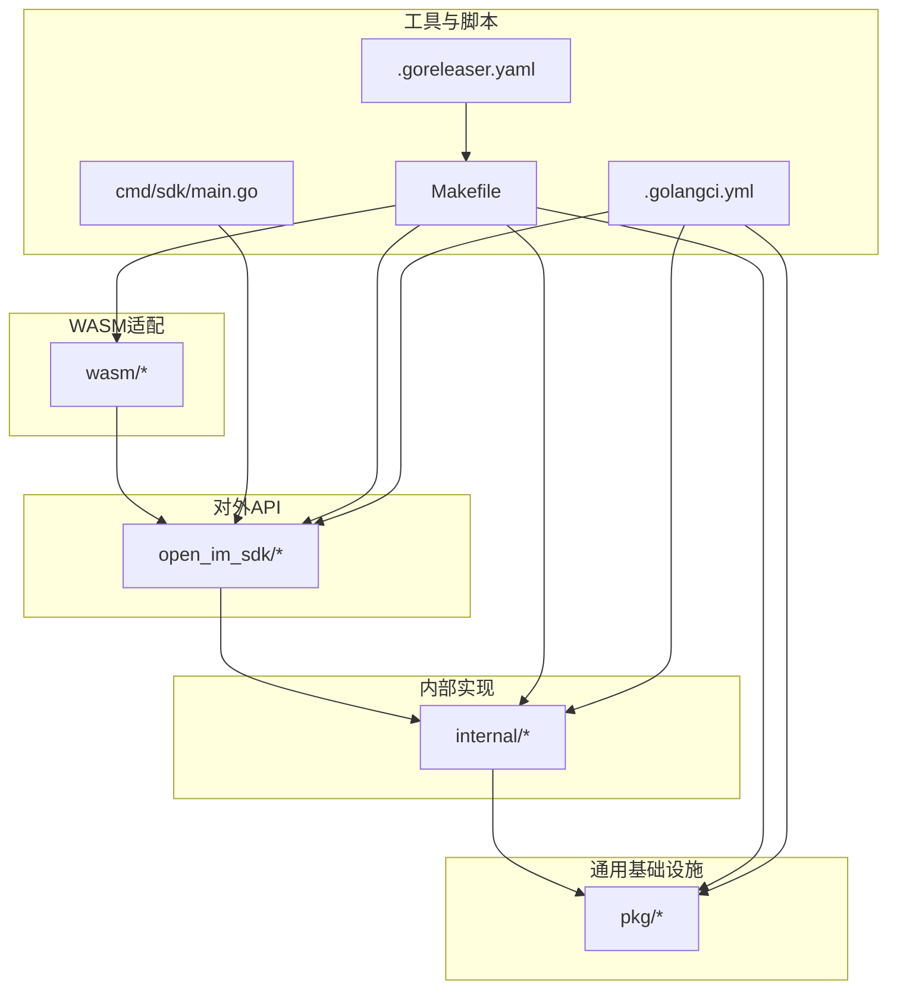
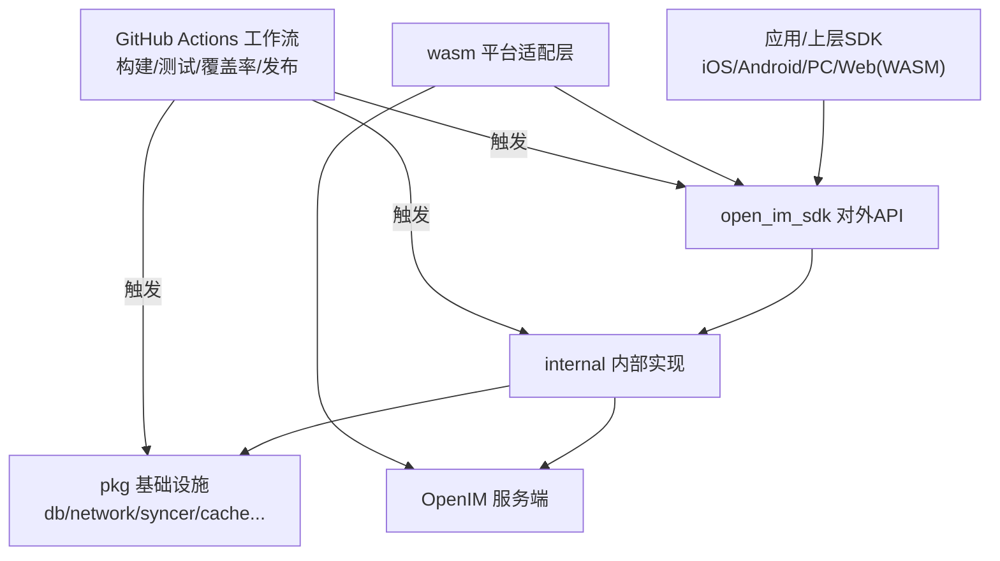
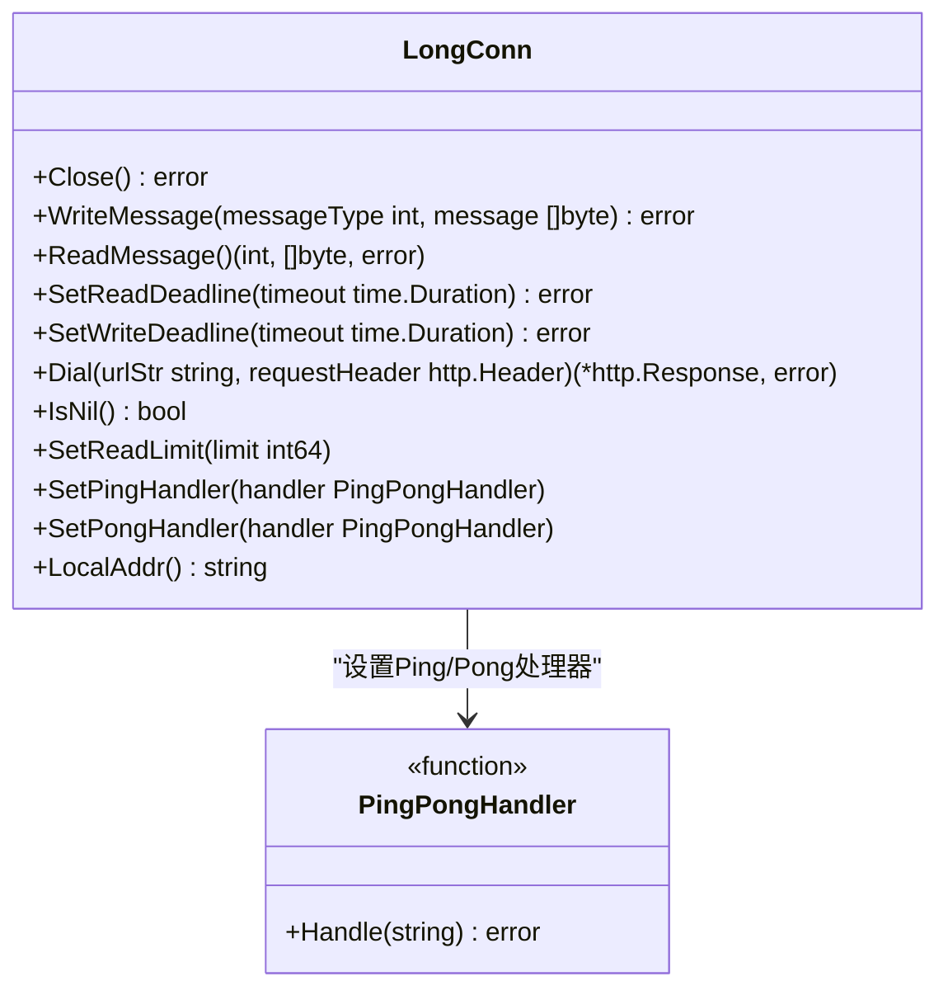
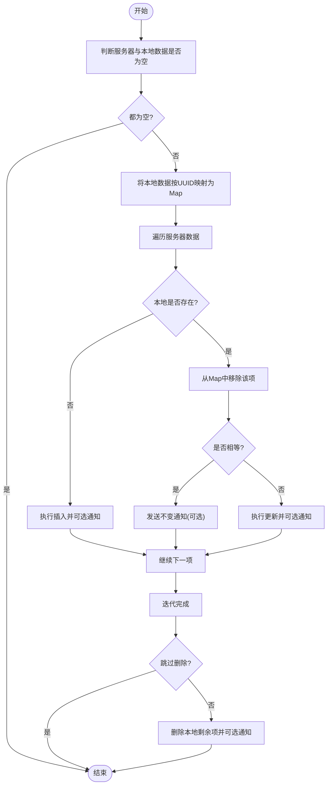
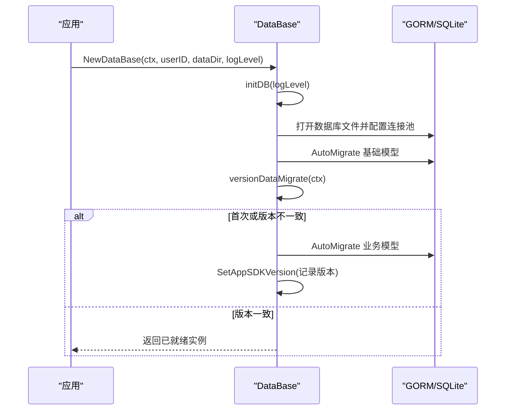
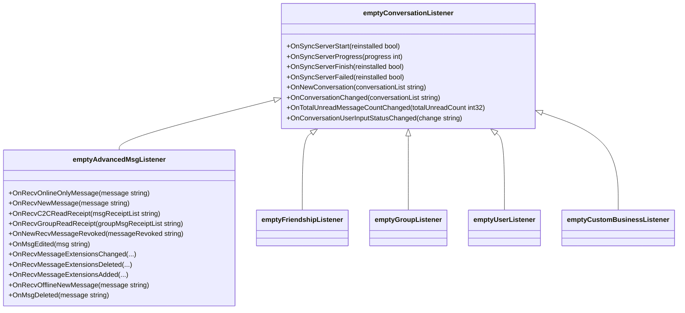
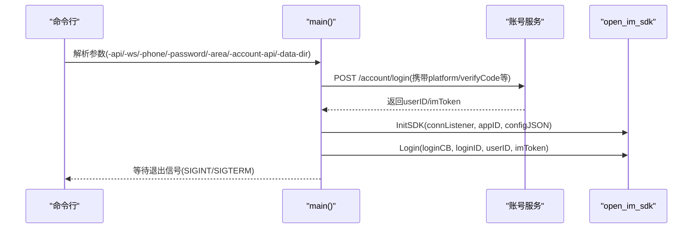
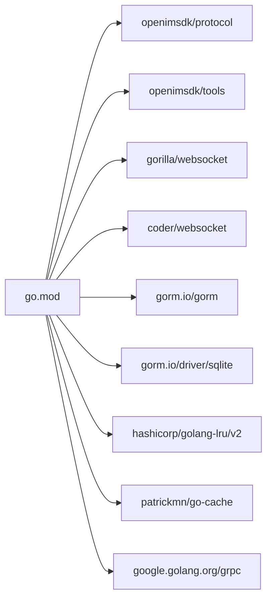

# 开发指南

<cite>
**本文引用的文件**   
- [README.md](file://README.md)
- [CONTRIBUTING.md](file://CONTRIBUTING.md)
- [go.mod](file://go.mod)
- [Makefile](file://Makefile)
- [.golangci.yml](file://.golangci.yml)
- [.goreleaser.yaml](file://.goreleaser.yaml)
- [cmd/sdk/main.go](file://cmd/sdk/main.go)
- [open_im_sdk/em.go](file://open_im_sdk/em.go)
- [pkg/db/db_init.go](file://pkg/db/db_init.go)
- [internal/interaction/long_connection.go](file://internal/interaction/long_connection.go)
- [pkg/syncer/syncer.go](file://pkg/syncer/syncer.go)
- [.github/workflows/go-build-test.yml](file://.github/workflows/go-build-test.yml)
- [.github/workflows/check-coverage.yml](file://.github/workflows/check-coverage.yml)
- [.github/workflows/sdk-releaser.yml](file://.github/workflows/sdk-releaser.yml)
</cite>

## 目录
1. [简介](#简介)
2. [项目结构](#项目结构)
3. [核心组件](#核心组件)
4. [架构总览](#架构总览)
5. [详细组件分析](#详细组件分析)
6. [依赖分析](#依赖分析)
7. [性能考虑](#性能考虑)
8. [故障排查指南](#故障排查指南)
9. [结论](#结论)
10. [附录](#附录)

## 简介
本指南面向 OpenIM SDK Core（Go 语言）的贡献者与开发者，覆盖从环境搭建、代码规范、构建与发布、持续集成、测试策略、调试与性能分析到版本管理与社区协作的完整流程。SDK 作为跨平台 IM 核心层，支撑 iOS/Android/PC/Web(WASM) 等多端 SDK 的统一实现。

## 项目结构
仓库采用“对外 API + 内部实现 + 平台适配”的分层组织方式：
- open_im_sdk：对外暴露的公共 API 层（初始化、登录、会话消息、群组、关系、用户、第三方能力等）
- internal：内部业务实现（会话消息、群组、关系、用户、交互网络、长连接、增量同步等）
- pkg：通用基础设施（缓存、上下文、常量、内容类型、转换器、数据库、网络、分页、错误码、工具、版本管理等）
- wasm：WebAssembly 平台适配层，通过 wasm_wrapper 将核心能力暴露给 JS 调用
- cmd/sdk：本地联调入口程序，模拟应用使用 SDK 进行登录与基础操作
- .github/workflows：GitHub Actions 工作流（构建、测试、覆盖率、发布等）
- Makefile：统一的构建、测试、打包、工具安装命令集
- .golangci.yml：代码质量检查配置
- .goreleaser.yaml：二进制与归档产物发布配置

**图表来源** 
- [Makefile:153-177](file://Makefile#L153-L177)
- [.golangci.yml:715-800](file://.golangci.yml#L715-L800)
- [.goreleaser.yaml:36-45](file://.goreleaser.yaml#L36-L45)

**章节来源**
- [README.md:30-54](file://README.md#L30-L54)
- [README.md:95-119](file://README.md#L95-L119)

## 核心组件
- 对外 API 层（open_im_sdk）：提供初始化、登录、会话消息、群组、关系、用户、第三方能力等接口；包含空监听器默认实现，便于未设置回调时安全运行。
- 内部实现（internal）：
  - interaction：长连接抽象与 WebSocket 实现、心跳、重连、订阅、消息批处理等
  - conversation_msg/group/relation/user：各业务域的数据同步、通知处理、服务端 API 封装
  - third：第三方能力（文件、压缩、进度、日志等）
- 通用基础设施（pkg）：
  - db：基于 GORM + SQLite 的本地消息存储与迁移
  - network：HTTP 客户端与网络请求封装
  - syncer：泛型数据同步器，支持全量/增量同步、批量拉取、差异对比与通知
  - cache/ccontext/content_type/converter/page/sdkerrs/utils/version：辅助模块

**章节来源**
- [open_im_sdk/em.go:25-245](file://open_im_sdk/em.go#L25-L245)
- [internal/interaction/long_connection.go:22-61](file://internal/interaction/long_connection.go#L22-L61)
- [pkg/db/db_init.go:71-168](file://pkg/db/db_init.go#L71-L168)
- [pkg/syncer/syncer.go:71-213](file://pkg/syncer/syncer.go#L71-L213)

## 架构总览
OpenIM SDK Core 的整体架构围绕“对外 API -> 内部业务 -> 基础设施 -> 平台适配”展开，并通过 GitHub Actions 完成 CI/CD 流水线。

**图表来源** 
- [Makefile:153-177](file://Makefile#L153-L177)
- [.github/workflows/go-build-test.yml](file://.github/workflows/go-build-test.yml)
- [.github/workflows/check-coverage.yml](file://.github/workflows/check-coverage.yml)
- [.github/workflows/sdk-releaser.yml](file://.github/workflows/sdk-releaser.yml)

## 详细组件分析

### 组件A：长连接抽象与实现（internal/interaction）
该组件定义了长连接的统一接口，屏蔽底层 WebSocket 实现差异，并提供读写超时、Ping/Pong 处理器、读限制等能力。

**图表来源** 
- [internal/interaction/long_connection.go:22-61](file://internal/interaction/long_connection.go#L22-L61)

**章节来源**
- [internal/interaction/long_connection.go:22-61](file://internal/interaction/long_connection.go#L22-L61)

### 组件B：数据同步器（pkg/syncer）
Syncer 提供泛型化的数据同步能力，支持插入、更新、删除、批量拉取、全量同步与通知回调。其核心流程如下：

**图表来源** 
- [pkg/syncer/syncer.go:240-345](file://pkg/syncer/syncer.go#L240-L345)

**章节来源**
- [pkg/syncer/syncer.go:71-213](file://pkg/syncer/syncer.go#L71-L213)
- [pkg/syncer/syncer.go:240-345](file://pkg/syncer/syncer.go#L240-L345)
- [pkg/syncer/syncer.go:347-379](file://pkg/syncer/syncer.go#L347-L379)

### 组件C：本地数据库与迁移（pkg/db）
非 WASM 平台使用 GORM + SQLite 进行本地持久化，包含表结构自动迁移与版本管理。

**图表来源** 
- [pkg/db/db_init.go:98-168](file://pkg/db/db_init.go#L98-L168)
- [pkg/db/db_init.go:170-213](file://pkg/db/db_init.go#L170-L213)

**章节来源**
- [pkg/db/db_init.go:71-168](file://pkg/db/db_init.go#L71-L168)
- [pkg/db/db_init.go:170-213](file://pkg/db/db_init.go#L170-L213)

### 组件D：对外 API 与默认监听器（open_im_sdk）
对外 API 层提供空监听器默认实现，避免未设置回调时的空指针风险，并在关键事件处输出日志以便定位问题。

**图表来源** 
- [open_im_sdk/em.go:123-245](file://open_im_sdk/em.go#L123-L245)

**章节来源**
- [open_im_sdk/em.go:25-245](file://open_im_sdk/em.go#L25-L245)

### 组件E：本地联调入口（cmd/sdk）
提供命令行参数用于快速启动 SDK 并进行登录与基础操作验证，便于本地联调与回归测试。

**图表来源** 
- [cmd/sdk/main.go:114-171](file://cmd/sdk/main.go#L114-L171)

**章节来源**
- [cmd/sdk/main.go:34-42](file://cmd/sdk/main.go#L34-L42)
- [cmd/sdk/main.go:114-171](file://cmd/sdk/main.go#L114-L171)

## 依赖分析
- Go 版本要求：go.mod 指定了最低 Go 版本，确保开发与构建一致性
- 主要依赖：
  - 协议与工具：openimsdk/protocol、openimsdk/tools
  - 网络：gorilla/websocket、coder/websocket
  - 数据库：gorm.io/gorm、gorm.io/driver/sqlite
  - 其他：hashicorp/golang-lru/v2、patrickmn/go-cache、google.golang.org/grpc（间接）

**图表来源** 
- [go.mod:1-41](file://go.mod#L1-L41)

**章节来源**
- [go.mod:1-41](file://go.mod#L1-L41)

## 性能考虑
- 数据库连接池：在初始化时设置了最大连接数、空闲连接与生命周期，避免资源泄露与过度占用
- 同步器优化：
  - 使用 Map 索引减少查找复杂度
  - 支持批量插入与分页拉取，降低网络与 I/O 开销
  - 可跳过删除与通知以提升特定场景下的吞吐
- 网络层：
  - 长连接抽象支持读写超时与读限制，防止异常报文导致内存暴涨
  - 心跳机制（Ping/Pong）保障连接健康度

[本节为通用指导，不直接分析具体文件]

## 故障排查指南
- 本地联调
  - 使用 cmd/sdk 快速验证登录与基础功能，结合环境变量 SDK_DEBUG 查看请求体与响应
  - 调整日志级别与输出路径，便于观察初始化与同步过程
- 数据库问题
  - 检查数据库文件路径与权限，确认 AutoMigrate 是否成功执行
  - 关注版本迁移逻辑，确保版本升级后表结构正确更新
- 网络与连接
  - 检查 API 与 WebSocket 地址配置是否正确
  - 关注 OnConnectFailed、OnKickedOffline、OnUserTokenExpired 等回调，定位认证与踢下线问题
- 同步异常
  - 查看 Syncer 的日志输出，确认 insert/update/delete 是否按预期执行
  - 核对 UUID 生成与 equal 比较逻辑，避免误判导致重复或遗漏

**章节来源**
- [cmd/sdk/main.go:76-112](file://cmd/sdk/main.go#L76-L112)
- [open_im_sdk/em.go:175-208](file://open_im_sdk/em.go#L175-L208)
- [pkg/db/db_init.go:113-168](file://pkg/db/db_init.go#L113-L168)
- [pkg/syncer/syncer.go:240-345](file://pkg/syncer/syncer.go#L240-L345)

## 结论
OpenIM SDK Core 以清晰的层次结构与完善的工具链为基础，提供了跨平台一致的 IM 能力。通过规范的贡献流程、严格的代码质量检查、自动化测试与发布流水线，确保了项目的稳定性与可维护性。新贡献者可依据本指南快速上手，逐步深入核心实现与平台适配。

[本节为总结，不直接分析具体文件]

## 附录

### 代码贡献流程
- Fork 仓库并创建分支，遵循语义化提交信息（feat/fix/docs/style/refactor/test/chore）
- 提交前运行 lint 与格式化，确保通过代码检查
- 推送分支并发起 PR，保持 PR 描述清晰并与 Issue 关联
- 通过 DCO 签名检查，确保合规

**章节来源**
- [CONTRIBUTING.md:91-181](file://CONTRIBUTING.md#L91-L181)
- [CONTRIBUTING.md:221-268](file://CONTRIBUTING.md#L221-L268)
- [CONTRIBUTING.md:289-307](file://CONTRIBUTING.md#L289-L307)

### 开发环境搭建
- 安装 Go（满足 go.mod 指定版本）
- 使用 Makefile 提供的命令进行构建、测试与工具安装
- 推荐 Linux 环境以获得最佳体验

**章节来源**
- [CONTRIBUTING.md:19-29](file://CONTRIBUTING.md#L19-L29)
- [Makefile:153-177](file://Makefile#L153-L177)
- [Makefile:240-254](file://Makefile#L240-L254)

### 构建与发布流程
- 本地构建：make build（当前平台）、make build-multiple（多平台）
- WebAssembly：make build-wasm
- 打包与归档：.goreleaser.yaml 定义构建与归档规则
- 版本发布：Release Please + GoReleaser 自动化生成 Release 与变更日志

**章节来源**
- [Makefile:153-177](file://Makefile#L153-L177)
- [Makefile:170-173](file://Makefile#L170-L173)
- [.goreleaser.yaml:36-45](file://.goreleaser.yaml#L36-L45)
- [CONTRIBUTING.md:380-405](file://CONTRIBUTING.md#L380-L405)

### 代码规范与质量保证
- 使用 golangci-lint 进行静态检查，配置文件位于 .golangci.yml
- 启用 typecheck、errcheck、staticcheck、govet、stylecheck 等检查器
- 建议本地运行 make style 与 make lint 保证提交质量

**章节来源**
- [.golangci.yml:715-800](file://.golangci.yml#L715-L800)
- [Makefile:240-244](file://Makefile#L240-L244)

### 持续集成与自动化测试
- GitHub Actions 工作流：
  - go-build-test.yml：构建与单元测试
  - check-coverage.yml：覆盖率检查
  - sdk-releaser.yml：发布相关任务
- 建议在 PR 中确保所有检查通过后再合并

**章节来源**
- [.github/workflows/go-build-test.yml](file://.github/workflows/go-build-test.yml)
- [.github/workflows/check-coverage.yml](file://.github/workflows/check-coverage.yml)
- [.github/workflows/sdk-releaser.yml](file://.github/workflows/sdk-releaser.yml)

### 调试技巧与性能分析
- 使用 cmd/sdk 进行端到端联调，结合环境变量与日志级别提升可观测性
- 使用 delve 进行断点调试（可通过 Makefile 安装）
- 使用 richgo 增强测试输出可读性（可通过 Makefile 安装）

**章节来源**
- [cmd/sdk/main.go:114-171](file://cmd/sdk/main.go#L114-L171)
- [Makefile:378-386](file://Makefile#L378-L386)
- [Makefile:440-443](file://Makefile#L440-L443)

### 版本管理与社区协作
- 版本管理：Release Please 自动生成变更日志与 Release，GoReleaser 负责构建与归档
- 社区协作：Slack、邮件、博客与微信渠道，欢迎参与讨论与贡献

**章节来源**
- [CONTRIBUTING.md:380-405](file://CONTRIBUTING.md#L380-L405)
- [CONTRIBUTING.md:407-421](file://CONTRIBUTING.md#L407-L421)