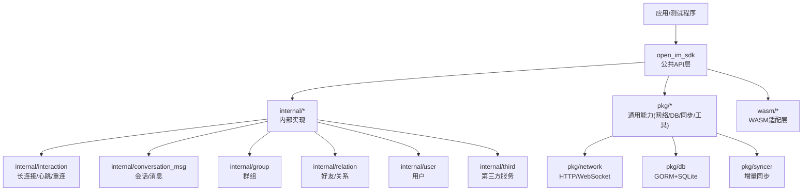
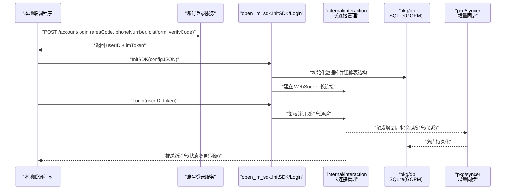
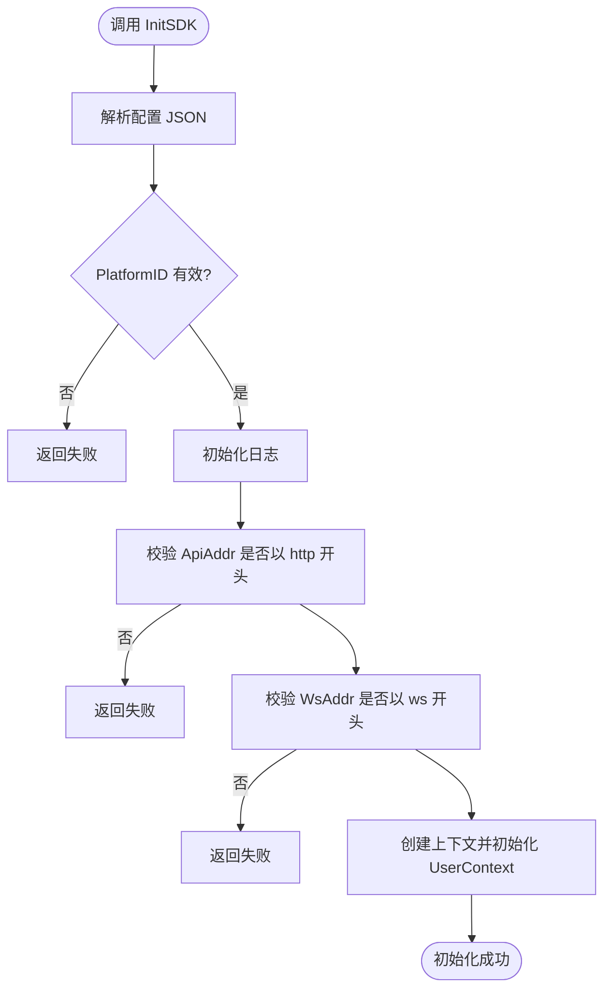
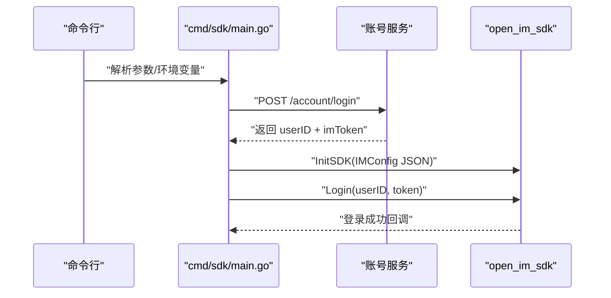
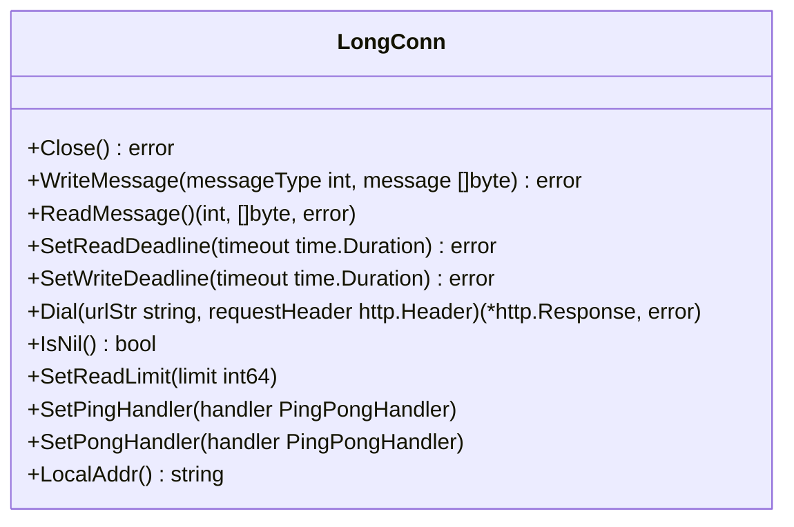
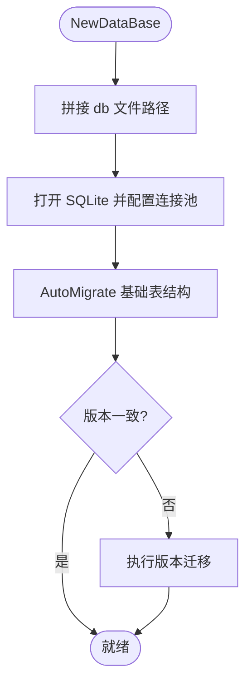
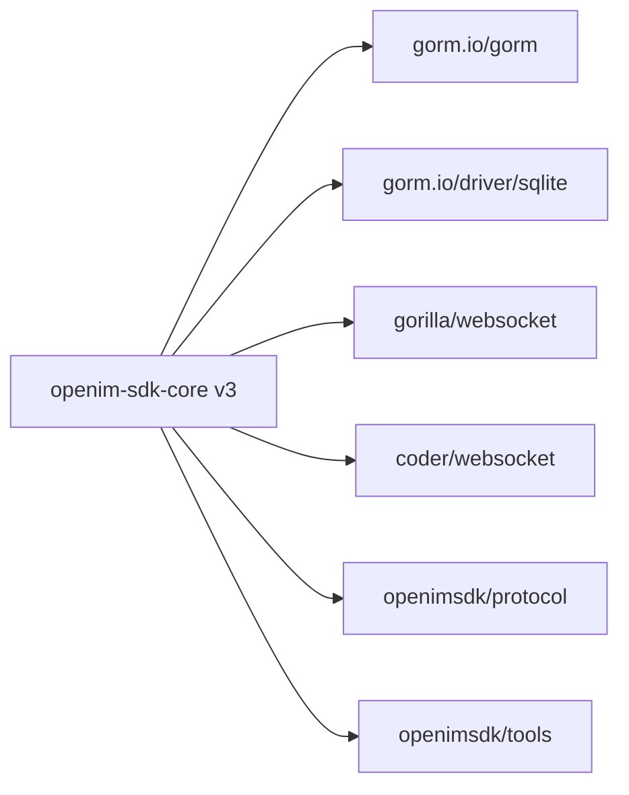

# 快速开始

<cite>
**本文引用的文件**   
- [README_zh-CN.md](file://README_zh-CN.md)
- [go.mod](file://go.mod)
- [cmd/sdk/main.go](file://cmd/sdk/main.go)
- [open_im_sdk/init_login.go](file://open_im_sdk/init_login.go)
- [open_im_sdk/em.go](file://open_im_sdk/em.go)
- [sdk_struct/sdk_struct.go](file://sdk_struct/sdk_struct.go)
- [pkg/cliconf/client_config.go](file://pkg/cliconf/client_config.go)
- [internal/interaction/long_connection.go](file://internal/interaction/long_connection.go)
- [pkg/db/db_init.go](file://pkg/db/db_init.go)
</cite>

## 目录
1. [简介](#简介)
2. [项目结构](#项目结构)
3. [核心组件](#核心组件)
4. [架构总览](#架构总览)
5. [详细组件分析](#详细组件分析)
6. [依赖分析](#依赖分析)
7. [性能考虑](#性能考虑)
8. [故障排查指南](#故障排查指南)
9. [结论](#结论)
10. [附录](#附录)

## 简介
本指南面向首次接触 OpenIM SDK Core 的开发者，帮助你在最短时间内完成环境准备、安装配置与基本使用，包括：
- 服务器搭建要求与本地联调方式
- SDK 初始化与登录认证流程
- 基础消息收发示例路径
- 配置文件参数与环境变量说明
- 多平台集成步骤与注意事项
- 常见问题与排障建议

OpenIM SDK Core 是跨平台 IM 核心层（Go），为 iOS/Android/PC/Web(WASM) 等上层 SDK 提供统一能力。模块路径为 github.com/openimsdk/openim-sdk-core/v3，Go 1.24+，依赖 openimsdk/protocol 和 openimsdk/tools。

**章节来源**
- [README_zh-CN.md:55-93](file://README_zh-CN.md#L55-L93)

## 项目结构
- open_im_sdk/：对外暴露的公共 API 层（init_login、conversation_msg、group、relation、user、third 等）
- internal/：内部业务实现（交互、会话、群组、关系、用户、第三方服务等）
- pkg/：通用能力（网络、数据库、缓存、同步器、工具等）
- wasm/：WebAssembly 平台适配层，通过 wasm_wrapper 将核心能力暴露给 JS 调用
- cmd/sdk：本地联调入口程序，便于快速验证 SDK 功能

**图表来源**
- [open_im_sdk/init_login.go:44-84](file://open_im_sdk/init_login.go#L44-L84)
- [internal/interaction/long_connection.go:24-61](file://internal/interaction/long_connection.go#L24-L61)
- [pkg/db/db_init.go:113-168](file://pkg/db/db_init.go#L113-L168)

**章节来源**
- [README_zh-CN.md:30-54](file://README_zh-CN.md#L30-L54)

## 核心组件
- 初始化与登录
  - InitSDK：解析配置、初始化日志、校验地址格式、启动上下文与监听器
  - Login：传入 userID 与 token 完成登录
  - GetLoginUserID/GetLoginStatus：获取当前登录状态
- 回调与监听
  - OnConnListener：连接生命周期回调（连接中、成功、失败、被踢、token过期/无效）
  - 空监听器：当未设置具体监听器时，SDK 提供默认空实现避免崩溃
- 配置项
  - IMConfig：系统类型、平台ID、API/WSS 地址、数据目录、日志级别与输出、日志轮转保留数、后台停止 goroutine 开关
- 客户端配置拉取
  - ClientConfig：从服务端动态拉取用户级配置（如会话活跃数量等）

**章节来源**
- [open_im_sdk/init_login.go:44-139](file://open_im_sdk/init_login.go#L44-L139)
- [open_im_sdk/em.go:25-245](file://open_im_sdk/em.go#L25-L245)
- [sdk_struct/sdk_struct.go:310-323](file://sdk_struct/sdk_struct.go#L310-L323)
- [pkg/cliconf/client_config.go:23-118](file://pkg/cliconf/client_config.go#L23-L118)

## 架构总览
下图展示了“本地联调程序”到“SDK 核心”的关键调用链与数据流，涵盖账号登录、SDK 初始化、WebSocket 长连接建立与消息处理。

**图表来源**
- [cmd/sdk/main.go:65-130](file://cmd/sdk/main.go#L65-L130)
- [open_im_sdk/init_login.go:44-139](file://open_im_sdk/init_login.go#L44-L139)
- [internal/interaction/long_connection.go:24-61](file://internal/interaction/long_connection.go#L24-L61)
- [pkg/db/db_init.go:113-168](file://pkg/db/db_init.go#L113-L168)

## 详细组件分析

### 组件A：初始化与登录流程
- 关键函数
  - InitSDK：解析 JSON 配置、初始化日志、校验 ApiAddr/WsAddr 协议前缀、创建上下文并委托 UserContext 完成初始化
  - Login：封装调用 UserContext.Login，最终进入内部登录流程
- 错误处理
  - 配置解析失败、PlatformID 为空、ApiAddr 非 http、WsAddr 非 ws、listener 或 config 为空均会直接返回失败
- 回调机制
  - 连接事件由 OnConnListener 接收；若未设置，em.go 中的空监听器会记录警告日志

**图表来源**
- [open_im_sdk/init_login.go:44-84](file://open_im_sdk/init_login.go#L44-L84)

**章节来源**
- [open_im_sdk/init_login.go:44-139](file://open_im_sdk/init_login.go#L44-L139)
- [open_im_sdk/em.go:25-245](file://open_im_sdk/em.go#L25-L245)

### 组件B：本地联调入口（cmd/sdk）
- 功能要点
  - 命令行参数：api/ws/account-api/data-dir/phone/password/area
  - 环境变量：SDK_PASSWORD（覆盖密码）、SDK_DEBUG（打印请求体与响应）
  - 账号登录：POST {account-api}/account/login，携带 areaCode、phoneNumber、platform、verifyCode
  - 初始化 SDK：构造 IMConfig JSON，调用 InitSDK，随后调用 Login
- 运行方式
  - go run ./cmd/sdk [-api ...] [-ws ...] [-account-api ...] [-data-dir ...] [-phone ...] [-password ...] [-area ...]

**图表来源**
- [cmd/sdk/main.go:34-130](file://cmd/sdk/main.go#L34-L130)
- [open_im_sdk/init_login.go:98-122](file://open_im_sdk/init_login.go#L98-L122)

**章节来源**
- [cmd/sdk/main.go:34-130](file://cmd/sdk/main.go#L34-L130)

### 组件C：长连接与心跳
- 接口定义
  - LongConn：封装 Close、WriteMessage、ReadMessage、Dial、SetPingHandler/SetPongHandler 等
- 作用
  - 负责与服务器建立 WebSocket 长连接、读写消息、设置超时与心跳回调
- 集成点
  - SDK 在初始化后建立长连接，并在登录成功后订阅消息通道

**图表来源**
- [internal/interaction/long_connection.go:24-61](file://internal/interaction/long_connection.go#L24-L61)

**章节来源**
- [internal/interaction/long_connection.go:24-61](file://internal/interaction/long_connection.go#L24-L61)

### 组件D：本地存储（SQLite + GORM）
- 初始化
  - 根据 dataDir 与 BigVersion + loginUserID 生成 .db 文件路径
  - 按日志级别配置 SQL 日志，设置连接池参数
- 版本迁移
  - 首次启动自动迁移所有表结构，并写入 SDK 版本
  - 后续版本升级时执行对应迁移逻辑
- 适用平台
  - 非 WebAssembly 平台使用 SQLite 作为本地消息与关系数据存储

**图表来源**
- [pkg/db/db_init.go:113-168](file://pkg/db/db_init.go#L113-L168)
- [pkg/db/db_init.go:170-213](file://pkg/db/db_init.go#L170-L213)

**章节来源**
- [pkg/db/db_init.go:113-213](file://pkg/db/db_init.go#L113-L213)

### 组件E：客户端配置拉取
- 功能
  - 从服务端拉取用户级配置（例如会话活跃数量），支持异步获取与重试
  - 提供 ClearConfig 清理当前配置缓存
- 典型字段
  - ConversationActiveNum：会话活跃数量上限，默认 50

**章节来源**
- [pkg/cliconf/client_config.go:23-118](file://pkg/cliconf/client_config.go#L23-L118)

## 依赖分析
- Go 版本与模块
  - 模块路径：github.com/openimsdk/openim-sdk-core/v3
  - Go 版本：1.24.7
- 关键外部依赖
  - gorm.io/gorm + gorm.io/driver/sqlite：本地消息与关系数据持久化
  - github.com/gorilla/websocket / github.com/coder/websocket：WebSocket 通信
  - github.com/openimsdk/protocol：协议定义
  - github.com/openimsdk/tools：日志、错误、上下文等工具库

**图表来源**
- [go.mod:1-41](file://go.mod#L1-L41)

**章节来源**
- [go.mod:1-41](file://go.mod#L1-L41)

## 性能考虑
- 数据库连接池
  - 最大连接数、空闲连接数与最大空闲时间已做合理限制，避免资源泄露
- 日志级别
  - 调试阶段可开启较高日志级别，生产环境建议降低以减少 IO 开销
- 长连接
  - 心跳与重连策略由 interaction 层管理，注意合理设置读/写超时以避免阻塞

[本节为通用指导，不直接分析具体文件]

## 故障排查指南
- 初始化失败常见原因
  - PlatformID 未设置
  - ApiAddr 不以 http 开头
  - WsAddr 不以 ws 开头
  - listener 或 config 为空
- 账号登录失败
  - 检查 account-api 地址是否正确
  - 确认 areaCode、phoneNumber、platform、verifyCode 是否符合服务端要求
  - 启用 SDK_DEBUG 查看请求体与响应
- 本地数据库问题
  - 检查 dataDir 是否存在且可写
  - 观察 SQLite 文件路径与权限
- 长连接异常
  - 检查防火墙与代理设置
  - 关注 OnConnectFailed/OnUserTokenExpired/OnUserTokenInvalid 回调

**章节来源**
- [open_im_sdk/init_login.go:44-84](file://open_im_sdk/init_login.go#L44-L84)
- [cmd/sdk/main.go:65-130](file://cmd/sdk/main.go#L65-L130)
- [pkg/db/db_init.go:113-168](file://pkg/db/db_init.go#L113-L168)

## 结论
通过以上步骤，你可以在本地快速完成 OpenIM SDK Core 的环境准备、初始化与登录，并使用内置联调程序进行基础功能验证。结合各组件的职责与依赖关系，你可以进一步扩展消息收发、群组与好友管理等能力。

[本节为总结性内容，不直接分析具体文件]

## 附录

### 一、环境准备与服务器要求
- 语言与工具
  - Go 1.24+
  - 可选：MinGW64（Windows 下构建 WASM）
- 服务器
  - 部署 OpenIM Server，确保 API 与 WebSocket 地址可达
  - 账号登录服务需支持 POST /account/login

**章节来源**
- [README_zh-CN.md:55-93](file://README_zh-CN.md#L55-L93)
- [go.mod:1-10](file://go.mod#L1-L10)

### 二、安装与运行（本地联调）
- 克隆仓库并进入 cmd/sdk
- 运行命令（按需覆盖参数）：
  - go run ./cmd/sdk -api http://your-server-api -ws ws://your-server-ws -account-api http://your-account-api -data-dir ./sdk_data -phone 17764228283 -area +86 -password <你的密码>
- 环境变量
  - SDK_PASSWORD：覆盖密码
  - SDK_DEBUG：打印请求体与响应

**章节来源**
- [cmd/sdk/main.go:34-130](file://cmd/sdk/main.go#L34-L130)

### 三、SDK 初始化与登录（示例路径）
- 初始化
  - 构造 IMConfig JSON，调用 InitSDK
  - 参考路径：[open_im_sdk/init_login.go:44-84](file://open_im_sdk/init_login.go#L44-L84)
- 登录
  - 调用 Login(userID, token)
  - 参考路径：[open_im_sdk/init_login.go:98-122](file://open_im_sdk/init_login.go#L98-L122)

**章节来源**
- [open_im_sdk/init_login.go:44-139](file://open_im_sdk/init_login.go#L44-L139)

### 四、基础消息收发（示例路径）
- 发送文本消息
  - 参考路径：[internal/conversation_msg/create_message.go](file://internal/conversation_msg/create_message.go)
- 接收新消息回调
  - 参考路径：[open_im_sdk/em.go:171-177](file://open_im_sdk/em.go#L171-L177)

**章节来源**
- [internal/conversation_msg/create_message.go](file://internal/conversation_msg/create_message.go)
- [open_im_sdk/em.go:171-177](file://open_im_sdk/em.go#L171-L177)

### 五、配置文件参数与环境变量
- IMConfig 主要字段
  - systemType：系统类型标识
  - platformID：平台 ID（必须设置）
  - apiAddr：HTTP API 地址（必须以 http 开头）
  - wsAddr：WebSocket 地址（必须以 ws 开头）
  - dataDir：本地数据目录（包含 SQLite 数据库与缓存）
  - logLevel：日志级别（数值越大越详细）
  - isLogStandardOutput：是否输出到标准输出
  - logFilePath：日志文件路径
  - logRemainCount：日志轮转保留数量
  - stopGoroutineOnBackground：是否在后台停止 goroutine（iOS 防 watchdog）
- 环境变量
  - SDK_PASSWORD：覆盖密码
  - SDK_DEBUG：打印请求体与响应

**章节来源**
- [sdk_struct/sdk_struct.go:310-323](file://sdk_struct/sdk_struct.go#L310-L323)
- [cmd/sdk/main.go:34-130](file://cmd/sdk/main.go#L34-L130)

### 六、多平台集成步骤与注意事项
- Android/iOS
  - 参考文档：[README_zh-CN.md:99-101](file://README_zh-CN.md#L99-L101)
- WebAssembly
  - 构建命令：make wasm（Windows 使用 mingw32-make wasm）
  - 参考路径：[README_zh-CN.md:103-115](file://README_zh-CN.md#L103-L115)
- Windows/MacOS/Linux
  - 参考 C++ 封装仓库的构建说明
  - 参考路径：[README_zh-CN.md:117-119](file://README_zh-CN.md#L117-L119)

**章节来源**
- [README_zh-CN.md:99-119](file://README_zh-CN.md#L99-L119)

### 七、常见问题与解决方案
- 无法连接服务器
  - 检查 API 与 WebSocket 地址是否正确，确认防火墙与代理设置
- 登录失败
  - 核对账号服务地址与参数，启用 SDK_DEBUG 查看请求体与响应
- 本地数据库报错
  - 检查 dataDir 权限与磁盘空间，确认 SQLite 文件路径正确
- 消息未收到
  - 确认已设置消息监听器，检查 OnRecvNewMessage 回调是否被触发

**章节来源**
- [open_im_sdk/init_login.go:44-84](file://open_im_sdk/init_login.go#L44-L84)
- [cmd/sdk/main.go:65-130](file://cmd/sdk/main.go#L65-L130)
- [pkg/db/db_init.go:113-168](file://pkg/db/db_init.go#L113-L168)
- [open_im_sdk/em.go:171-177](file://open_im_sdk/em.go#L171-L177)