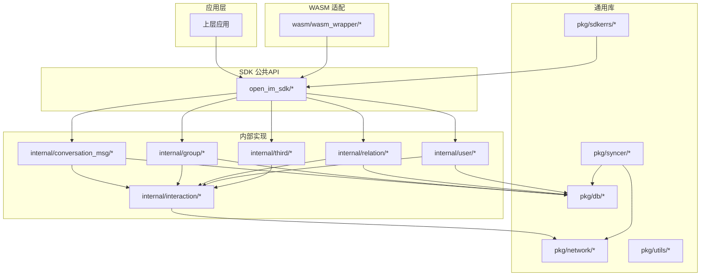
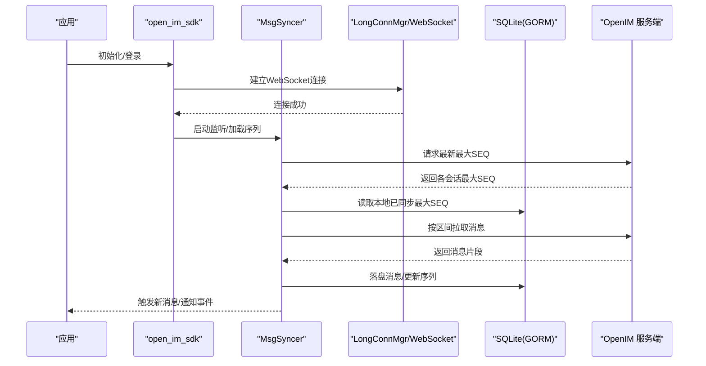
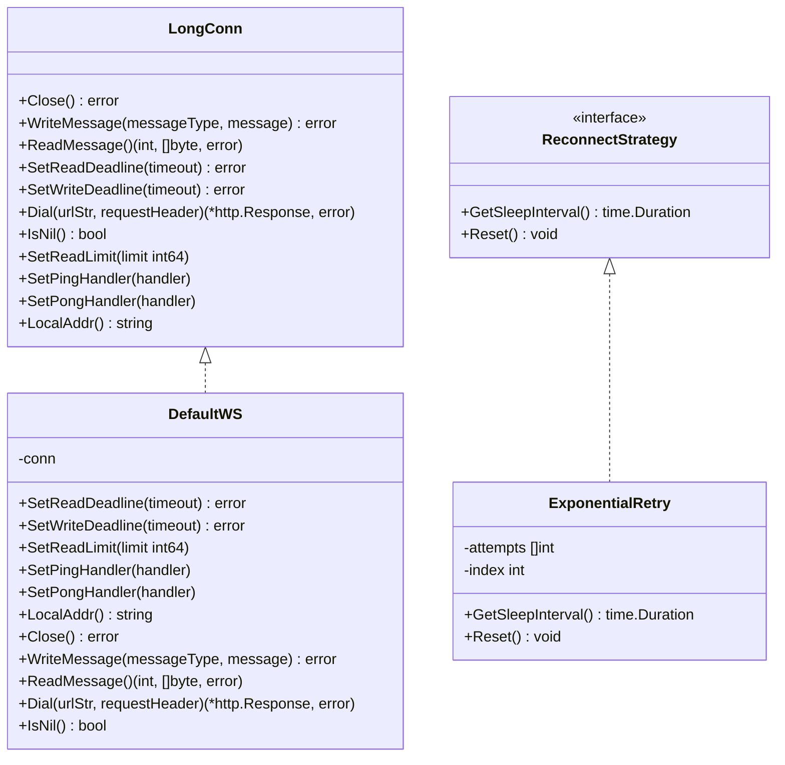
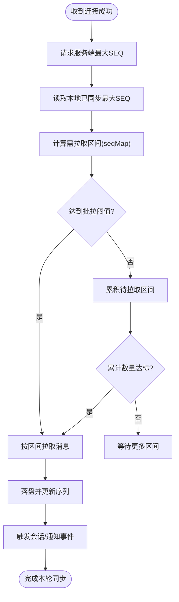
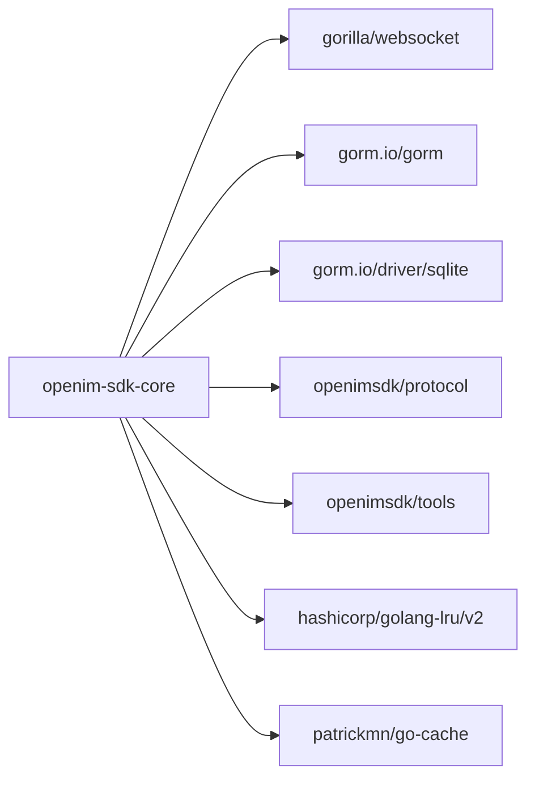

# 故障排除

<cite>
**本文引用的文件**   
- [README.md](file://README.md)
- [go.mod](file://go.mod)
- [pkg/sdkerrs/code.go](file://pkg/sdkerrs/code.go)
- [pkg/sdkerrs/error.go](file://pkg/sdkerrs/error.go)
- [internal/interaction/reconnect.go](file://internal/interaction/reconnect.go)
- [internal/interaction/long_connection.go](file://internal/interaction/long_connection.go)
- [internal/interaction/ws_default.go](file://internal/interaction/ws_default.go)
- [internal/interaction/msg_sync.go](file://internal/interaction/msg_sync.go)
- [pkg/db/db_init.go](file://pkg/db/db_init.go)
- [pkg/syncer/syncer.go](file://pkg/syncer/syncer.go)
</cite>

## 目录
1. [简介](#简介)
2. [项目结构](#项目结构)
3. [核心组件](#核心组件)
4. [架构总览](#架构总览)
5. [详细组件分析](#详细组件分析)
6. [依赖分析](#依赖分析)
7. [性能考虑](#性能考虑)
8. [故障排除指南](#故障排除指南)
9. [结论](#结论)
10. [附录](#附录)

## 简介
本指南面向 OpenIM SDK Core（Go 语言）的集成与运维人员，聚焦于常见问题定位与解决，覆盖网络连接、消息同步、数据库操作、错误码对照、日志分析方法、调试技巧、性能诊断与优化建议、内存泄漏检测与资源管理、兼容性与平台特定问题，以及社区支持与反馈流程。读者可据此快速定位并修复问题，提升稳定性与用户体验。

## 项目结构
OpenIM SDK Core 采用分层组织：
- open_im_sdk/：对外暴露的公共 API 层（初始化登录、会话消息、群组、关系、用户、第三方等）。
- internal/：内部业务实现，包括交互层（长连接、重连策略、消息同步）、领域模块（会话消息、群组、关系、用户）、第三方能力（文件、压缩、进度）。
- pkg/：通用能力库，包含网络、缓存、上下文、常量、内容类型、转换器、数据获取器、数据库（GORM + SQLite）、分页、错误码、服务器参数、同步器、工具、版本管理等。
- wasm/：WebAssembly 平台适配层，通过 wasm_wrapper 将核心能力暴露给 JS 调用。
- cmd/sdk/：示例入口程序。
- integration_test/：集成测试。

图表来源
- [README.md:1-189](file://README.md#L1-L189)
- [go.mod:1-41](file://go.mod#L1-L41)

章节来源
- [README.md:1-189](file://README.md#L1-L189)
- [go.mod:1-41](file://go.mod#L1-L41)

## 核心组件
- 错误码与错误包装：集中定义常见错误码并提供统一包装方法，便于上层捕获与展示。
- 长连接与重连策略：抽象 WebSocket 接口，提供默认实现与指数退避重连策略。
- 消息同步器：负责拉取增量消息、处理推送、触发会话事件、重建安装后的首次同步。
- 本地数据库：基于 GORM + SQLite 的本地持久化，含表检查、迁移与连接池配置。
- 通用同步器：泛型化的全量/增量同步框架，支持批量拉取与通知回调。

章节来源
- [pkg/sdkerrs/code.go:1-54](file://pkg/sdkerrs/code.go#L1-L54)
- [pkg/sdkerrs/error.go:1-27](file://pkg/sdkerrs/error.go#L1-L27)
- [internal/interaction/reconnect.go:1-33](file://internal/interaction/reconnect.go#L1-L33)
- [internal/interaction/long_connection.go:1-62](file://internal/interaction/long_connection.go#L1-L62)
- [internal/interaction/ws_default.go:1-87](file://internal/interaction/ws_default.go#L1-L87)
- [internal/interaction/msg_sync.go:1-762](file://internal/interaction/msg_sync.go#L1-L762)
- [pkg/db/db_init.go:1-214](file://pkg/db/db_init.go#L1-L214)
- [pkg/syncer/syncer.go:1-380](file://pkg/syncer/syncer.go#L1-L380)

## 架构总览
下图展示了从应用到核心层的调用路径，重点体现网络、消息同步与本地存储的交互。

图表来源
- [internal/interaction/msg_sync.go:429-471](file://internal/interaction/msg_sync.go#L429-L471)
- [internal/interaction/msg_sync.go:507-563](file://internal/interaction/msg_sync.go#L507-L563)
- [internal/interaction/ws_default.go:72-78](file://internal/interaction/ws_default.go#L72-L78)
- [pkg/db/db_init.go:113-168](file://pkg/db/db_init.go#L113-L168)

## 详细组件分析

### 错误码与错误包装
- 错误码分类：网络类、参数类、上下文超时、未知/Sdk内部错误、未初始化/未登录、消息相关、会话相关、群组相关等。
- 错误包装：提供 New/Wrap/WrapMsg 等方法，便于携带详情与链路信息。

排查要点
- 遇到 10000/10001：优先检查网络连通性、代理、证书与超时设置。
- 遇到 10008/10009：确认 SDK 是否完成初始化与登录。
- 遇到 102xx 系列：关注消息编解码、压缩、重复与删除状态。
- 使用 Wrap/WrapMsg 保留原始错误链，结合日志定位根因。

章节来源
- [pkg/sdkerrs/code.go:17-53](file://pkg/sdkerrs/code.go#L17-L53)
- [pkg/sdkerrs/error.go:19-26](file://pkg/sdkerrs/error.go#L19-L26)

### 长连接与重连策略
- LongConn 接口定义了读写、超时、Dial、限制、Ping/Pong 处理器等能力；ws_default.go 提供 gorilla/websocket 默认实现。
- ReconnectStrategy 抽象了重试间隔计算，ExponentialRetry 提供固定步长的指数退避。

排查要点
- 频繁断线：检查服务端心跳、客户端 SetReadDeadline/SetWriteDeadline 配置、网络抖动。
- 重连风暴：确认 ExponentialRetry 的间隔与上限，必要时自定义策略。
- 大消息导致读失败：调整 SetReadLimit，避免超过限制被拒绝。

图表来源
- [internal/interaction/long_connection.go:24-61](file://internal/interaction/long_connection.go#L24-L61)
- [internal/interaction/ws_default.go:26-86](file://internal/interaction/ws_default.go#L26-L86)
- [internal/interaction/reconnect.go:7-32](file://internal/interaction/reconnect.go#L7-L32)

章节来源
- [internal/interaction/long_connection.go:1-62](file://internal/interaction/long_connection.go#L1-L62)
- [internal/interaction/ws_default.go:1-87](file://internal/interaction/ws_default.go#L1-L87)
- [internal/interaction/reconnect.go:1-33](file://internal/interaction/reconnect.go#L1-L33)

### 消息同步器（MsgSyncer）
职责
- 监听连接成功、唤醒、手动同步、推送消息等事件。
- 对比本地与服务器最大 SEQ，计算需要拉取的区间。
- 分批拉取消息，写入本地数据库，触发会话与通知事件。
- 处理重装场景的特殊同步逻辑。

关键流程
- 连接成功后请求 GetNewestSeq，比较 syncedMaxSeqs，生成 seqMap，分批拉取。
- 推送消息时判断连续性，必要时触发增量拉取。
- 重装后先记录通知序列，再拉取普通消息，完成后标记 Installed。

图表来源
- [internal/interaction/msg_sync.go:429-471](file://internal/interaction/msg_sync.go#L429-L471)
- [internal/interaction/msg_sync.go:507-563](file://internal/interaction/msg_sync.go#L507-L563)
- [internal/interaction/msg_sync.go:280-345](file://internal/interaction/msg_sync.go#L280-L345)

章节来源
- [internal/interaction/msg_sync.go:1-762](file://internal/interaction/msg_sync.go#L1-L762)

### 本地数据库（SQLite + GORM）
职责
- 初始化数据库文件路径、连接池参数、慢查询日志级别。
- 自动迁移表结构，维护 SDK 版本与安装状态。
- 提供表存在性检查与并发安全访问。

排查要点
- 初始化失败：检查 dataDir 权限、磁盘空间、文件名拼接与 BigVersion。
- 迁移失败：核对模型变更与 AutoMigrate 顺序，查看版本字段是否匹配。
- 连接池瓶颈：根据并发与 I/O 特性调整 MaxOpenConns/MaxIdleConns/ConnMaxLifetime。

章节来源
- [pkg/db/db_init.go:98-168](file://pkg/db/db_init.go#L98-L168)
- [pkg/db/db_init.go:170-213](file://pkg/db/db_init.go#L170-L213)

### 通用同步器（Syncer）
职责
- 提供泛型化的插入、更新、删除、相等比较与通知回调。
- 支持全量同步（清空本地、分页拉取、批量插入）与增量同步（对比差异）。
- 内置日志输出，便于追踪同步结果。

排查要点
- 全量同步失败：检查 deleteAll 与 batchInsert 的实现与幂等性。
- 增量同步不一致：校验 uuid/equal 函数是否正确，避免误判相等导致不更新。
- 分页拉取异常：确认 WithBatchPageReq/WithBatchPageRespConvertFunc 的转换逻辑。

章节来源
- [pkg/syncer/syncer.go:40-69](file://pkg/syncer/syncer.go#L40-L69)
- [pkg/syncer/syncer.go:245-345](file://pkg/syncer/syncer.go#L245-L345)
- [pkg/syncer/syncer.go:347-379](file://pkg/syncer/syncer.go#L347-L379)

## 依赖分析
- Go 版本要求：1.24+。
- 关键外部依赖：gorilla/websocket、gorm.io/gorm、gorm.io/driver/sqlite、openimsdk/protocol、openimsdk/tools、hashicorp/golang-lru/v2、patrickmn/go-cache 等。
- 注意间接依赖版本冲突，尤其是 protobuf 与 grpc 相关包。

图表来源
- [go.mod:1-41](file://go.mod#L1-L41)

章节来源
- [go.mod:1-41](file://go.mod#L1-L41)

## 性能考虑
- 连接与心跳：合理设置 SetReadDeadline/SetWriteDeadline，避免频繁超时；根据网络质量调整心跳频率。
- 消息拉取：利用 SplitPullMsgNum 控制批拉大小，避免单次过大导致阻塞；对通知会话与普通会话差异化计数。
- 数据库：调优连接池参数（MaxOpenConns/MaxIdleConns/ConnMaxLifetime），在高频写入场景适当增大并发度；开启慢查询日志定位热点 SQL。
- 同步器：为大数据量实体启用 WithFullSyncLimit 限制全量拉取规模；确保 equal 比较高效，避免深度对象比较开销。
- 内存：避免在循环中创建大对象；复用缓冲区；监控 GC 压力与堆增长。

[本节为通用指导，无需具体文件引用]

## 故障排除指南

### 一、网络连接问题
症状
- 无法建立 WebSocket 连接或频繁断开。
- 读写超时、心跳无响应。
- 大消息被拒绝或截断。

定位步骤
- 检查 Dial 返回的错误与 HTTP 响应头，确认认证参数与压缩选项。
- 验证 SetReadDeadline/SetWriteDeadline 是否过短导致误判超时。
- 调整 SetReadLimit 以容纳大消息。
- 观察重连间隔是否符合预期，必要时自定义 ReconnectStrategy。

参考实现
- [internal/interaction/ws_default.go:72-78](file://internal/interaction/ws_default.go#L72-L78)
- [internal/interaction/long_connection.go:32-41](file://internal/interaction/long_connection.go#L32-L41)
- [internal/interaction/reconnect.go:17-32](file://internal/interaction/reconnect.go#L17-L32)

章节来源
- [internal/interaction/ws_default.go:1-87](file://internal/interaction/ws_default.go#L1-L87)
- [internal/interaction/long_connection.go:1-62](file://internal/interaction/long_connection.go#L1-L62)
- [internal/interaction/reconnect.go:1-33](file://internal/interaction/reconnect.go#L1-L33)

### 二、消息同步异常
症状
- 新消息不出现或乱序。
- 重装后消息缺失或重复。
- 通知消息未触发。

定位步骤
- 检查 DoListener 是否捕获 panic 并记录堆栈。
- 确认 LoadSeq 正确加载各会话最大 SEQ，并与服务器返回的 MaxSeqs 对比。
- 观察 compareSeqsAndBatchSync 生成的 seqMap 与批拉阈值。
- 对于通知会话，确认 IsNotification 分支与 BatchInsertNotificationSeq 执行。
- 检查 triggerConversation/triggerNotification 的事件分发是否成功。

参考实现
- [internal/interaction/msg_sync.go:163-180](file://internal/interaction/msg_sync.go#L163-L180)
- [internal/interaction/msg_sync.go:81-159](file://internal/interaction/msg_sync.go#L81-L159)
- [internal/interaction/msg_sync.go:280-345](file://internal/interaction/msg_sync.go#L280-L345)
- [internal/interaction/msg_sync.go:507-563](file://internal/interaction/msg_sync.go#L507-L563)
- [internal/interaction/msg_sync.go:721-761](file://internal/interaction/msg_sync.go#L721-L761)

章节来源
- [internal/interaction/msg_sync.go:1-762](file://internal/interaction/msg_sync.go#L1-L762)

### 三、数据库操作错误
症状
- 初始化失败、表不存在或迁移失败。
- 写入缓慢或锁竞争。
- 版本不一致导致行为异常。

定位步骤
- 检查 InitDB 路径拼接与 BigVersion 一致性。
- 查看 AutoMigrate 是否覆盖所有模型，确认 LocalAppSDKVersion 的版本字段。
- 调整连接池参数，观察慢查询日志。
- 若出现 ErrRecordNotFound，确认是否为首次安装或数据清理导致。

参考实现
- [pkg/db/db_init.go:113-168](file://pkg/db/db_init.go#L113-L168)
- [pkg/db/db_init.go:170-213](file://pkg/db/db_init.go#L170-L213)

章节来源
- [pkg/db/db_init.go:1-214](file://pkg/db/db_init.go#L1-L214)

### 四、错误码对照表
- 10000 网络错误 / 10001 网络超时 / 10002 参数错误 / 10003 上下文超时
- 10005 未知代码 / 10006 SDK 内部错误 / 10007 无更新 / 10008 SDK 未初始化 / 10009 SDK 未登录
- 10100 UserID 不存在或未注册 / 10101 已登出 / 10102 重复登录
- 10200 文件未找到 / 10201 解压失败 / 10202 解码失败 / 10203 不支持的消息类型 / 10204 消息重复 / 10205 不支持的内容类型 / 10206 无序列号 / 10207 消息已删除
- 10301 不支持的操作 / 10302 不支持的类型 / 10303 未读数错误
- 10400 群组ID不存在 / 10401 群组类型错误

章节来源
- [pkg/sdkerrs/code.go:17-53](file://pkg/sdkerrs/code.go#L17-L53)

### 五、日志分析方法
- 关键日志点：
  - 连接成功/失败、读写超时、重连间隔。
  - 同步开始/结束、拉取区间、批拉次数、落盘结果。
  - 数据库打开/迁移/连接池配置、慢查询。
  - 错误包装链（Wrap/WrapMsg）与 panic 堆栈。
- 建议：
  - 在关键路径增加 ZDebug/ZInfo/ZWarn/ZError 日志，附带必要上下文（conversationID、seq、type）。
  - 对异常分支打印完整错误链，便于回溯。
  - 生产环境关闭冗余 Debug 日志，按需开启慢查询日志。

章节来源
- [internal/interaction/msg_sync.go:245-253](file://internal/interaction/msg_sync.go#L245-L253)
- [pkg/db/db_init.go:126-142](file://pkg/db/db_init.go#L126-L142)
- [pkg/sdkerrs/error.go:19-26](file://pkg/sdkerrs/error.go#L19-L26)

### 六、调试技巧
- 最小复现：构造单会话、少量消息，逐步放大规模。
- 隔离变量：切换不同网络环境、禁用压缩、降低批拉阈值。
- 断点与堆栈：在 DoListener 的 recover 处收集 panic 堆栈；在 SendReqWaitResp 前后打点。
- 数据校验：比对服务器返回的 MaxSeqs 与本地 syncedMaxSeqs，确认区间计算正确。

章节来源
- [internal/interaction/msg_sync.go:163-180](file://internal/interaction/msg_sync.go#L163-L180)

### 七、性能问题的诊断与优化建议
- 指标采集：拉取耗时、落盘耗时、GC 停顿、连接池利用率。
- 优化方向：
  - 调整批拉阈值与并发度，避免峰值拥塞。
  - 优化 equal 比较与索引设计，减少不必要的更新。
  - 针对大群/多会话场景，分片加载与延迟初始化。
  - 使用 LRU 缓存热点数据，降低 IO 压力。

[本节为通用指导，无需具体文件引用]

### 八、内存泄漏检测与资源管理
- 检测手段：pprof 抓取 heap/profile，观察 goroutine 与对象生命周期。
- 资源释放：确保 Close 调用（数据库连接、WebSocket 连接）；避免闭包持有大对象。
- 缓冲复用：复用字节切片与临时对象，减少分配。
- 事件队列：防止 conversationEventQueue 堆积，消费端及时处理。

[本节为通用指导，无需具体文件引用]

### 九、兼容性与平台特定错误
- WebAssembly：
  - 使用 wasm_wrapper 暴露能力，注意 JS 侧调用边界与错误传播。
  - 浏览器环境下的 WebSocket 限制与跨域策略。
- 移动端（iOS/Android）：
  - 后台保活与系统级网络限制，需配合心跳与前台/后台事件。
- Windows/MacOS/Linux：
  - 文件系统权限与路径分隔符差异，确保 dataDir 可写。

章节来源
- [README.md:46-53](file://README.md#L46-L53)

### 十、在线社区支持与问题反馈流程
- 社区渠道：Slack、GitHub Issues、会议记录与路线图。
- 反馈流程：
  - 收集日志与错误码、复现步骤与环境信息。
  - 在 GitHub Issues 提交问题，附上最小复现与期望行为。
  - 参与 Slack 讨论，获取即时帮助。

章节来源
- [README.md:121-133](file://README.md#L121-L133)

## 结论
通过系统化梳理错误码、网络与同步流程、数据库与同步器实现，并结合日志分析与性能优化建议，开发者可以快速定位并修复 OpenIM SDK Core 的常见问题。建议在集成阶段完善日志埋点与监控指标，持续优化批拉与数据库参数，保障在高并发与复杂网络环境下的稳定性。

## 附录
- 术语：SEQ（消息序列号）、Push（推送）、Reinstall（重装）、FullSync（全量同步）、IncrementalSync（增量同步）。
- 参考：项目 README 中的快速开始与构建说明，便于搭建测试环境与复现问题。

章节来源
- [README.md:55-93](file://README.md#L55-L93)