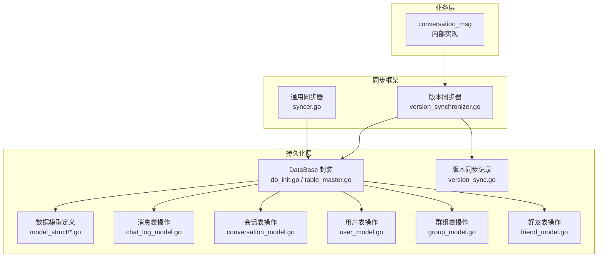
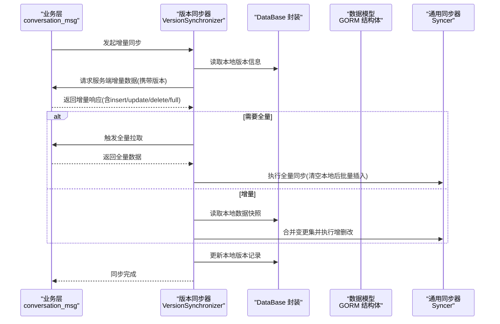
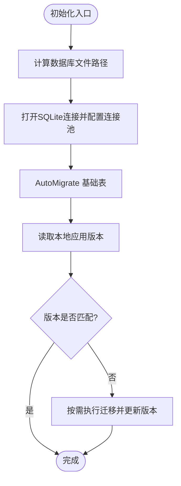
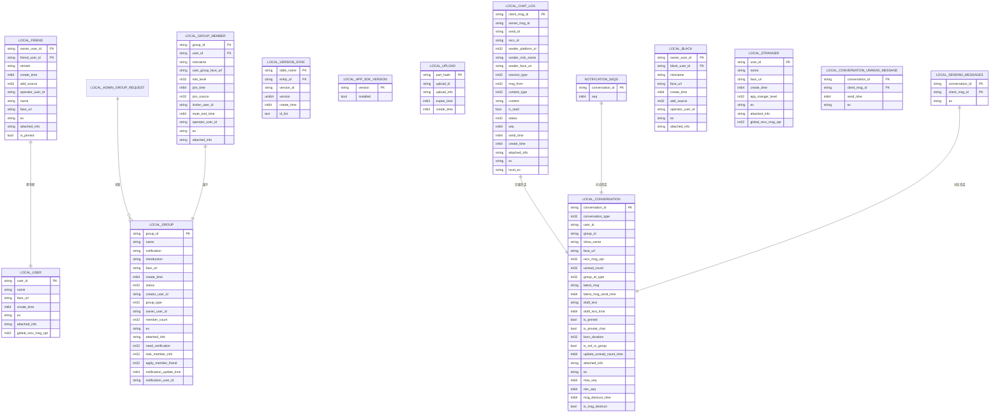
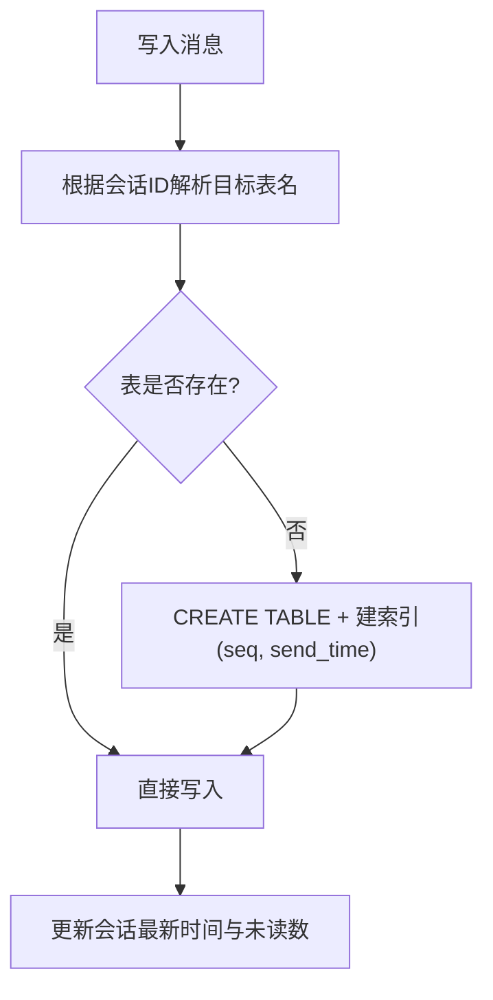
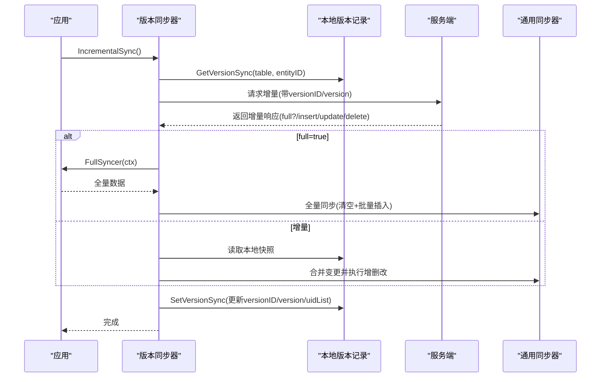
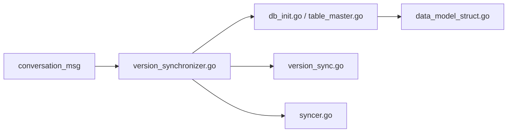

# 数据持久化

<cite>
**本文引用的文件**
- [pkg/db/db_init.go](file://pkg/db/db_init.go)
- [pkg/db/table_master.go](file://pkg/db/table_master.go)
- [pkg/db/model_struct/data_model_struct.go](file://pkg/db/model_struct/data_model_struct.go)
- [pkg/db/chat_log_model.go](file://pkg/db/chat_log_model.go)
- [pkg/db/conversation_model.go](file://pkg/db/conversation_model.go)
- [pkg/db/user_model.go](file://pkg/db/user_model.go)
- [pkg/db/group_model.go](file://pkg/db/group_model.go)
- [pkg/db/friend_model.go](file://pkg/db/friend_model.go)
- [pkg/db/version_sync.go](file://pkg/db/version_sync.go)
- [pkg/syncer/syncer.go](file://pkg/syncer/syncer.go)
- [pkg/syncer/version_synchronizer.go](file://pkg/syncer/version_synchronizer.go)
- [internal/conversation_msg/incremental_sync.go](file://internal/conversation_msg/incremental_sync.go)
</cite>

## 目录
1. [简介](#简介)
2. [项目结构](#项目结构)
3. [核心组件](#核心组件)
4. [架构总览](#架构总览)
5. [详细组件分析](#详细组件分析)
6. [依赖关系分析](#依赖关系分析)
7. [性能考量](#性能考量)
8. [故障排查指南](#故障排查指南)
9. [结论](#结论)
10. [附录](#附录)

## 简介
本文件面向 OpenIM SDK Core 的数据持久化子系统，聚焦基于 GORM + SQLite 的本地数据存储方案。内容涵盖：
- 数据模型设计与表结构定义、实体关系
- 数据库初始化与迁移管理、版本控制
- 增量同步机制、冲突解决策略
- 数据访问模式、缓存策略与性能优化建议
- 数据安全、隐私要求与访问控制
- 数据生命周期管理、保留策略与归档规则

## 项目结构
OpenIM SDK Core 将数据持久化能力集中在 pkg/db 下，使用 GORM 抽象 SQLite 存储；业务层通过 internal/* 模块调用 db 接口进行读写；通用同步框架位于 pkg/syncer，提供增量/全量同步与版本一致性保障。

图表来源
- [pkg/db/db_init.go:79-168](file://pkg/db/db_init.go#L79-L168)
- [pkg/db/table_master.go:12-18](file://pkg/db/table_master.go#L12-L18)
- [pkg/db/model_struct/data_model_struct.go:24-322](file://pkg/db/model_struct/data_model_struct.go#L24-L322)
- [pkg/db/chat_log_model.go:37-83](file://pkg/db/chat_log_model.go#L37-L83)
- [pkg/db/conversation_model.go:38-56](file://pkg/db/conversation_model.go#L38-L56)
- [pkg/db/user_model.go:30-67](file://pkg/db/user_model.go#L30-L67)
- [pkg/db/group_model.go:30-109](file://pkg/db/group_model.go#L30-L109)
- [pkg/db/friend_model.go:31-149](file://pkg/db/friend_model.go#L31-L149)
- [pkg/db/version_sync.go:30-73](file://pkg/db/version_sync.go#L30-L73)
- [pkg/syncer/syncer.go:40-88](file://pkg/syncer/syncer.go#L40-L88)
- [pkg/syncer/version_synchronizer.go:14-34](file://pkg/syncer/version_synchronizer.go#L14-L34)
- [internal/conversation_msg/incremental_sync.go:26-89](file://internal/conversation_msg/incremental_sync.go#L26-L89)

章节来源
- [pkg/db/db_init.go:79-168](file://pkg/db/db_init.go#L79-L168)
- [pkg/db/table_master.go:12-18](file://pkg/db/table_master.go#L12-L18)
- [pkg/db/model_struct/data_model_struct.go:24-322](file://pkg/db/model_struct/data_model_struct.go#L24-L322)

## 核心组件
- 数据库连接与初始化
  - 按登录用户隔离数据库文件路径，包含大版本号与用户ID，避免多用户/多实例冲突
  - 自动迁移基础表（应用版本、好友、群组、成员、用户、黑名单、会话、通知序列、聊天日志、上传、发送中消息、版本同步等）
  - 维护已存在表的内存缓存，减少重复检查开销
- 数据模型
  - 以 GORM 结构体定义各实体表，主键、索引、字段长度均有明确约束
  - 聊天日志采用“按会话分表”策略，提升查询与写入性能
- 版本同步记录
  - 为每个实体表+实体ID维护版本ID、版本号与UID列表，支撑增量同步与一致性校验
- 通用同步器
  - 提供插入/更新/删除/批量插入/全量拉取等可插拔能力
  - 支持自定义相等性比较与通知回调
- 版本同步器
  - 基于 LocalVersionSync 记录，驱动增量同步流程，必要时触发全量同步
  - 处理版本ID不一致、版本号跳跃、顺序变化等异常场景

章节来源
- [pkg/db/db_init.go:98-168](file://pkg/db/db_init.go#L98-L168)
- [pkg/db/table_master.go:12-18](file://pkg/db/table_master.go#L12-L18)
- [pkg/db/model_struct/data_model_struct.go:24-322](file://pkg/db/model_struct/data_model_struct.go#L24-L322)
- [pkg/db/version_sync.go:30-73](file://pkg/db/version_sync.go#L30-L73)
- [pkg/syncer/syncer.go:40-88](file://pkg/syncer/syncer.go#L40-L88)
- [pkg/syncer/version_synchronizer.go:14-34](file://pkg/syncer/version_synchronizer.go#L14-L34)

## 架构总览
下图展示从业务层到持久化层的调用链与关键职责划分。

图表来源
- [internal/conversation_msg/incremental_sync.go:26-89](file://internal/conversation_msg/incremental_sync.go#L26-L89)
- [pkg/syncer/version_synchronizer.go:56-157](file://pkg/syncer/version_synchronizer.go#L56-L157)
- [pkg/syncer/syncer.go:240-345](file://pkg/syncer/syncer.go#L240-L345)
- [pkg/db/version_sync.go:30-73](file://pkg/db/version_sync.go#L30-L73)

## 详细组件分析

### 数据库初始化与迁移
- 数据库文件命名与路径
  - 路径由数据目录、大版本号与登录用户ID拼接而成，确保多用户/多版本隔离
- 连接池配置
  - 最大连接数、空闲连接数、最大生命周期与空闲时间均做了合理限制
- 自动迁移
  - 首次启动或版本变化时，对基础表执行 AutoMigrate
  - 维护应用SDK版本记录，用于后续迁移判断
- 表存在性缓存
  - 通过 TableChecker 缓存已存在的表名，避免频繁元数据查询

图表来源
- [pkg/db/db_init.go:113-168](file://pkg/db/db_init.go#L113-L168)
- [pkg/db/db_init.go:170-213](file://pkg/db/db_init.go#L170-L213)
- [pkg/db/table_master.go:12-18](file://pkg/db/table_master.go#L12-L18)

章节来源
- [pkg/db/db_init.go:98-168](file://pkg/db/db_init.go#L98-L168)
- [pkg/db/db_init.go:170-213](file://pkg/db/db_init.go#L170-L213)
- [pkg/db/table_master.go:12-18](file://pkg/db/table_master.go#L12-L18)

### 数据模型与表结构
- 核心实体
  - 用户(LocalUser)、好友(LocalFriend)、群组(LocalGroup)、群成员(LocalGroupMember)、黑名单(LocalBlack)
  - 会话(LocalConversation)、未读消息(LocalConversationUnreadMessage)
  - 聊天日志(LocalChatLog)，按会话分表存储
  - 上传进度(LocalUpload)、发送中消息(LocalSendingMessages)
  - 通知序列(NotificationSeqs)、版本同步(LocalVersionSync)、应用版本(LocalAppSDKVersion)
- 索引与约束
  - 会话消息表针对 seq、send_time 建立索引，加速分页与排序
  - 会话表对最新发送时间建立索引，优化会话列表排序
  - 群成员表对角色等级、加入时间建立索引，便于权限与时间范围查询
- 扩展字段
  - 多处使用 ex/attached_info 文本字段承载扩展信息，便于向前兼容

图表来源
- [pkg/db/model_struct/data_model_struct.go:24-322](file://pkg/db/model_struct/data_model_struct.go#L24-L322)

章节来源
- [pkg/db/model_struct/data_model_struct.go:24-322](file://pkg/db/model_struct/data_model_struct.go#L24-L322)

### 会话与消息持久化
- 会话表
  - 提供会话列表、分页、置顶、免打扰、草稿、未读数统计、批量更新等能力
- 消息表
  - 按会话分表，动态创建表与索引
  - 支持单条/批量插入、按客户端ID或seq查询、按时间区间分页、关键字搜索、已读标记、批量删除等
  - 维护会话级最大seq，辅助增量拉取

图表来源
- [pkg/db/chat_log_model.go:37-83](file://pkg/db/chat_log_model.go#L37-L83)
- [pkg/db/chat_log_model.go:105-124](file://pkg/db/chat_log_model.go#L105-L124)
- [pkg/db/chat_log_model.go:158-190](file://pkg/db/chat_log_model.go#L158-L190)
- [pkg/db/chat_log_model.go:410-440](file://pkg/db/chat_log_model.go#L410-L440)
- [pkg/db/conversation_model.go:333-370](file://pkg/db/conversation_model.go#L333-L370)

章节来源
- [pkg/db/chat_log_model.go:37-83](file://pkg/db/chat_log_model.go#L37-L83)
- [pkg/db/chat_log_model.go:105-124](file://pkg/db/chat_log_model.go#L105-L124)
- [pkg/db/chat_log_model.go:158-190](file://pkg/db/chat_log_model.go#L158-L190)
- [pkg/db/chat_log_model.go:410-440](file://pkg/db/chat_log_model.go#L410-L440)
- [pkg/db/conversation_model.go:333-370](file://pkg/db/conversation_model.go#L333-L370)

### 用户、群组与好友持久化
- 用户
  - 获取/更新当前登录用户信息，支持按字段选择性更新
- 群组
  - 增删改查、批量插入、按关键词模糊搜索
- 好友
  - 增删改查、分页、批量插入、按用户ID/昵称/备注组合搜索

章节来源
- [pkg/db/user_model.go:30-67](file://pkg/db/user_model.go#L30-L67)
- [pkg/db/group_model.go:30-109](file://pkg/db/group_model.go#L30-L109)
- [pkg/db/friend_model.go:31-149](file://pkg/db/friend_model.go#L31-L149)

### 增量同步与冲突解决
- 版本同步记录
  - 为每个实体表+实体ID维护 versionID、version 与 uidList
  - 提供 Get/Set/Delete 接口
- 版本同步器
  - 读取本地版本信息，向服务端请求增量数据
  - 若服务端返回 full=true，则走全量同步流程
  - 否则合并 insert/update/delete 到本地快照，交由通用同步器执行差异同步
  - 处理版本ID不匹配、版本号跳跃、ID顺序变化等异常，必要时回退到全量
- 通用同步器
  - 基于 uuid/equal 函数对比服务器与本地数据
  - 依次执行插入、更新、删除，并支持跳过删除与通知回调

图表来源
- [pkg/db/version_sync.go:30-73](file://pkg/db/version_sync.go#L30-L73)
- [pkg/syncer/version_synchronizer.go:56-157](file://pkg/syncer/version_synchronizer.go#L56-L157)
- [pkg/syncer/syncer.go:240-345](file://pkg/syncer/syncer.go#L240-L345)
- [internal/conversation_msg/incremental_sync.go:26-89](file://internal/conversation_msg/incremental_sync.go#L26-L89)

章节来源
- [pkg/db/version_sync.go:30-73](file://pkg/db/version_sync.go#L30-L73)
- [pkg/syncer/version_synchronizer.go:56-157](file://pkg/syncer/version_synchronizer.go#L56-L157)
- [pkg/syncer/syncer.go:240-345](file://pkg/syncer/syncer.go#L240-L345)
- [internal/conversation_msg/incremental_sync.go:26-89](file://internal/conversation_msg/incremental_sync.go#L26-L89)

## 依赖关系分析
- 低耦合高内聚
  - db 层仅暴露结构化方法，模型定义集中于 model_struct
  - syncer 层通过函数式注入实现解耦，适配不同实体类型
- 外部依赖
  - GORM + SQLite 作为底层存储
  - tools/errs 与 tools/log 统一错误与日志
- 潜在循环依赖
  - 当前结构未见循环引用；业务层通过版本同步器间接依赖 db 与 syncer

图表来源
- [internal/conversation_msg/incremental_sync.go:26-89](file://internal/conversation_msg/incremental_sync.go#L26-L89)
- [pkg/syncer/version_synchronizer.go:14-34](file://pkg/syncer/version_synchronizer.go#L14-L34)
- [pkg/db/db_init.go:98-168](file://pkg/db/db_init.go#L98-L168)
- [pkg/db/table_master.go:12-18](file://pkg/db/table_master.go#L12-L18)
- [pkg/db/version_sync.go:30-73](file://pkg/db/version_sync.go#L30-L73)
- [pkg/syncer/syncer.go:40-88](file://pkg/syncer/syncer.go#L40-L88)
- [pkg/db/model_struct/data_model_struct.go:24-322](file://pkg/db/model_struct/data_model_struct.go#L24-L322)

章节来源
- [internal/conversation_msg/incremental_sync.go:26-89](file://internal/conversation_msg/incremental_sync.go#L26-L89)
- [pkg/syncer/version_synchronizer.go:14-34](file://pkg/syncer/version_synchronizer.go#L14-L34)
- [pkg/db/db_init.go:98-168](file://pkg/db/db_init.go#L98-L168)
- [pkg/db/table_master.go:12-18](file://pkg/db/table_master.go#L12-L18)
- [pkg/db/version_sync.go:30-73](file://pkg/db/version_sync.go#L30-L73)
- [pkg/syncer/syncer.go:40-88](file://pkg/syncer/syncer.go#L40-L88)
- [pkg/db/model_struct/data_model_struct.go:24-322](file://pkg/db/model_struct/data_model_struct.go#L24-L322)

## 性能考量
- 连接池与并发
  - 设置最大连接数与空闲连接上限，降低并发写竞争
- 分表与索引
  - 会话消息按会话分表，避免单表过大；对 seq、send_time 建索引，提高分页与排序效率
- 批量操作
  - 会话与消息均提供批量插入接口，减少事务与网络往返
- 条件查询优化
  - 会话列表按置顶与最新时间排序，利用索引减少全表扫描
- 内存缓存
  - 表存在性缓存避免重复查询 sqlite_master

[本节为通用指导，无需代码来源]

## 故障排查指南
- 常见错误定位
  - RowsAffected == 0：表示无行被更新，需检查主键或条件是否正确
  - ErrRecordNotFound：记录不存在，需确认数据是否已被删除或未同步
  - 版本ID不匹配/版本号跳跃：触发全量同步，检查网络与服务端状态
- 日志与调试
  - 开启 SQL 日志级别有助于定位慢查询与失败语句
  - 关注同步过程中的 notice 回调，便于追踪插入/更新/删除事件

章节来源
- [pkg/db/chat_log_model.go:89-97](file://pkg/db/chat_log_model.go#L89-L97)
- [pkg/db/conversation_model.go:185-194](file://pkg/db/conversation_model.go#L185-L194)
- [pkg/db/user_model.go:44-52](file://pkg/db/user_model.go#L44-L52)
- [pkg/syncer/version_synchronizer.go:159-251](file://pkg/syncer/version_synchronizer.go#L159-L251)

## 结论
OpenIM SDK Core 的持久化系统以 GORM + SQLite 为基础，结合会话分表、索引优化与批量操作，提供了高效可靠的本地存储能力。通过版本同步记录与通用同步框架，实现了稳健的增量同步与冲突恢复机制。建议在大规模数据场景下持续监控索引命中率与慢查询，并结合业务需求完善清理与归档策略。

[本节为总结性内容，无需代码来源]

## 附录

### 数据访问模式与缓存策略
- 访问模式
  - 会话：按会话ID精确查询、分页列表、置顶优先、草稿与未读数维护
  - 消息：按会话分表，支持按时间窗口分页、关键字检索、已读标记
  - 用户/群组/好友：标准CRUD与模糊搜索
- 缓存策略
  - 表存在性缓存：减少 sqlite_master 查询
  - 内存快照：在增量同步前加载本地数据至内存，构建映射进行差异比对

章节来源
- [pkg/db/table_master.go:12-18](file://pkg/db/table_master.go#L12-L18)
- [pkg/syncer/version_synchronizer.go:119-140](file://pkg/syncer/version_synchronizer.go#L119-L140)

### 数据安全、隐私与访问控制
- 数据隔离
  - 数据库文件按用户隔离，避免跨用户数据泄露
- 敏感字段
  - 头像URL、昵称、扩展信息等存储在本地，应遵循平台安全策略与最小化原则
- 访问控制
  - 所有写操作均受 DataBase.mRWMutex 保护，保证并发安全
  - 会话消息按会话分表，天然具备细粒度访问边界

章节来源
- [pkg/db/db_init.go:113-168](file://pkg/db/db_init.go#L113-L168)
- [pkg/db/chat_log_model.go:37-83](file://pkg/db/chat_log_model.go#L37-L83)

### 数据生命周期管理、保留与归档
- 生命周期
  - 会话重置/清空：清除未读数、最新消息与草稿，但不删除历史消息
  - 会话删除：删除会话记录；消息删除支持按客户端ID或seq批量删除
- 保留策略
  - 会话表包含销毁时长与开关字段，可用于实现阅后即焚等策略
- 归档建议
  - 对长期不活跃的会话，可将消息归档至冷存储或压缩备份，本地仅保留摘要

章节来源
- [pkg/db/conversation_model.go:236-274](file://pkg/db/conversation_model.go#L236-L274)
- [pkg/db/chat_log_model.go:192-214](file://pkg/db/chat_log_model.go#L192-L214)
- [pkg/db/model_struct/data_model_struct.go:194-219](file://pkg/db/model_struct/data_model_struct.go#L194-L219)