# 架构设计

<cite>
**本文引用的文件**   
- [README.md](file://README.md)
- [go.mod](file://go.mod)
- [cmd/sdk/main.go](file://cmd/sdk/main.go)
- [open_im_sdk/em.go](file://open_im_sdk/em.go)
- [open_im_sdk/init_login.go](file://open_im_sdk/init_login.go)
- [pkg/db/db_init.go](file://pkg/db/db_init.go)
- [pkg/db/model_struct/data_model_struct.go](file://pkg/db/model_struct/data_model_struct.go)
- [internal/interaction/long_connection.go](file://internal/interaction/long_connection.go)
- [internal/interaction/reconnect.go](file://internal/interaction/reconnect.go)
- [internal/interaction/msg_sync.go](file://internal/interaction/msg_sync.go)
- [pkg/syncer/syncer.go](file://pkg/syncer/syncer.go)
- [pkg/syncer/version_synchronizer.go](file://pkg/syncer/version_synchronizer.go)
- [pkg/network/http_client.go](file://pkg/network/http_client.go)
- [pkg/api/api.go](file://pkg/api/api.go)
- [internal/conversation_msg/server_api.go](file://internal/conversation_msg/server_api.go)
- [internal/user/server_api.go](file://internal/user/server_api.go)
- [wasm/wasm_wrapper/wasm_init_login.go](file://wasm/wasm_wrapper/wasm_init_login.go)
- [wasm/indexdb/init.go](file://wasm/indexdb/init.go)
</cite>

## 目录
1. [简介](#简介)
2. [项目结构](#项目结构)
3. [核心组件](#核心组件)
4. [架构总览](#架构总览)
5. [详细组件分析](#详细组件分析)
6. [依赖关系分析](#依赖关系分析)
7. [性能与可扩展性](#性能与可扩展性)
8. [横切关注点：安全、监控、灾难恢复](#横切关注点安全监控灾难恢复)
9. [技术栈与兼容性](#技术栈与兼容性)
10. [部署拓扑与基础设施](#部署拓扑与基础设施)
11. [故障排查指南](#故障排查指南)
12. [结论](#结论)

## 简介
OpenIM SDK Core 是跨平台即时通讯 SDK 的核心层，面向 iOS/Android/PC/Web(WASM) 等终端提供一致的 IM 能力。其职责包括：
- 长连接管理与心跳保活
- 消息编码解码、增量同步与离线补拉
- 本地消息存储（SQLite/IndexedDB）
- 好友/群组/会话等数据的全量与增量同步
- 跨平台回调与事件分发（含 WebAssembly 桥接）

本设计文档围绕分层架构（API层→业务层→数据层→平台适配层）、核心组件交互、数据流向、集成模式、技术决策与权衡、扩展性与部署拓扑、以及横切关注点展开。

## 项目结构
整体采用“对外 API 层 + 内部实现 + 平台适配”的分层组织方式：
- open_im_sdk：对外暴露的公共 API（初始化、登录、会话、群组、关系、用户、第三方等）
- internal：内部业务实现（会话消息、群组、关系、用户、交互网络、同步器等）
- pkg：通用基础能力（HTTP 客户端、数据库抽象与模型、分页、错误码、版本同步器、缓存等）
- wasm：WebAssembly 平台适配层（JS 桥接、IndexedDB 实现）
- cmd/sdk：本地联调入口程序

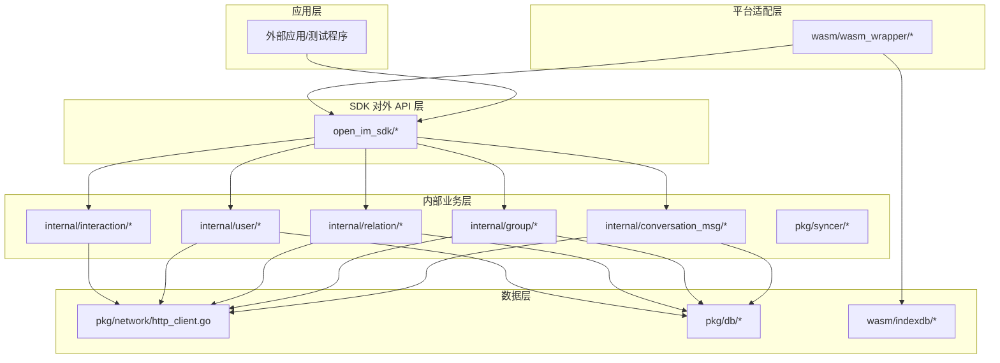

图表来源
- [open_im_sdk/init_login.go:44-84](file://open_im_sdk/init_login.go#L44-L84)
- [internal/conversation_msg/server_api.go:1-85](file://internal/conversation_msg/server_api.go#L1-L85)
- [pkg/network/http_client.go:58-165](file://pkg/network/http_client.go#L58-L165)
- [pkg/db/db_init.go:98-168](file://pkg/db/db_init.go#L98-L168)
- [wasm/wasm_wrapper/wasm_init_login.go:108-134](file://wasm/wasm_wrapper/wasm_init_login.go#L108-L134)
- [wasm/indexdb/init.go:54-66](file://wasm/indexdb/init.go#L54-L66)

章节来源
- [README.md:30-54](file://README.md#L30-L54)
- [go.mod:1-41](file://go.mod#L1-L41)

## 核心组件
- 初始化与生命周期管理
  - InitSDK/UnInitSDK：解析配置、初始化日志、校验参数、启动上下文与监听器
  - Login/Logout：建立认证上下文并触发连接与同步流程
- 长连接与重连策略
  - LongConn 接口：封装底层 WebSocket 读写、超时、Ping/Pong、读限制
  - ReconnectStrategy：指数退避重连策略
- 消息同步器 MsgSyncer
  - 负责连接成功/唤醒/手动触发时的最大序列号获取、差量拉取、批量合并、通知与对话事件派发
- 通用同步器 Syncer 与版本同步器 VersionSynchronizer
  - 基于泛型与选项注入的增删改对比与批处理；按版本号进行增量/全量同步
- 网络与 API 封装
  - ApiPost/CALL 统一请求、gzip 解压、错误码映射、分页拉取
  - api.* 集中注册各模块 REST 路由
- 本地数据持久化
  - SQLite（Go）与 IndexedDB（WASM）双实现，GORM 建模与迁移
- 平台适配层（WASM）
  - JS 到 Go 的函数调用桥接、回调转发、异步调用封装

章节来源
- [open_im_sdk/init_login.go:44-139](file://open_im_sdk/init_login.go#L44-L139)
- [internal/interaction/long_connection.go:24-61](file://internal/interaction/long_connection.go#L24-L61)
- [internal/interaction/reconnect.go:7-33](file://internal/interaction/reconnect.go#L7-L33)
- [internal/interaction/msg_sync.go:46-180](file://internal/interaction/msg_sync.go#L46-L180)
- [pkg/syncer/syncer.go:40-117](file://pkg/syncer/syncer.go#L40-L117)
- [pkg/syncer/version_synchronizer.go:14-56](file://pkg/syncer/version_synchronizer.go#L14-L56)
- [pkg/network/http_client.go:58-165](file://pkg/network/http_client.go#L58-L165)
- [pkg/api/api.go:14-114](file://pkg/api/api.go#L14-L114)
- [pkg/db/db_init.go:98-168](file://pkg/db/db_init.go#L98-L168)
- [wasm/wasm_wrapper/wasm_init_login.go:108-134](file://wasm/wasm_wrapper/wasm_init_login.go#L108-L134)

## 架构总览
系统采用四层分层架构：
- API 层：open_im_sdk 暴露统一方法，屏蔽内部细节，提供跨平台一致接口
- 业务层：internal 下各域（会话、群组、关系、用户）与 interaction（网络与消息同步）
- 数据层：pkg/network 统一 HTTP 访问；pkg/db 提供本地持久化（SQLite/IndexedDB）
- 平台适配层：wasm 将核心能力暴露给 JS，并通过 indexdb 适配浏览器存储

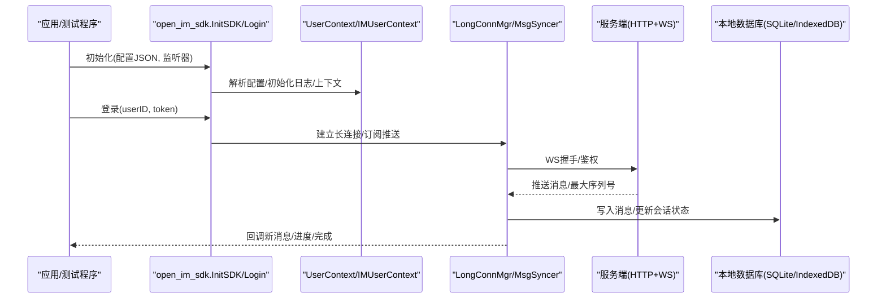

图表来源
- [open_im_sdk/init_login.go:44-139](file://open_im_sdk/init_login.go#L44-L139)
- [internal/interaction/msg_sync.go:429-471](file://internal/interaction/msg_sync.go#L429-L471)
- [pkg/network/http_client.go:58-165](file://pkg/network/http_client.go#L58-L165)
- [pkg/db/db_init.go:113-168](file://pkg/db/db_init.go#L113-L168)

## 详细组件分析

### 初始化与登录流程
- 初始化阶段
  - 解析 IMConfig，校验协议前缀，初始化日志与上下文
  - 设置默认空监听器（避免上层未实现回调导致崩溃）
- 登录阶段
  - 通过 HTTP 获取 token（示例入口），调用 SDK Login
  - 建立长连接，触发首次最大序列号拉取与增量同步

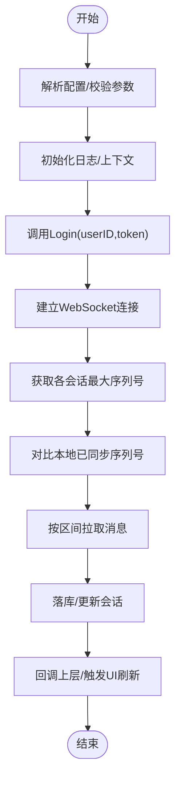

图表来源
- [open_im_sdk/init_login.go:44-139](file://open_im_sdk/init_login.go#L44-L139)
- [internal/interaction/msg_sync.go:429-471](file://internal/interaction/msg_sync.go#L429-L471)
- [cmd/sdk/main.go:114-171](file://cmd/sdk/main.go#L114-L171)

章节来源
- [open_im_sdk/em.go:25-245](file://open_im_sdk/em.go#L25-L245)
- [open_im_sdk/init_login.go:44-139](file://open_im_sdk/init_login.go#L44-L139)
- [cmd/sdk/main.go:114-171](file://cmd/sdk/main.go#L114-L171)

### 长连接与重连机制
- LongConn 接口定义统一的 WebSocket 操作（Dial/Read/Write/Deadline/PingPong）
- 指数退避重连策略：固定间隔数组循环，支持重置
- 连接成功后触发消息同步流程

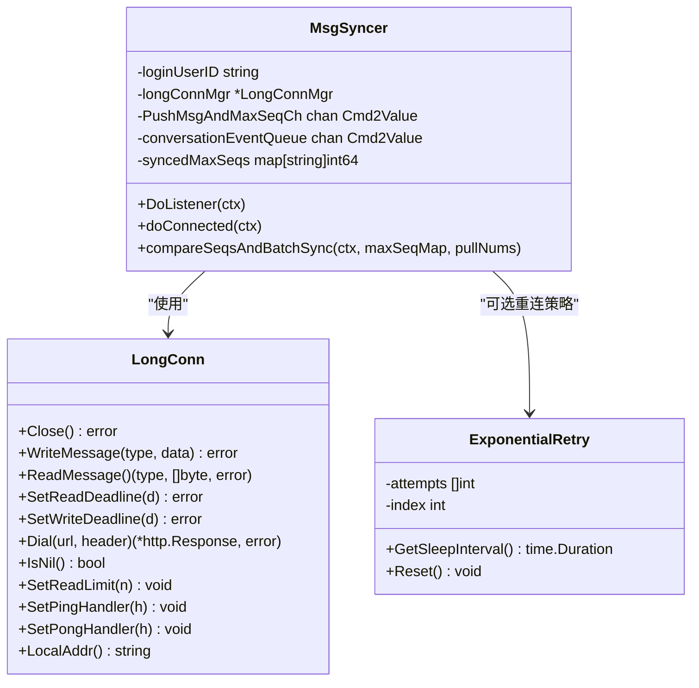

图表来源
- [internal/interaction/long_connection.go:24-61](file://internal/interaction/long_connection.go#L24-L61)
- [internal/interaction/reconnect.go:7-33](file://internal/interaction/reconnect.go#L7-L33)
- [internal/interaction/msg_sync.go:46-180](file://internal/interaction/msg_sync.go#L46-L180)

章节来源
- [internal/interaction/long_connection.go:24-61](file://internal/interaction/long_connection.go#L24-L61)
- [internal/interaction/reconnect.go:7-33](file://internal/interaction/reconnect.go#L7-L33)
- [internal/interaction/msg_sync.go:162-219](file://internal/interaction/msg_sync.go#L162-L219)

### 消息同步与增量拉取
- 连接成功或应用唤醒时，向服务端请求各会话最大序列号
- 对比本地已同步序列号，计算需要拉取的区间
- 按批次拉取消息，写入本地并触发对话/通知回调
- 支持重新安装场景下的特殊处理（跳过通知消息、标记安装完成）

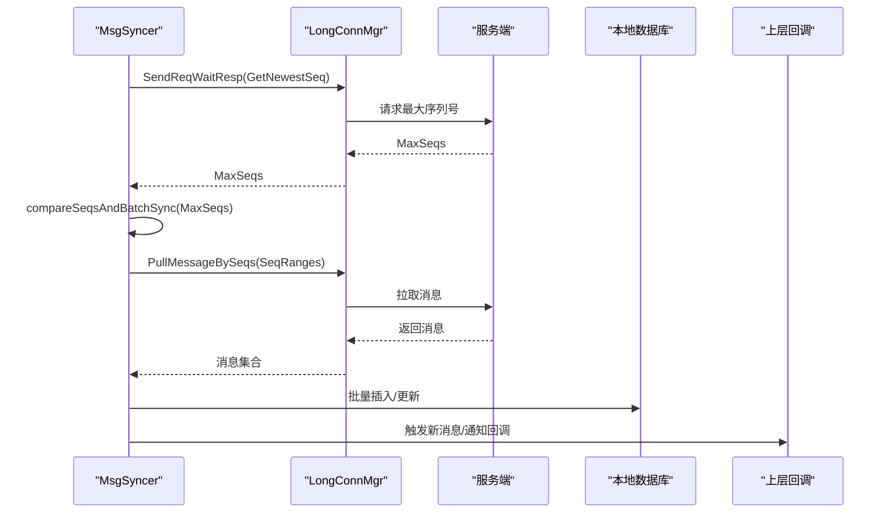

图表来源
- [internal/interaction/msg_sync.go:429-471](file://internal/interaction/msg_sync.go#L429-L471)
- [internal/interaction/msg_sync.go:507-563](file://internal/interaction/msg_sync.go#L507-L563)
- [internal/interaction/msg_sync.go:668-685](file://internal/interaction/msg_sync.go#L668-L685)

章节来源
- [internal/interaction/msg_sync.go:192-219](file://internal/interaction/msg_sync.go#L192-L219)
- [internal/interaction/msg_sync.go:280-345](file://internal/interaction/msg_sync.go#L280-L345)
- [internal/interaction/msg_sync.go:507-563](file://internal/interaction/msg_sync.go#L507-L563)

### 通用同步器与版本同步器
- Syncer[T]：基于泛型与选项注入，提供 insert/update/delete/equal/notice 等钩子，支持批量拉取与差异对比
- VersionSynchronizer[V,R]：以表维度维护版本信息，支持增量/全量同步、额外数据处理、ID 顺序变化检测

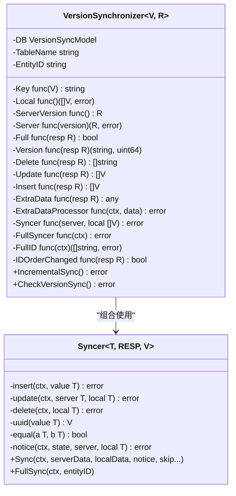

图表来源
- [pkg/syncer/syncer.go:40-117](file://pkg/syncer/syncer.go#L40-L117)
- [pkg/syncer/syncer.go:240-380](file://pkg/syncer/syncer.go#L240-L380)
- [pkg/syncer/version_synchronizer.go:14-56](file://pkg/syncer/version_synchronizer.go#L14-L56)
- [pkg/syncer/version_synchronizer.go:56-157](file://pkg/syncer/version_synchronizer.go#L56-L157)

章节来源
- [pkg/syncer/syncer.go:40-117](file://pkg/syncer/syncer.go#L40-L117)
- [pkg/syncer/syncer.go:240-380](file://pkg/syncer/syncer.go#L240-L380)
- [pkg/syncer/version_synchronizer.go:56-157](file://pkg/syncer/version_synchronizer.go#L56-L157)

### 网络与 API 封装
- ApiPost：统一序列化请求、附加 operationID/token、gzip 解压、错误码映射与回调
- 分页工具：GetPageAll/FetchAndInsertPagedData/PageNext 简化大批量数据拉取与落库
- api.*：集中声明各模块 REST 路由，供业务层直接调用

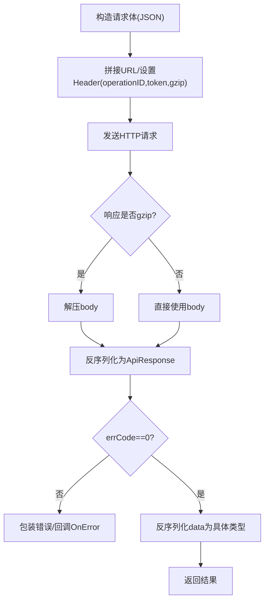

图表来源
- [pkg/network/http_client.go:58-165](file://pkg/network/http_client.go#L58-L165)
- [pkg/network/http_client.go:176-260](file://pkg/network/http_client.go#L176-L260)
- [pkg/api/api.go:14-114](file://pkg/api/api.go#L14-L114)

章节来源
- [pkg/network/http_client.go:58-165](file://pkg/network/http_client.go#L58-L165)
- [pkg/api/api.go:14-114](file://pkg/api/api.go#L14-L114)

### 本地数据模型与持久化
- 数据模型：包含好友、群组、成员、用户、黑名单、会话、消息、上传、版本同步等实体
- 初始化：按用户隔离数据库文件，自动迁移表结构，记录 SDK 版本
- 平台适配：WASM 环境使用 IndexedDB 实现相同接口

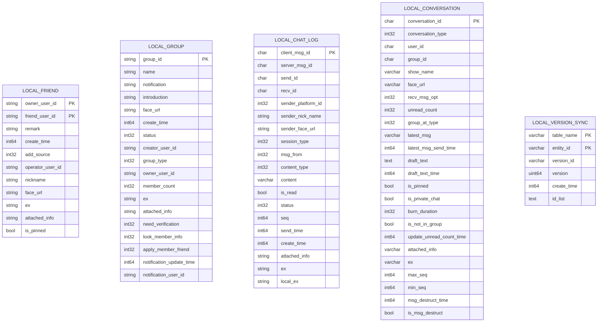

图表来源
- [pkg/db/model_struct/data_model_struct.go:24-322](file://pkg/db/model_struct/data_model_struct.go#L24-L322)
- [pkg/db/db_init.go:113-168](file://pkg/db/db_init.go#L113-L168)

章节来源
- [pkg/db/db_init.go:98-168](file://pkg/db/db_init.go#L98-L168)
- [pkg/db/model_struct/data_model_struct.go:24-322](file://pkg/db/model_struct/data_model_struct.go#L24-L322)

### 平台适配层（WASM）
- wasm_wrapper：将 JS 调用转换为 Go 方法调用，统一回调封装，支持异步/同步调用
- indexdb：在浏览器环境中实现与 pkg/db 一致的接口，适配 IndexedDB 存储

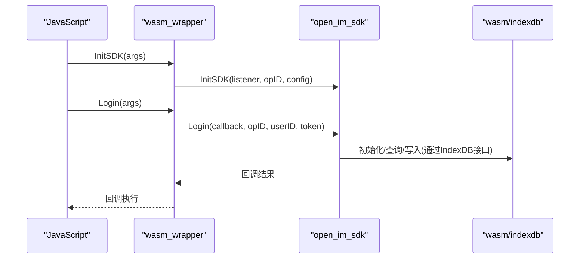

图表来源
- [wasm/wasm_wrapper/wasm_init_login.go:108-134](file://wasm/wasm_wrapper/wasm_init_login.go#L108-L134)
- [wasm/indexdb/init.go:54-66](file://wasm/indexdb/init.go#L54-L66)

章节来源
- [wasm/wasm_wrapper/wasm_init_login.go:108-134](file://wasm/wasm_wrapper/wasm_init_login.go#L108-L134)
- [wasm/indexdb/init.go:54-66](file://wasm/indexdb/init.go#L54-L66)

## 依赖关系分析
- 模块路径：github.com/openimsdk/openim-sdk-core/v3
- 关键依赖
  - 协议与工具：openimsdk/protocol、openimsdk/tools
  - 网络：gorilla/websocket、coder/websocket
  - 数据库：gorm.io/gorm + gorm.io/driver/sqlite
  - 其他：hashicorp/golang-lru、patrickmn/go-cache、protobuf 等

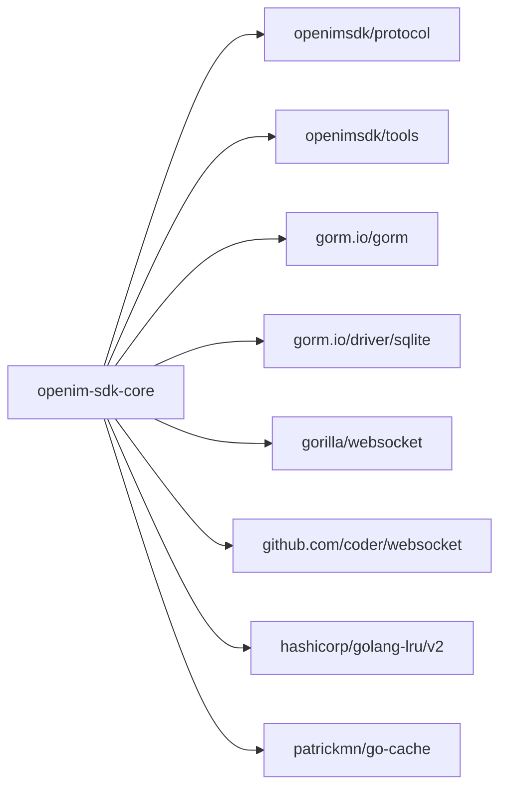

图表来源
- [go.mod:1-41](file://go.mod#L1-L41)

章节来源
- [go.mod:1-41](file://go.mod#L1-L41)

## 性能与可扩展性
- 性能优化
  - 批量拉取与批量插入：FetchAndInsertPagedData 减少往返与事务开销
  - 分片拉取：SplitPullMsgNum 控制单次拉取规模，避免阻塞
  - 并发加载：LoadSeq 对会话列表分批并行查询
  - 连接池与超时：HTTP Client 全局实例与合理超时
- 可扩展性
  - 泛型 Syncer 与 Option 注入：新增数据域只需实现增删改/比较/通知钩子
  - VersionSynchronizer：按表维度维护版本，支持额外数据处理与 ID 顺序变化检测
  - 平台适配：通过 db_interface 抽象，可替换不同后端存储

[本节为通用指导，不直接分析具体文件]

## 横切关注点：安全、监控、灾难恢复
- 安全性
  - 请求头携带 operationID 与 token，便于审计与鉴权
  - 敏感字段建议加密存储（当前模型以明文为主，可按需扩展）
- 监控与可观测性
  - 统一日志初始化与 SQL 慢查询日志开关
  - API 调用耗时统计与错误码回调
- 灾难恢复
  - 指数退避重连策略
  - 版本不一致或版本ID不匹配时触发完整增量同步
  - 重新安装场景的特殊处理（跳过通知消息、标记安装完成）

章节来源
- [pkg/network/http_client.go:58-165](file://pkg/network/http_client.go#L58-L165)
- [internal/interaction/reconnect.go:7-33](file://internal/interaction/reconnect.go#L7-L33)
- [pkg/syncer/version_synchronizer.go:159-252](file://pkg/syncer/version_synchronizer.go#L159-L252)
- [internal/interaction/msg_sync.go:566-623](file://internal/interaction/msg_sync.go#L566-L623)

## 技术栈与兼容性
- 语言与版本：Go 1.24+
- 主要依赖
  - 协议：openimsdk/protocol v0.0.73-alpha.12
  - 工具：openimsdk/tools v0.0.50-alpha.80
  - 网络：gorilla/websocket v1.4.2、coder/websocket v1.8.13
  - 数据库：gorm.io/gorm v1.25.10、gorm.io/driver/sqlite v1.5.5
  - 其他：golang.org/x/net、protobuf、LRU、Cache 等

章节来源
- [go.mod:1-41](file://go.mod#L1-L41)

## 部署拓扑与基础设施
- 客户端侧
  - 运行于各平台（iOS/Android/PC/Web），通过 HTTP 与 WebSocket 与服务端通信
  - 本地存储：桌面/移动端使用 SQLite，Web 使用 IndexedDB
- 服务端侧
  - 提供 REST API（/user、/friend、/group、/msg、/conversation、/third 等）
  - 提供 WebSocket 服务用于实时推送与双向通信
- 典型拓扑
  - 客户端 → API 网关/负载均衡 → 业务服务（用户/群组/消息/会话/第三方）
  - 客户端 ↔ WebSocket 服务（消息推送/最大序列号/拉取）

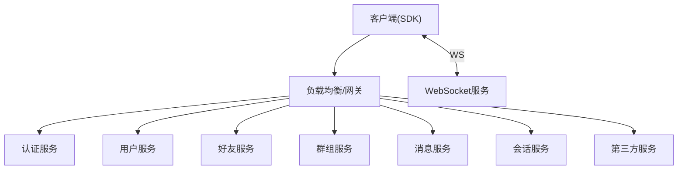

[此图为概念性拓扑，不直接映射具体源码文件]

## 故障排查指南
- 常见问题定位
  - 初始化失败：检查 API/WSS 地址格式、PlatformID 是否为 0、监听器是否为 nil
  - 登录失败：确认账号服务返回 errCode=0 且 data 非空
  - 消息不同步：查看最大序列号获取是否成功、是否需要触发手动同步
  - 存储异常：检查数据库文件路径权限、GORM 迁移是否成功
- 调试手段
  - 开启 Debug 日志级别，观察 API 调用耗时与错误码
  - 使用 test 目录中的用例模拟真实场景
  - 在 WASM 环境下检查 JS 回调是否正确注册

章节来源
- [open_im_sdk/init_login.go:44-84](file://open_im_sdk/init_login.go#L44-L84)
- [cmd/sdk/main.go:114-171](file://cmd/sdk/main.go#L114-L171)
- [pkg/network/http_client.go:58-165](file://pkg/network/http_client.go#L58-L165)
- [pkg/db/db_init.go:113-168](file://pkg/db/db_init.go#L113-L168)

## 结论
OpenIM SDK Core 通过清晰的分层架构与模块化设计，实现了跨平台一致的 IM 能力。其核心优势在于：
- 高内聚低耦合：API 层屏蔽实现细节，业务层专注领域逻辑
- 可扩展性强：泛型同步器与版本同步器降低新增数据域成本
- 平台适配灵活：通过接口抽象与 WASM 桥接，覆盖多端生态
- 健壮可靠：完善的网络重试、增量同步与本地持久化保障用户体验

建议在后续演进中持续优化大数据量场景下的内存占用与 IO 吞吐，完善监控埋点与告警体系，并逐步引入更细粒度的数据加密与隐私保护策略。