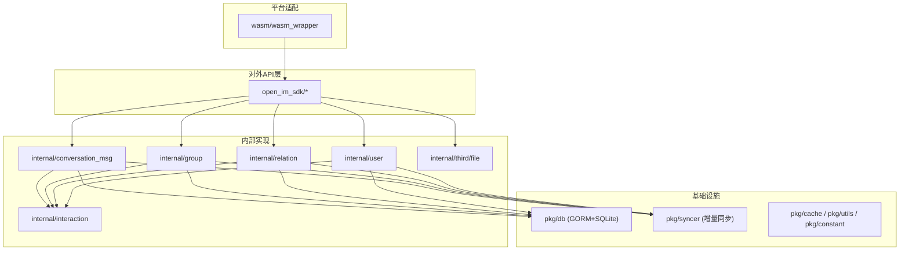
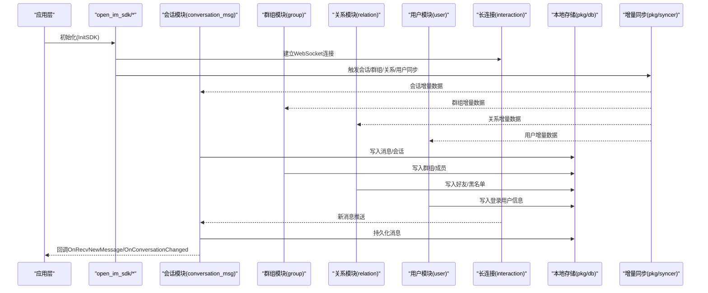
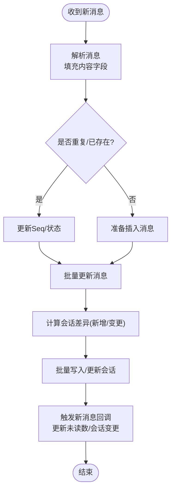
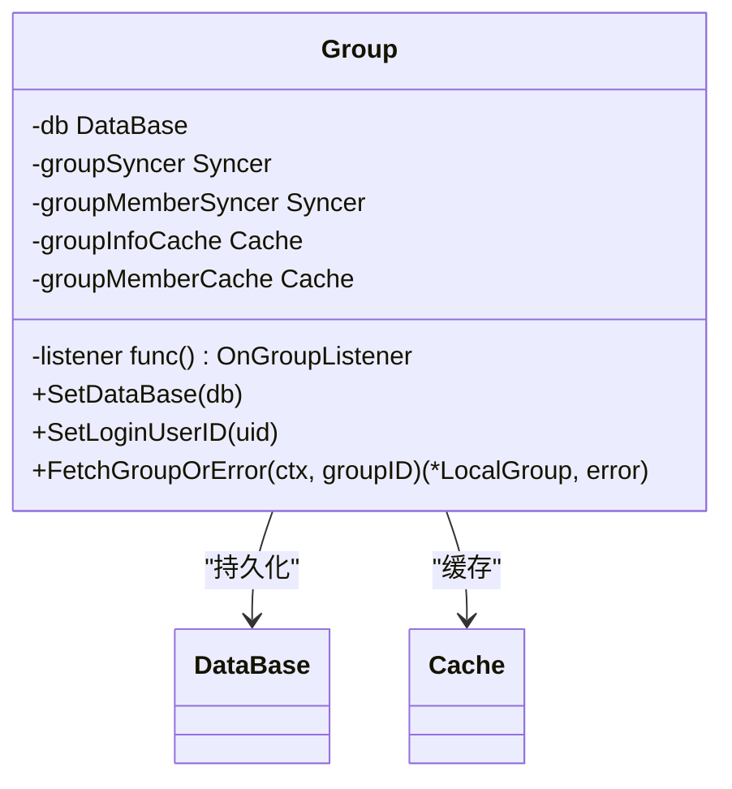
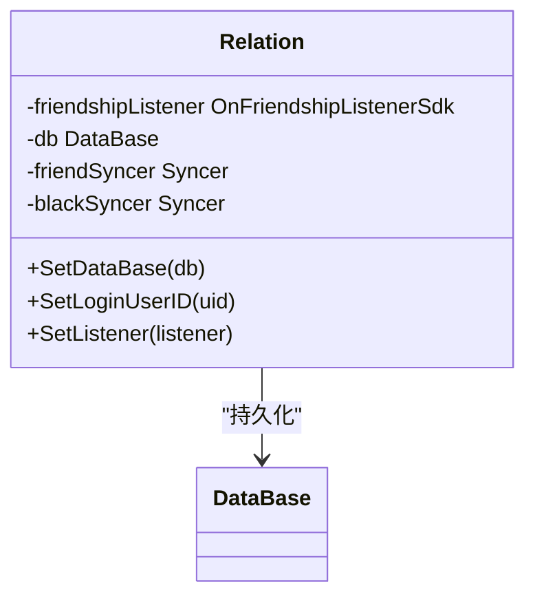
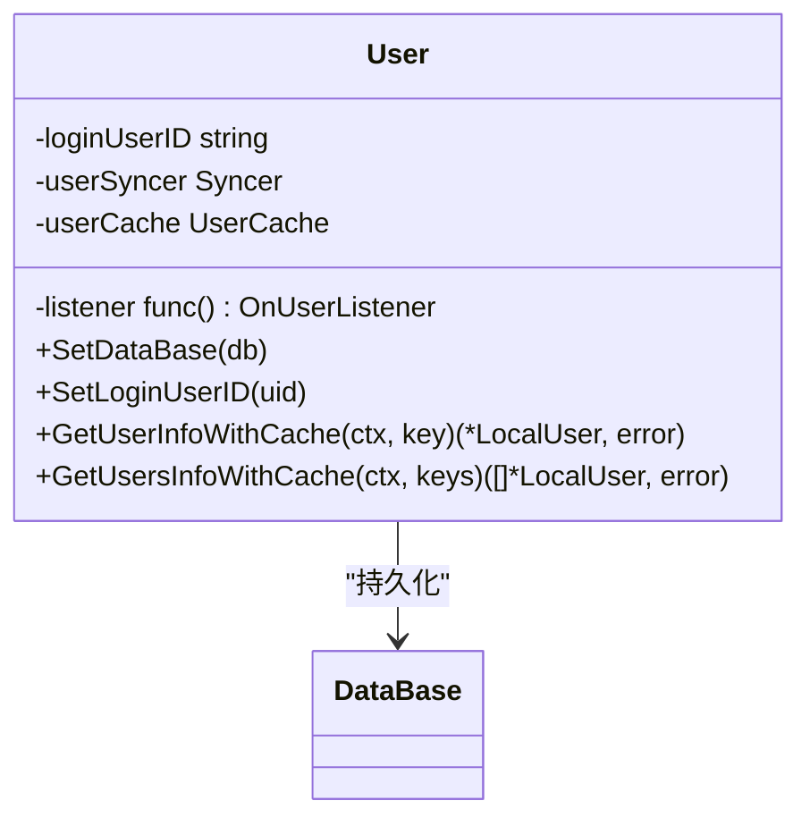
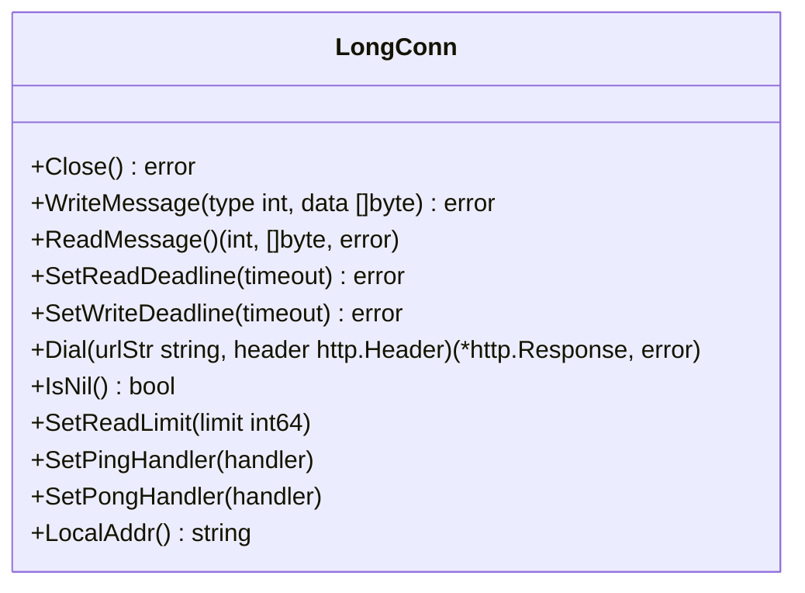
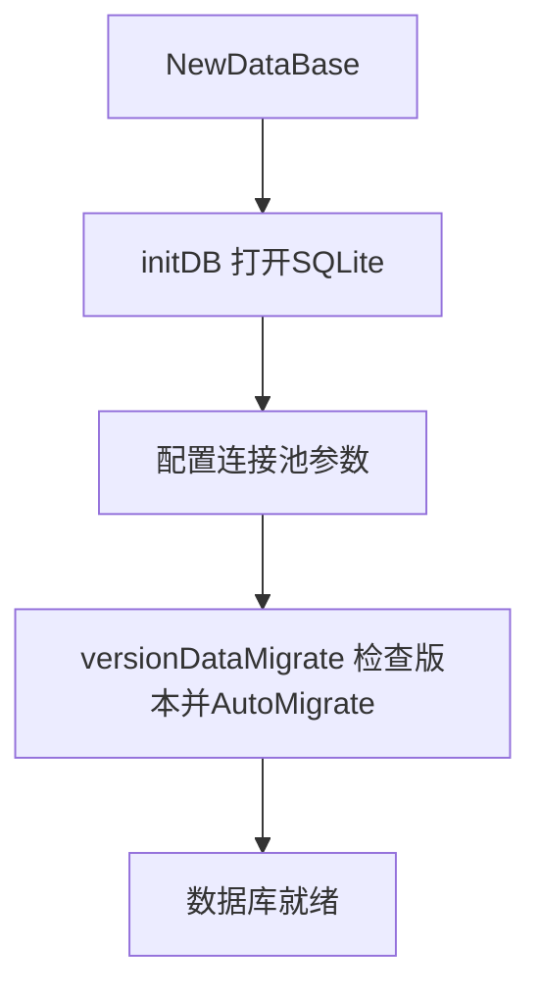
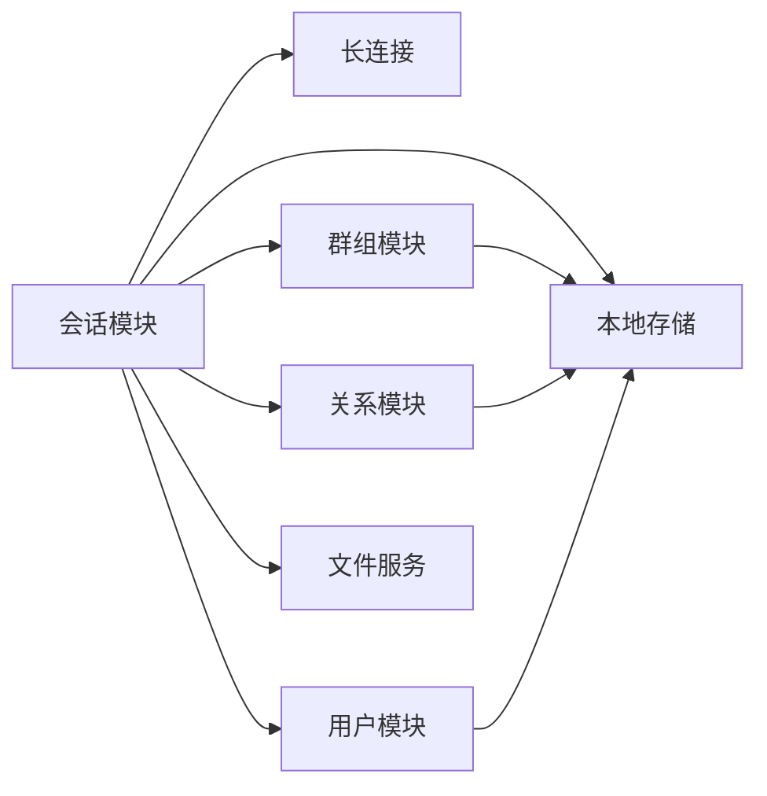

# 核心功能模块

<cite>
**本文引用的文件**   
- [README.md](file://README.md)
- [go.mod](file://go.mod)
- [open_im_sdk/em.go](file://open_im_sdk/em.go)
- [open_im_sdk/init_login.go](file://open_im_sdk/init_login.go)
- [internal/interaction/long_connection.go](file://internal/interaction/long_connection.go)
- [pkg/db/db_init.go](file://pkg/db/db_init.go)
- [internal/conversation_msg/conversation_msg.go](file://internal/conversation_msg/conversation_msg.go)
- [internal/group/group.go](file://internal/group/group.go)
- [internal/relation/relation.go](file://internal/relation/relation.go)
- [internal/user/user.go](file://internal/user/user.go)
</cite>

## 目录
1. [简介](#简介)
2. [项目结构](#项目结构)
3. [核心组件](#核心组件)
4. [架构总览](#架构总览)
5. [详细组件分析](#详细组件分析)
6. [依赖关系分析](#依赖关系分析)
7. [性能考虑](#性能考虑)
8. [故障排查指南](#故障排查指南)
9. [结论](#结论)
10. [附录：API参考与使用示例](#附录api参考与使用示例)

## 简介
OpenIM SDK Core 是跨平台 IM SDK 的核心层，为 iOS、Android、PC、Web（WASM）等上层 SDK 提供一致的会话消息管理、群组管理、关系管理、用户管理与文件传输能力。其设计强调：
- 统一的对外 API 层（open_im_sdk/）
- 内部业务实现（internal/）
- 网络长连接与心跳（internal/interaction）
- 本地持久化（pkg/db，基于 GORM + SQLite）
- 增量同步（pkg/syncer）
- WebAssembly 适配（wasm/）

本文件聚焦“核心功能模块”的职责、接口设计与实现原理，并给出模块间依赖、数据流转、错误处理、性能优化与最佳实践建议，覆盖从基础使用到高级定制的全链路指导。

章节来源
- [README.md:1-189](file://README.md#L1-L189)

## 项目结构
整体采用分层与按领域划分相结合的组织方式：
- open_im_sdk：对外暴露的公共 API 层（初始化、登录、会话消息、群组、关系、用户、第三方服务等）
- internal：内部业务实现（conversation_msg、group、relation、user、interaction、third 等）
- pkg：通用基础设施（缓存、数据库、网络、常量、错误码、版本、工具等）
- wasm：WebAssembly 平台适配层，通过 wasm_wrapper 将核心能力暴露给 JS 调用
- cmd/sdk：命令行入口（示例/测试用）

图表来源
- [open_im_sdk/init_login.go:1-139](file://open_im_sdk/init_login.go#L1-L139)
- [internal/conversation_msg/conversation_msg.go:1-800](file://internal/conversation_msg/conversation_msg.go#L1-L800)
- [internal/group/group.go:1-280](file://internal/group/group.go#L1-L280)
- [internal/relation/relation.go:1-174](file://internal/relation/relation.go#L1-L174)
- [internal/user/user.go:1-155](file://internal/user/user.go#L1-L155)
- [internal/interaction/long_connection.go:1-62](file://internal/interaction/long_connection.go#L1-L62)
- [pkg/db/db_init.go:1-214](file://pkg/db/db_init.go#L1-L214)

章节来源
- [README.md:1-189](file://README.md#L1-L189)

## 核心组件
- 会话消息管理（internal/conversation_msg）
  - 负责消息收发、在线/离线消息分发、会话列表同步、已读回执、撤回、扩展（Reaction）、输入状态（Typing）等。
  - 关键数据结构 Conversation 持有 LongConnMgr、DB、Relation、Group、User、File 等依赖，并通过 syncer 完成会话数据的增量同步。
- 群组管理（internal/group）
  - 负责群信息、成员信息的增删改查与增量同步，并在变更时联动更新会话与消息展示信息（头像、昵称）。
- 关系管理（internal/relation）
  - 负责好友与黑名单的同步，变更时联动更新会话与消息展示信息。
- 用户管理（internal/user）
  - 负责当前登录用户信息与用户缓存，支持批量拉取用户信息，并在自身信息变更时联动更新会话与消息展示信息。
- 网络长连接（internal/interaction）
  - 定义 LongConn 接口与连接管理器，封装 WebSocket 读写、心跳、重连、压缩等能力。
- 本地存储（pkg/db）
  - 基于 GORM + SQLite 的本地持久化，包含表结构迁移、连接池配置、版本管理等。
- 增量同步（pkg/syncer）
  - 提供通用的全量/增量同步框架，统一分页请求、响应转换、插入/更新/删除、通知回调等。

章节来源
- [internal/conversation_msg/conversation_msg.go:1-800](file://internal/conversation_msg/conversation_msg.go#L1-L800)
- [internal/group/group.go:1-280](file://internal/group/group.go#L1-L280)
- [internal/relation/relation.go:1-174](file://internal/relation/relation.go#L1-L174)
- [internal/user/user.go:1-155](file://internal/user/user.go#L1-L155)
- [internal/interaction/long_connection.go:1-62](file://internal/interaction/long_connection.go#L1-L62)
- [pkg/db/db_init.go:1-214](file://pkg/db/db_init.go#L1-L214)

## 架构总览
SDK 启动后，初始化日志、上下文与配置，建立长连接，随后进行会话、群组、关系、用户等数据的增量同步；消息到达后由会话模块解析、落库、触发 UI 事件；群组/关系/用户变更会联动更新会话与消息展示信息。

图表来源
- [open_im_sdk/init_login.go:1-139](file://open_im_sdk/init_login.go#L1-L139)
- [internal/conversation_msg/conversation_msg.go:1-800](file://internal/conversation_msg/conversation_msg.go#L1-L800)
- [internal/group/group.go:1-280](file://internal/group/group.go#L1-L280)
- [internal/relation/relation.go:1-174](file://internal/relation/relation.go#L1-L174)
- [internal/user/user.go:1-155](file://internal/user/user.go#L1-L155)
- [internal/interaction/long_connection.go:1-62](file://internal/interaction/long_connection.go#L1-L62)
- [pkg/db/db_init.go:1-214](file://pkg/db/db_init.go#L1-L214)

## 详细组件分析

### 会话消息管理（conversation_msg）
职责
- 消息接收与分发（在线/离线/仅在线）
- 会话列表增量同步与变更通知
- 消息落库与批量写入、异常消息记录
- 未读数统计与全局未读数变化
- Typing 状态、消息扩展（Reaction）等高级特性

关键结构与流程
- Conversation 聚合 LongConnMgr、DB、Relation、Group、User、File 等依赖，维护消息发送器、最大序列记录器、消息拉取进度缓存等。
- doMsgNew 处理服务端推送的新消息，去重、解析、分类（历史/非历史），更新会话与消息，触发回调。
- newMessage 根据后台/前台状态与全局接收策略，决定回调类型（仅在线/离线/普通新消息）。
- batchInsertMessageList/batchUpdateMessageList 保证消息写入的幂等与一致性。

图表来源
- [internal/conversation_msg/conversation_msg.go:227-500](file://internal/conversation_msg/conversation_msg.go#L227-L500)
- [internal/conversation_msg/conversation_msg.go:739-800](file://internal/conversation_msg/conversation_msg.go#L739-L800)

章节来源
- [internal/conversation_msg/conversation_msg.go:1-800](file://internal/conversation_msg/conversation_msg.go#L1-L800)

### 群组管理（group）
职责
- 加入群列表与成员列表的增量同步
- 群信息/成员信息变更时，联动更新会话与消息展示信息（头像、昵称）
- 群解散、踢出/邀请等场景的清理与通知

关键流程
- initSyncer 注册组与成员的插入/更新/删除处理器，并在 Notice 阶段触发 OnJoinedGroupAdded/OnGroupInfoChanged/OnGroupMemberAdded 等回调。
- 当群名或头像变化时，向会话队列派发更新任务，刷新会话列表与最近消息显示。

图表来源
- [internal/group/group.go:47-227](file://internal/group/group.go#L47-L227)

章节来源
- [internal/group/group.go:1-280](file://internal/group/group.go#L1-L280)

### 关系管理（relation）
职责
- 好友与黑名单的增量同步
- 好友/黑名单变更时，联动更新会话与消息展示信息（头像、昵称、备注）

关键流程
- initSyncer 注册好友与黑名单的插入/更新/删除处理器，在 Notice 阶段触发 OnFriendAdded/OnFriendDeleted/OnBlackAdded 等回调。
- 当好友信息变化时，向会话与消息队列派发更新任务，刷新相关会话与消息的显示信息。

图表来源
- [internal/relation/relation.go:27-151](file://internal/relation/relation.go#L27-L151)

章节来源
- [internal/relation/relation.go:1-174](file://internal/relation/relation.go#L1-L174)

### 用户管理（user）
职责
- 当前登录用户信息同步与缓存
- 批量获取用户信息（含缓存与服务器回源）
- 自身信息变更时，联动更新会话与消息展示信息

关键流程
- initSyncer 注册用户信息更新处理器，在 Notice 阶段触发 OnSelfInfoUpdated 回调。
- UserCache 提供懒加载与批量拉取能力，减少不必要的网络请求。

图表来源
- [internal/user/user.go:37-113](file://internal/user/user.go#L37-L113)

章节来源
- [internal/user/user.go:1-155](file://internal/user/user.go#L1-L155)

### 网络长连接（interaction）
职责
- 定义 LongConn 接口，封装 WebSocket 的连接、读写、超时、心跳、压缩等能力
- 提供默认与 JS 平台的差异化实现（ws_default.go/ws_js.go）

图表来源
- [internal/interaction/long_connection.go:22-61](file://internal/interaction/long_connection.go#L22-L61)

章节来源
- [internal/interaction/long_connection.go:1-62](file://internal/interaction/long_connection.go#L1-L62)

### 本地存储（pkg/db）
职责
- 基于 GORM + SQLite 的本地数据库初始化、连接池配置、表结构自动迁移与版本管理
- 提供多表模型（会话、消息、群组、成员、好友、黑名单、上传记录等）

关键点
- NewDataBase 创建数据库实例，initDB 打开 SQLite 文件并设置连接池参数
- versionDataMigrate 负责首次建表与版本升级时的 AutoMigrate

图表来源
- [pkg/db/db_init.go:98-168](file://pkg/db/db_init.go#L98-L168)
- [pkg/db/db_init.go:170-213](file://pkg/db/db_init.go#L170-L213)

章节来源
- [pkg/db/db_init.go:1-214](file://pkg/db/db_init.go#L1-L214)

## 依赖关系分析
- 会话模块依赖：
  - 网络：LongConnMgr（用于消息推送与发送）
  - 数据：DataBase（消息与会话持久化）
  - 业务：Relation、Group、User（用于头像/昵称等信息回填）
  - 文件：File（用于图片/文件等媒体资源处理）
  - 同步：syncer（会话增量同步）
- 群组/关系/用户模块均依赖 DataBase 与 syncer，并在变更时通过 common 通道向会话模块派发更新任务，确保 UI 一致性。

图表来源
- [internal/conversation_msg/conversation_msg.go:47-138](file://internal/conversation_msg/conversation_msg.go#L47-L138)
- [internal/group/group.go:59-71](file://internal/group/group.go#L59-L71)
- [internal/relation/relation.go:33-43](file://internal/relation/relation.go#L33-L43)
- [internal/user/user.go:44-54](file://internal/user/user.go#L44-L54)

章节来源
- [internal/conversation_msg/conversation_msg.go:1-800](file://internal/conversation_msg/conversation_msg.go#L1-L800)
- [internal/group/group.go:1-280](file://internal/group/group.go#L1-L280)
- [internal/relation/relation.go:1-174](file://internal/relation/relation.go#L1-L174)
- [internal/user/user.go:1-155](file://internal/user/user.go#L1-L155)

## 性能考虑
- 批量写入与去重
  - 会话模块对消息进行批量插入/更新，并对重复消息进行 Seq 更新，避免重复落库。
- 增量同步与分页限制
  - 各模块通过 syncer 配置全量同步上限（如群组/成员/好友），降低一次性拉取压力。
- 缓存命中
  - 用户模块提供 UserCache，优先本地缓存，缺失再回源服务器，减少网络开销。
- 连接池与并发控制
  - 数据库连接池大小与空闲时间合理配置，避免过多连接导致资源竞争。
- 后台模式优化
  - 会话模块在后台模式下根据全局接收策略过滤消息，减少不必要回调与 UI 刷新。

[本节为通用性能建议，不直接分析具体文件]

## 故障排查指南
- 初始化失败
  - 检查 InitSDK 的配置合法性（API/WSS 地址协议、PlatformID、日志配置等）。
  - 若监听器为空或配置为空，将返回错误。
- 登录失败
  - 确认 userID/token 正确，检查网络连通性与鉴权。
- 消息丢失或重复
  - 检查客户端消息 ID 与服务端消息 ID 的去重逻辑，关注 Seq 更新路径。
  - 查看异常消息记录，定位解析失败或状态异常的消息。
- 会话未更新
  - 检查群组/关系/用户变更是否成功派发更新任务至会话队列。
- 数据库问题
  - 检查 SQLite 文件路径与权限，确认 AutoMigrate 是否执行成功。
  - 查看连接池配置与慢查询日志。

章节来源
- [open_im_sdk/init_login.go:44-84](file://open_im_sdk/init_login.go#L44-L84)
- [internal/conversation_msg/conversation_msg.go:227-500](file://internal/conversation_msg/conversation_msg.go#L227-L500)
- [pkg/db/db_init.go:113-168](file://pkg/db/db_init.go#L113-L168)

## 结论
OpenIM SDK Core 以清晰的模块化与统一的增量同步框架为核心，结合本地持久化与长连接能力，提供了稳定高效的 IM 基础能力。通过会话、群组、关系、用户四大模块的协同工作，实现了消息、会话、联系人、群组的一致性与可扩展性。开发者可基于此快速构建跨平台 IM 应用，并根据需要扩展自定义消息类型与业务逻辑。

[本节为总结性内容，不直接分析具体文件]

## 附录：API参考与使用示例

### 初始化与登录
- 初始化 SDK
  - 入口函数：InitSDK(listener, operationID, config)
  - 作用：解析配置、初始化日志、校验参数、调用内部初始化流程
- 登录/登出
  - Login(callback, operationID, userID, token)
  - Logout(callback, operationID)
- 应用前后台切换
  - SetAppBackgroundStatus(callback, operationID, isBackground)
- 网络状态变化
  - NetworkStatusChanged(callback, operationID)

章节来源
- [open_im_sdk/init_login.go:44-139](file://open_im_sdk/init_login.go#L44-L139)

### 会话消息管理
- 主要能力
  - 消息发送/接收、在线/离线消息分发
  - 会话列表增量同步、未读数统计
  - 消息撤回、已读回执、消息扩展（Reaction）、输入状态（Typing）
- 关键回调
  - OnRecvNewMessage、OnRecvOnlineOnlyMessage、OnRecvOfflineNewMessage
  - OnConversationChanged、OnTotalUnreadMessageCountChanged

章节来源
- [internal/conversation_msg/conversation_msg.go:227-500](file://internal/conversation_msg/conversation_msg.go#L227-L500)
- [internal/conversation_msg/conversation_msg.go:739-800](file://internal/conversation_msg/conversation_msg.go#L739-L800)

### 群组管理
- 主要能力
  - 加入群列表与成员列表的增量同步
  - 群信息/成员信息变更回调（OnJoinedGroupAdded、OnGroupInfoChanged、OnGroupMemberAdded 等）
- 联动更新
  - 群名/头像变化时，自动更新会话与消息展示信息

章节来源
- [internal/group/group.go:73-227](file://internal/group/group.go#L73-L227)

### 关系管理
- 主要能力
  - 好友与黑名单的增量同步
  - 好友/黑名单变更回调（OnFriendAdded、OnFriendDeleted、OnBlackAdded 等）
- 联动更新
  - 好友信息变化时，自动更新会话与消息展示信息

章节来源
- [internal/relation/relation.go:45-151](file://internal/relation/relation.go#L45-L151)

### 用户管理
- 主要能力
  - 当前登录用户信息同步与缓存
  - 批量获取用户信息（本地缓存优先，缺失则回源）
- 联动更新
  - 自身信息变化时，自动更新会话与消息展示信息

章节来源
- [internal/user/user.go:83-113](file://internal/user/user.go#L83-L113)

### 文件传输
- 主要能力
  - 文件上传、下载、进度回调、MD5 校验、位图处理等
- 集成点
  - 会话模块在发送/接收媒体消息时，通过 file.File 完成资源处理

章节来源
- [internal/third/file/upload.go](file://internal/third/file/upload.go)
- [internal/third/file/file.go](file://internal/third/file/file.go)

### 错误处理与空监听器
- 空监听器实现
  - 提供 emptyGroupListener、emptyFriendshipListener、emptyConversationListener、emptyAdvancedMsgListener、emptyUserListener、emptyCustomBusinessListener 等默认实现，避免 nil 指针异常
- 常见错误
  - ErrNotImplemented：未设置监听器
  - 初始化失败：配置非法、监听器为空、日志初始化失败

章节来源
- [open_im_sdk/em.go:25-245](file://open_im_sdk/em.go#L25-L245)
- [open_im_sdk/init_login.go:44-84](file://open_im_sdk/init_login.go#L44-L84)

### 使用示例（步骤式）
- 初始化
  - 调用 InitSDK，传入监听器、operationID 与 JSON 配置
- 登录
  - 调用 Login，传入 userID 与 token
- 订阅回调
  - 设置会话、群组、关系、用户等监听器
- 发送消息
  - 构造消息体，调用会话模块发送接口
- 接收消息
  - 在 OnRecvNewMessage 中处理新消息，必要时触发 UI 更新
- 退出
  - 调用 Logout，释放资源

章节来源
- [open_im_sdk/init_login.go:44-139](file://open_im_sdk/init_login.go#L44-L139)
- [internal/conversation_msg/conversation_msg.go:227-500](file://internal/conversation_msg/conversation_msg.go#L227-L500)