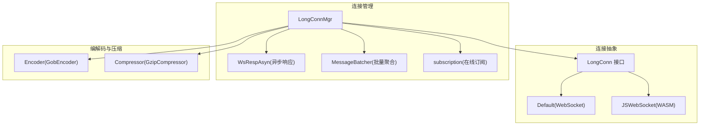
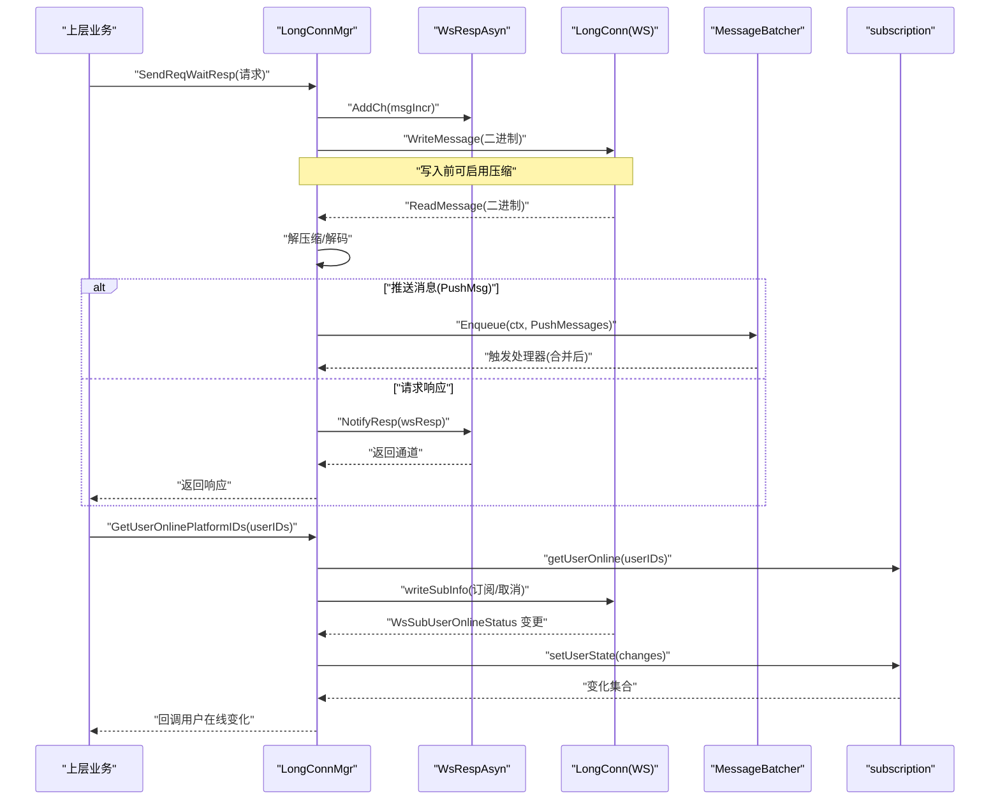
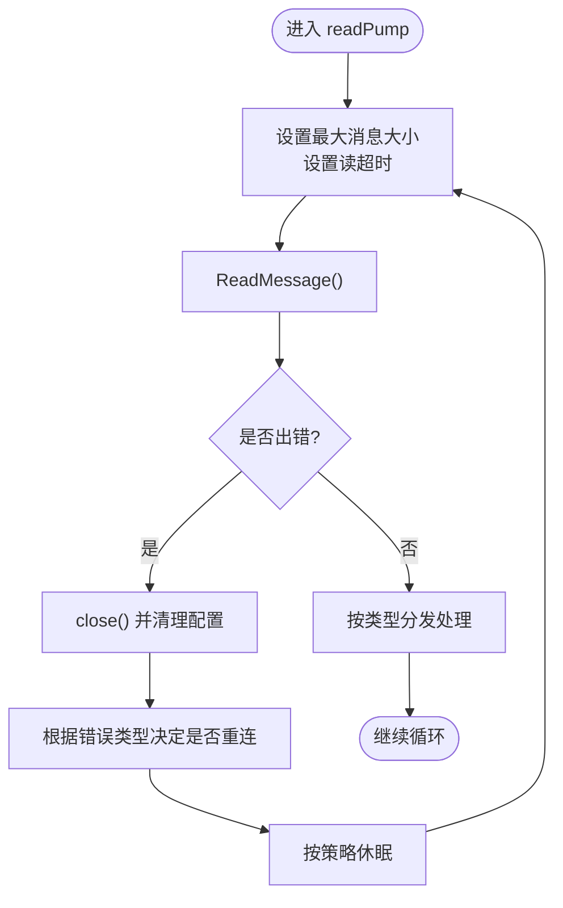
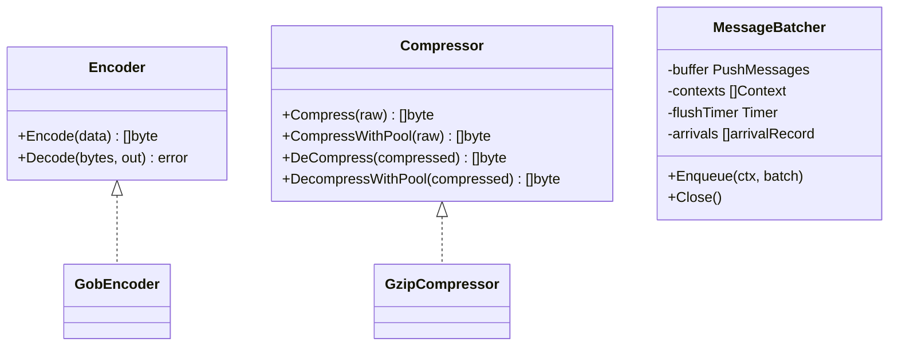
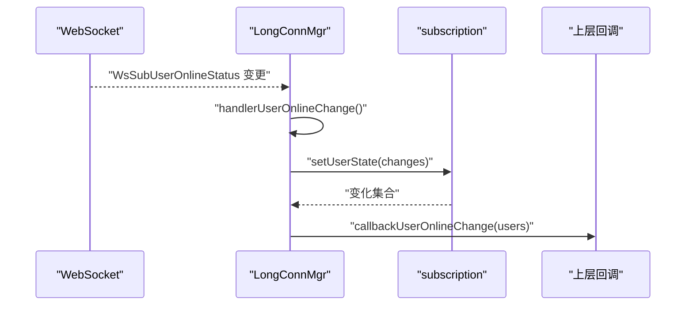
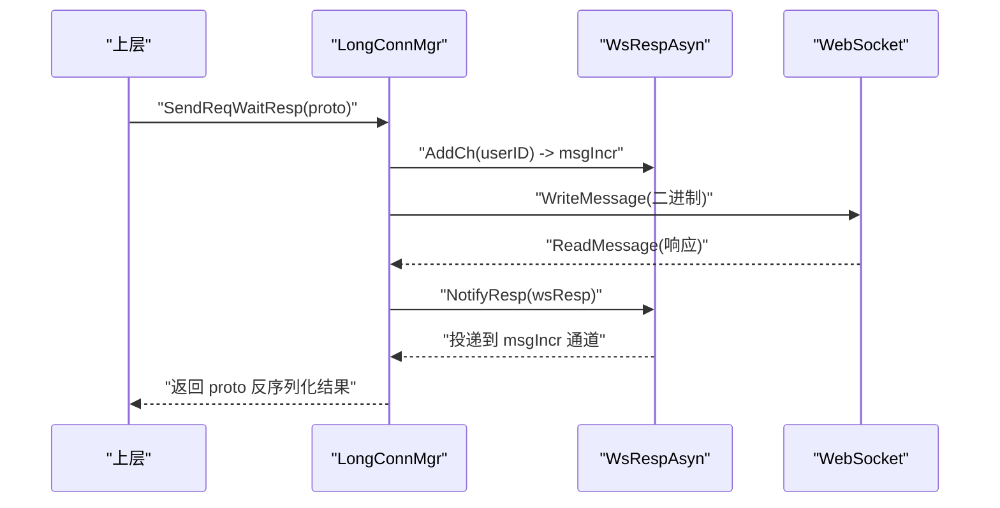
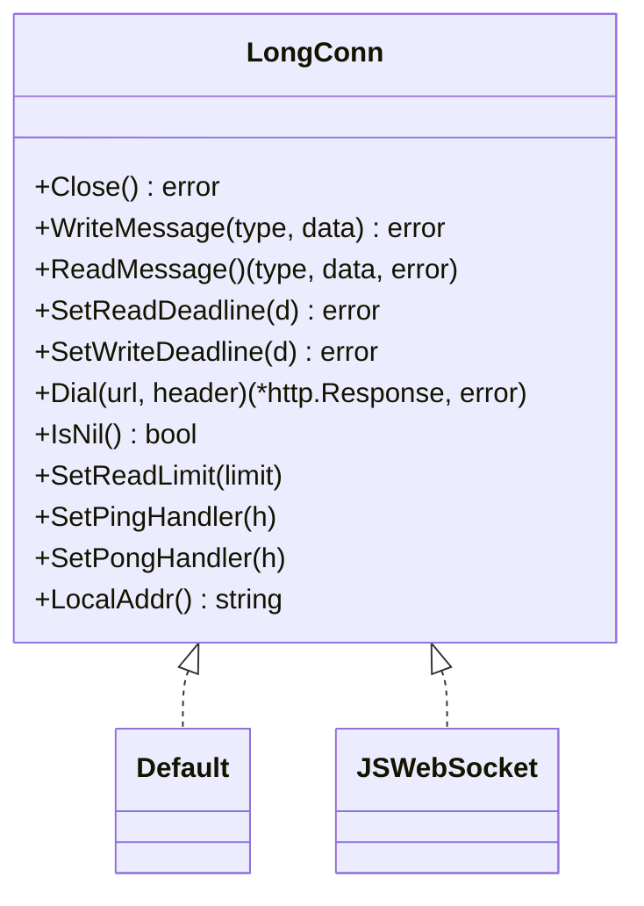
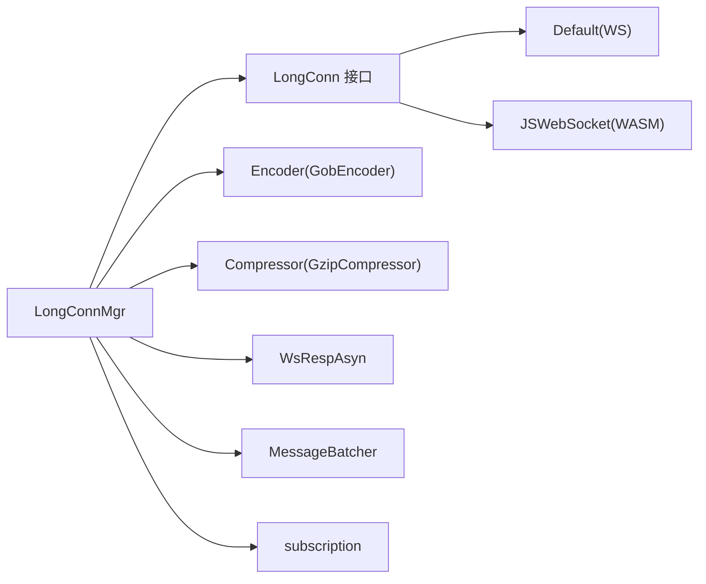

# 网络通信

<cite>
**本文引用的文件**   
- [long_conn_mgr.go](file://internal/interaction/long_conn_mgr.go)
- [long_connection.go](file://internal/interaction/long_connection.go)
- [ws_default.go](file://internal/interaction/ws_default.go)
- [ws_js.go](file://internal/interaction/ws_js.go)
- [reconnect.go](file://internal/interaction/reconnect.go)
- [compressor.go](file://internal/interaction/compressor.go)
- [encoder.go](file://internal/interaction/encoder.go)
- [message_batcher.go](file://internal/interaction/message_batcher.go)
- [subscription.go](file://internal/interaction/subscription.go)
- [ws_resp_asyn.go](file://internal/interaction/ws_resp_asyn.go)
</cite>

## 目录
1. [简介](#简介)
2. [项目结构](#项目结构)
3. [核心组件](#核心组件)
4. [架构总览](#架构总览)
5. [详细组件分析](#详细组件分析)
6. [依赖关系分析](#依赖关系分析)
7. [性能与资源管理](#性能与资源管理)
8. [故障排查指南](#故障排查指南)
9. [结论](#结论)

## 简介
本章节聚焦 OpenIM SDK Core 的网络通信子系统，围绕 WebSocket 长连接、心跳保活、断线重连、消息编解码与压缩、批量聚合、订阅分发与事件处理、以及异常与重试策略进行系统化说明。该子系统为跨平台（Go/WASM）提供统一的网络抽象与高可用保障，支撑 IM 消息的可靠收发与在线状态订阅。

## 项目结构
网络通信相关代码集中在 internal/interaction 包中，采用“接口 + 多实现”的分层设计：
- 连接抽象：LongConn 接口定义统一读写、超时、拨号等能力；默认 Go 实现 gorilla/websocket，WASM 平台使用 coder/websocket 并通过文本通道透传 Ping/Pong。
- 连接管理器：LongConnMgr 负责读/写泵、心跳、重连、请求-响应异步匹配、推送消息批处理、用户在线订阅等。
- 编码与压缩：Encoder/Compressor 接口分别由 GobEncoder 与 GzipCompressor 实现，支持对象池复用。
- 异步响应：WsRespAsyn 基于 msgIncr 将服务端响应路由到对应等待协程。
- 批量聚合：MessageBatcher 对推送消息按会话维度合并，结合自适应延迟降低 CPU 与内存抖动。
- 订阅机制：subscription 维护用户在线状态的订阅、去重、失败回退与结果通知。

图示来源
- [long_connection.go:24-61](file://internal/interaction/long_connection.go#L24-L61)
- [ws_default.go:26-87](file://internal/interaction/ws_default.go#L26-L87)
- [ws_js.go:46-238](file://internal/interaction/ws_js.go#L46-L238)
- [long_conn_mgr.go:85-156](file://internal/interaction/long_conn_mgr.go#L85-L156)
- [ws_resp_asyn.go:47-54](file://internal/interaction/ws_resp_asyn.go#L47-L54)
- [message_batcher.go:25-39](file://internal/interaction/message_batcher.go#L25-L39)
- [subscription.go:50-57](file://internal/interaction/subscription.go#L50-L57)
- [encoder.go:23-33](file://internal/interaction/encoder.go#L23-L33)
- [compressor.go:31-44](file://internal/interaction/compressor.go#L31-L44)

章节来源
- [long_connection.go:24-61](file://internal/interaction/long_connection.go#L24-L61)
- [ws_default.go:26-87](file://internal/interaction/ws_default.go#L26-L87)
- [ws_js.go:46-238](file://internal/interaction/ws_js.go#L46-L238)
- [long_conn_mgr.go:85-156](file://internal/interaction/long_conn_mgr.go#L85-L156)
- [ws_resp_asyn.go:47-54](file://internal/interaction/ws_resp_asyn.go#L47-L54)
- [message_batcher.go:25-39](file://internal/interaction/message_batcher.go#L25-L39)
- [subscription.go:50-57](file://internal/interaction/subscription.go#L50-L57)
- [encoder.go:23-33](file://internal/interaction/encoder.go#L23-L33)
- [compressor.go:31-44](file://internal/interaction/compressor.go#L31-L44)

## 核心组件
- LongConnMgr：连接生命周期与数据面控制中枢，包含读/写泵、心跳、重连、请求-响应匹配、推送聚合、在线订阅。
- LongConn 接口及实现：屏蔽底层差异，提供一致的读写、超时、拨号能力。
- Encoder/Compressor：通用编解码与压缩接口，Gob/Gzip 具体实现，配合对象池减少 GC 压力。
- WsRespAsyn：基于 msgIncr 的请求-响应通道映射，避免回调地狱并保证有序释放。
- MessageBatcher：推送消息按会话合并，自适应延迟，降低高频小包带来的系统开销。
- subscription：用户在线状态订阅中心，支持首次拉取、增量更新、取消与失败回退。

章节来源
- [long_conn_mgr.go:85-156](file://internal/interaction/long_conn_mgr.go#L85-L156)
- [long_connection.go:24-61](file://internal/interaction/long_connection.go#L24-L61)
- [encoder.go:23-52](file://internal/interaction/encoder.go#L23-L52)
- [compressor.go:31-107](file://internal/interaction/compressor.go#L31-L107)
- [ws_resp_asyn.go:47-172](file://internal/interaction/ws_resp_asyn.go#L47-L172)
- [message_batcher.go:25-295](file://internal/interaction/message_batcher.go#L25-L295)
- [subscription.go:50-208](file://internal/interaction/subscription.go#L50-L208)

## 架构总览
下图展示了从上层调用到网络收发的关键路径，包括请求发送、响应匹配、推送接收、批量聚合与在线订阅回调。

图示来源
- [long_conn_mgr.go:178-211](file://internal/interaction/long_conn_mgr.go#L178-L211)
- [long_conn_mgr.go:538-573](file://internal/interaction/long_conn_mgr.go#L538-L573)
- [long_conn_mgr.go:649-711](file://internal/interaction/long_conn_mgr.go#L649-L711)
- [message_batcher.go:185-238](file://internal/interaction/message_batcher.go#L185-L238)
- [ws_resp_asyn.go:120-137](file://internal/interaction/ws_resp_asyn.go#L120-L137)
- [long_conn_mgr.go:726-749](file://internal/interaction/long_conn_mgr.go#L726-L749)
- [subscription.go:138-177](file://internal/interaction/subscription.go#L138-L177)

## 详细组件分析

### 长连接管理与心跳/重连
- 读泵 readPump：循环读取消息，设置最大消息大小与读超时；遇到错误关闭连接并触发重连流程。
- 写泵 writePump：从发送队列消费消息，按通道类型与顺序控制（文本/媒体）进行调度与超时兜底。
- 心跳 heartbeat：周期性发送 Ping，确保链路活跃；在后台/前台切换时优雅退出。
- 重连策略 ReconnectStrategy：指数退避，避免雪崩式重连。
- 连接状态：Closed/Connecting/Connected 等状态机驱动行为。

图示来源
- [long_conn_mgr.go:219-283](file://internal/interaction/long_conn_mgr.go#L219-L283)
- [long_conn_mgr.go:436-466](file://internal/interaction/long_conn_mgr.go#L436-L466)
- [reconnect.go:12-33](file://internal/interaction/reconnect.go#L12-L33)

章节来源
- [long_conn_mgr.go:219-283](file://internal/interaction/long_conn_mgr.go#L219-L283)
- [long_conn_mgr.go:436-466](file://internal/interaction/long_conn_mgr.go#L436-L466)
- [reconnect.go:12-33](file://internal/interaction/reconnect.go#L12-L33)

### 消息编码、压缩与批量处理
- 编码：GobEncoder 将结构化请求/响应序列化为字节流。
- 压缩：GzipCompressor 通过 sync.Pool 复用 Writer/Reader，降低分配与 GC 压力。
- 批量聚合：MessageBatcher 按会话维度合并消息，依据近期到达速率动态调整聚合窗口，兼顾低延迟与吞吐。

图示来源
- [encoder.go:23-52](file://internal/interaction/encoder.go#L23-L52)
- [compressor.go:31-107](file://internal/interaction/compressor.go#L31-L107)
- [message_batcher.go:25-39](file://internal/interaction/message_batcher.go#L25-L39)

章节来源
- [encoder.go:23-52](file://internal/interaction/encoder.go#L23-L52)
- [compressor.go:31-107](file://internal/interaction/compressor.go#L31-L107)
- [message_batcher.go:185-238](file://internal/interaction/message_batcher.go#L185-L238)

### 订阅分发、消息路由与事件处理
- 订阅分发：subscription 维护用户在线状态订阅表，支持首次拉取、增量更新、取消与失败回退。
- 消息路由：handleMessage 根据 ReqIdentifier 分派至不同处理分支（推送、登录态、踢下线、查询类、在线状态变更）。
- 事件处理：在线状态变化经 callbackUserOnlineChange 回调上层；推送消息经 MessageBatcher 聚合后交由上层处理器。

图示来源
- [long_conn_mgr.go:713-724](file://internal/interaction/long_conn_mgr.go#L713-L724)
- [subscription.go:89-121](file://internal/interaction/subscription.go#L89-L121)
- [long_conn_mgr.go:771-789](file://internal/interaction/long_conn_mgr.go#L771-L789)

章节来源
- [long_conn_mgr.go:649-711](file://internal/interaction/long_conn_mgr.go#L649-L711)
- [subscription.go:89-121](file://internal/interaction/subscription.go#L89-L121)
- [long_conn_mgr.go:771-789](file://internal/interaction/long_conn_mgr.go#L771-L789)

### 请求-响应异步匹配
- 发送端：SendReqWaitResp 序列化请求，生成 msgIncr 并注册通道，阻塞等待响应或超时。
- 接收端：handleMessage 解析响应后通过 WsRespAsyn.NotifyResp 投递到对应通道。
- 超时与清理：sendAndWaitResp 设置等待超时；成功后删除通道避免泄漏。

图示来源
- [long_conn_mgr.go:178-211](file://internal/interaction/long_conn_mgr.go#L178-L211)
- [ws_resp_asyn.go:120-137](file://internal/interaction/ws_resp_asyn.go#L120-L137)

章节来源
- [long_conn_mgr.go:178-211](file://internal/interaction/long_conn_mgr.go#L178-L211)
- [ws_resp_asyn.go:120-137](file://internal/interaction/ws_resp_asyn.go#L120-L137)

### 连接抽象与平台适配
- 默认实现（Go）：基于 gorilla/websocket，直接暴露 Read/Write/Deadline/Dial 等能力。
- WASM 实现：基于 coder/websocket，通过文本通道封装 Ping/Pong，并在拨号阶段完成握手校验。

图示来源
- [long_connection.go:24-61](file://internal/interaction/long_connection.go#L24-L61)
- [ws_default.go:26-87](file://internal/interaction/ws_default.go#L26-L87)
- [ws_js.go:46-238](file://internal/interaction/ws_js.go#L46-L238)

章节来源
- [long_connection.go:24-61](file://internal/interaction/long_connection.go#L24-L61)
- [ws_default.go:26-87](file://internal/interaction/ws_default.go#L26-L87)
- [ws_js.go:46-238](file://internal/interaction/ws_js.go#L46-L238)

## 依赖关系分析
- LongConnMgr 依赖 LongConn 抽象、Encoder/Compressor、WsRespAsyn、MessageBatcher、subscription。
- 平台差异通过构建标签选择 ws_default.go 或 ws_js.go 实现。
- 重连策略独立于连接实现，便于替换与扩展。

图示来源
- [long_conn_mgr.go:85-156](file://internal/interaction/long_conn_mgr.go#L85-L156)
- [long_connection.go:24-61](file://internal/interaction/long_connection.go#L24-L61)
- [ws_default.go:26-87](file://internal/interaction/ws_default.go#L26-L87)
- [ws_js.go:46-238](file://internal/interaction/ws_js.go#L46-L238)

章节来源
- [long_conn_mgr.go:85-156](file://internal/interaction/long_conn_mgr.go#L85-L156)
- [long_connection.go:24-61](file://internal/interaction/long_connection.go#L24-L61)
- [ws_default.go:26-87](file://internal/interaction/ws_default.go#L26-L87)
- [ws_js.go:46-238](file://internal/interaction/ws_js.go#L46-L238)

## 性能与资源管理
- 对象池优化：Gzip 压缩器使用 sync.Pool 复用 Writer/Reader，显著降低频繁分配与 GC 抖动。
- 批量聚合：MessageBatcher 按会话合并推送消息，结合自适应延迟（低负载短延迟、高负载长延迟），平衡实时性与吞吐。
- 写锁串行化：写操作通过 connWrite 互斥锁串行，避免并发写导致的帧交错。
- 超时与限幅：读/写超时与最大消息大小限制防止慢连接与超大报文导致资源耗尽。
- 通道容量：请求-响应通道与发送队列具备合理缓冲，避免背压扩散。
- 建议调优项（结合现有常量与参数）：
  - 调整 pingPeriod/pongWait/writeWait 以匹配网络质量与服务器策略。
  - 根据业务峰值调整 maxBatchMessages 与聚合窗口，权衡端到端延迟与 CPU 占用。
  - 在高丢包场景适当增大 sendAndWaitTime 与重连间隔上限。

[本节为通用性能指导，不直接分析具体文件]

## 故障排查指南
- 常见错误码与语义：
  - 不支持的消息协议（Text 帧）、客户端主动关闭、网络超时、解压缩/解码失败、登录态失效、被踢下线等。
- 定位步骤：
  - 检查 readPump 日志中的 panic 堆栈与错误原因，确认是否为网络抖动或远端异常关闭。
  - 核对 handleMessage 分支，确认 ReqIdentifier 是否正确路由。
  - 若出现响应丢失，检查 WsRespAsyn 的 msgIncr 是否唯一且及时清理。
  - 观察 subscription 的 onConnClosed 是否对所有等待者正确回退。
- 恢复策略：
  - 自动重连：指数退避，避免风暴。
  - 降级：在网络不可用时，优先保证本地可用性，待恢复后同步最新数据。
  - 超时重试：对非幂等请求谨慎重试，必要时引入幂等键。

章节来源
- [long_conn_mgr.go:219-283](file://internal/interaction/long_conn_mgr.go#L219-L283)
- [long_conn_mgr.go:649-711](file://internal/interaction/long_conn_mgr.go#L649-L711)
- [ws_resp_asyn.go:120-137](file://internal/interaction/ws_resp_asyn.go#L120-L137)
- [subscription.go:65-79](file://internal/interaction/subscription.go#L65-L79)

## 结论
OpenIM SDK Core 的网络通信子系统通过清晰的接口抽象、稳健的心跳与重连机制、高效的编解码与压缩、智能的批量聚合与订阅分发，实现了跨平台的高可用与高性能。建议在部署侧结合网络特征与业务 SLA 微调超时与聚合参数，以获得更佳的端到端体验。