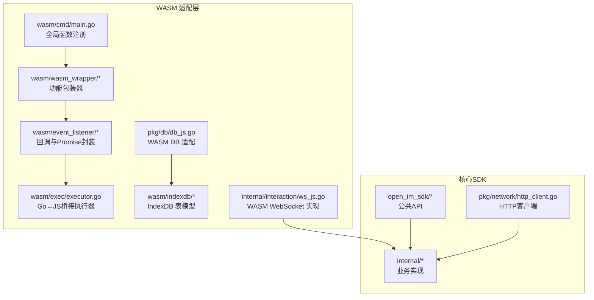
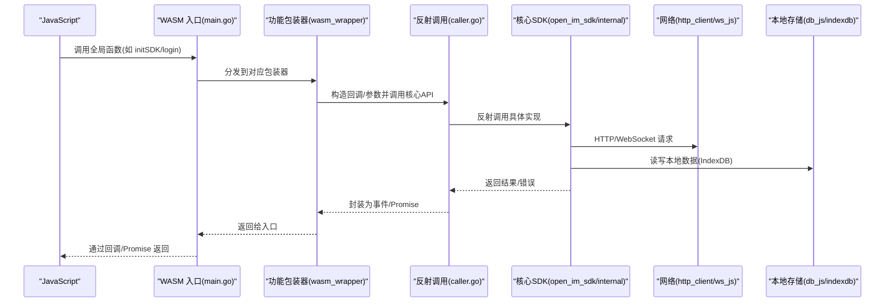
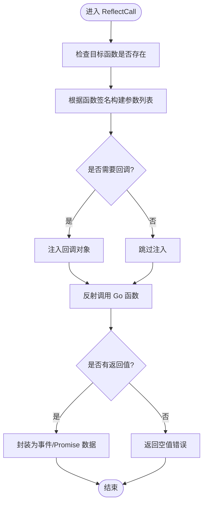
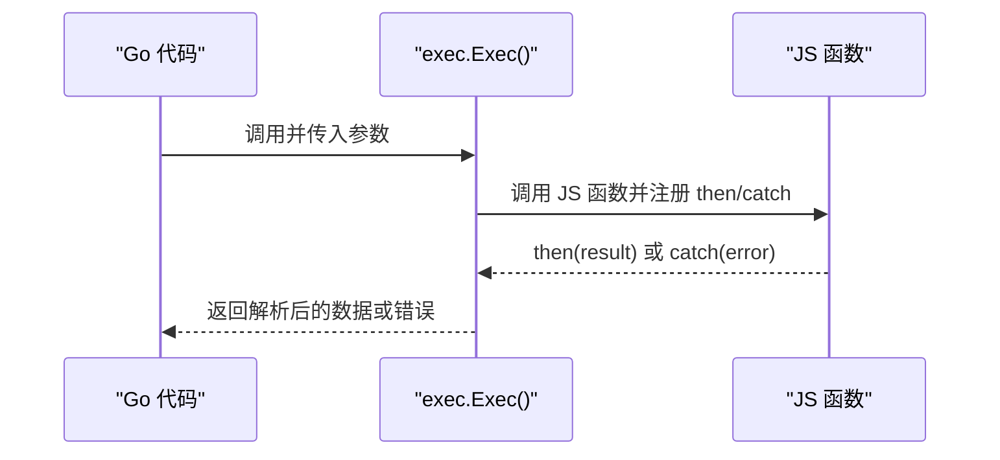
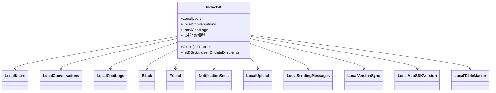
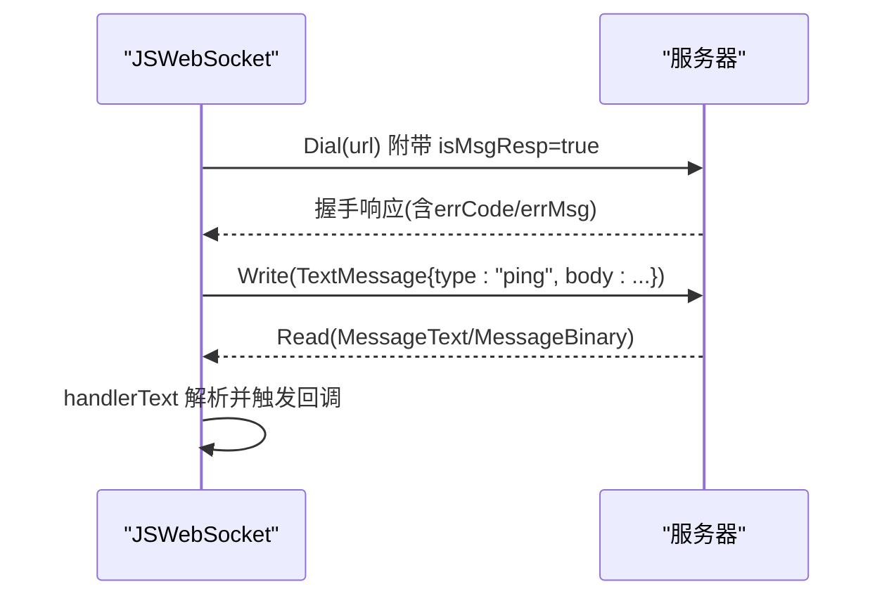
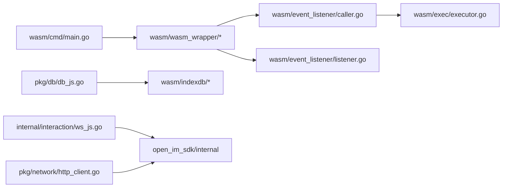
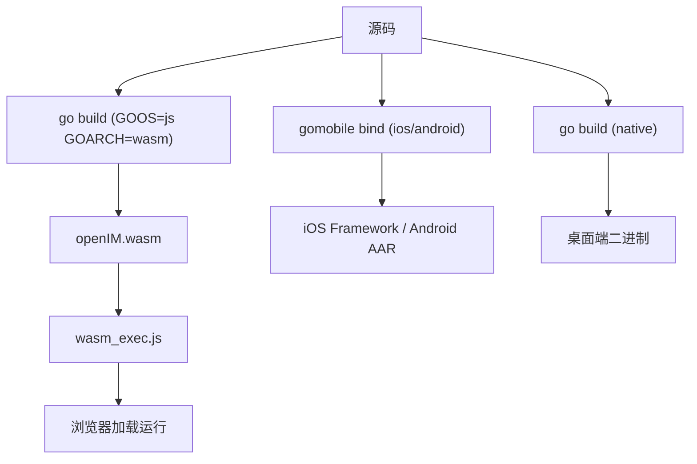

# 跨平台支持

<cite>
**本文引用的文件**
- [README.md](file://README.md)
- [Makefile](file://Makefile)
- [wasm/cmd/main.go](file://wasm/cmd/main.go)
- [wasm/cmd/Makefile](file://wasm/cmd/Makefile)
- [wasm/wasm_wrapper/wasm_init_login.go](file://wasm/wasm_wrapper/wasm_init_login.go)
- [wasm/event_listener/listener.go](file://wasm/event_listener/listener.go)
- [wasm/event_listener/caller.go](file://wasm/event_listener/caller.go)
- [wasm/event_listener/callback_writer.go](file://wasm/event_listener/callback_writer.go)
- [wasm/exec/executor.go](file://wasm/exec/executor.go)
- [pkg/db/db_js.go](file://pkg/db/db_js.go)
- [wasm/indexdb/init.go](file://wasm/indexdb/init.go)
- [internal/interaction/ws_js.go](file://internal/interaction/ws_js.go)
- [pkg/network/http_client.go](file://pkg/network/http_client.go)
</cite>

## 目录
1. [简介](#简介)
2. [项目结构](#项目结构)
3. [核心组件](#核心组件)
4. [架构总览](#架构总览)
5. [详细组件分析](#详细组件分析)
6. [依赖关系分析](#依赖关系分析)
7. [性能与优化](#性能与优化)
8. [构建、打包与部署](#构建打包与部署)
9. [平台适配与限制](#平台适配与限制)
10. [最佳实践与常见问题](#最佳实践与常见问题)
11. [结论](#结论)

## 简介
本文件面向 OpenIM SDK Core 的跨平台能力，重点阐述 WebAssembly（WASM）适配层的实现原理与架构设计，解释 Go 代码到 WASM 的编译过程、JS 绑定生成与调用机制，并覆盖移动端（iOS/Android）、桌面端与浏览器环境的适配策略、构建配置、打包流程与部署建议。同时提供跨平台开发的最佳实践与常见问题解决方案，帮助开发者在不同平台上稳定集成 OpenIM SDK Core。

## 项目结构
OpenIM SDK Core 采用“核心逻辑 + 平台适配”的分层组织方式：
- open_im_sdk/：对外暴露的公共 API 层（初始化登录、会话消息、群组、好友、用户、第三方等）。
- internal/：内部业务实现（网络、同步、消息处理等）。
- pkg/：通用工具与平台无关的基础设施（网络、缓存、数据库接口、版本管理等）。
- wasm/：WebAssembly 平台适配层，负责将核心能力暴露给 JS 调用，包含入口注册、事件回调、执行器、IndexDB 适配等。
- cmd/sdk/：命令行入口（非 WASM 场景）。
- Makefile 与 wasm/cmd/Makefile：多平台构建脚本。



图表来源
- [wasm/cmd/main.go:1-182](file://wasm/cmd/main.go#L1-L182)
- [wasm/wasm_wrapper/wasm_init_login.go:1-134](file://wasm/wasm_wrapper/wasm_init_login.go#L1-L134)
- [wasm/event_listener/listener.go:1-470](file://wasm/event_listener/listener.go#L1-L470)
- [wasm/event_listener/caller.go:1-299](file://wasm/event_listener/caller.go#L1-L299)
- [wasm/event_listener/callback_writer.go:1-155](file://wasm/event_listener/callback_writer.go#L1-L155)
- [wasm/exec/executor.go:1-150](file://wasm/exec/executor.go#L1-L150)
- [pkg/db/db_js.go:1-79](file://pkg/db/db_js.go#L1-L79)
- [wasm/indexdb/init.go:1-66](file://wasm/indexdb/init.go#L1-L66)
- [internal/interaction/ws_js.go:1-238](file://internal/interaction/ws_js.go#L1-L238)
- [pkg/network/http_client.go:1-306](file://pkg/network/http_client.go#L1-L306)

章节来源
- [README.md:1-189](file://README.md#L1-L189)

## 核心组件
- WASM 入口与全局绑定：在 WASM 主程序启动时，通过 syscall/js 将 Go 方法注册为全局 JS 函数，形成 JS→Go 的调用入口。
- 功能包装器（Wrapper）：按模块（初始化登录、会话消息、群组、好友、用户、第三方）对核心 API 进行包装，统一参数解析、错误处理与回调转发。
- 事件监听与回调：定义多种回调类型（连接、会话、消息、群组、好友、用户、自定义业务、信令），将 Go 侧事件转换为 JSON 事件或 Promise 结果回传给 JS。
- 执行器（Executor）：提供 Go 主动调用 JS 的能力，基于 Promise then/catch 模式，统一超时、异常与返回值解析。
- 数据库适配（IndexDB）：在 WASM 环境下以 IndexDB 替代 SQLite，通过 exec 执行器调用 JS 提供的持久化接口。
- 网络适配（WebSocket）：在 WASM 下使用 coder/websocket 实现长连接，封装 ping/pong 心跳与文本消息协议。

章节来源
- [wasm/cmd/main.go:1-182](file://wasm/cmd/main.go#L1-L182)
- [wasm/wasm_wrapper/wasm_init_login.go:1-134](file://wasm/wasm_wrapper/wasm_init_login.go#L1-L134)
- [wasm/event_listener/listener.go:1-470](file://wasm/event_listener/listener.go#L1-L470)
- [wasm/event_listener/caller.go:1-299](file://wasm/event_listener/caller.go#L1-L299)
- [wasm/event_listener/callback_writer.go:1-155](file://wasm/event_listener/callback_writer.go#L1-L155)
- [wasm/exec/executor.go:1-150](file://wasm/exec/executor.go#L1-L150)
- [pkg/db/db_js.go:1-79](file://pkg/db/db_js.go#L1-L79)
- [wasm/indexdb/init.go:1-66](file://wasm/indexdb/init.go#L1-L66)
- [internal/interaction/ws_js.go:1-238](file://internal/interaction/ws_js.go#L1-L238)

## 架构总览
下图展示了从 JS 调用到 Go 核心逻辑，再到网络与本地存储的整体数据流。



图表来源
- [wasm/cmd/main.go:1-182](file://wasm/cmd/main.go#L1-L182)
- [wasm/wasm_wrapper/wasm_init_login.go:1-134](file://wasm/wasm_wrapper/wasm_init_login.go#L1-L134)
- [wasm/event_listener/caller.go:1-299](file://wasm/event_listener/caller.go#L1-L299)
- [pkg/network/http_client.go:1-306](file://pkg/network/http_client.go#L1-L306)
- [internal/interaction/ws_js.go:1-238](file://internal/interaction/ws_js.go#L1-L238)
- [pkg/db/db_js.go:1-79](file://pkg/db/db_js.go#L1-L79)
- [wasm/indexdb/init.go:1-66](file://wasm/indexdb/init.go#L1-L66)

## 详细组件分析

### WASM 入口与全局绑定
- 作用：在 WASM 运行时启动后，注册所有需要被 JS 调用的全局函数，包括初始化登录、会话消息、群组、好友、用户、第三方上传等。
- 关键点：
  - 使用 js.Global().Set 将 Go 方法映射为 JS 全局函数名。
  - 统一通过包装器实例接收参数并调用核心 API。
  - 设置全局事件回调入口，用于异步事件推送。

```mermaid
classDiagram
class Main {
+main()
+registerFunc()
}
class WrapperCommon {
+CommonEventFunc(args) interface{}
}
class WrapperInitLogin {
+InitSDK(args) interface{}
+Login(args) interface{}
+Logout(args) interface{}
+GetLoginStatus(args) interface{}
+SetAppBackgroundStatus(args) interface{}
+NetworkStatusChanged(args) interface{}
}
Main --> WrapperCommon : "创建并注册全局事件回调"
Main --> WrapperInitLogin : "注册初始化登录相关全局函数"
```

图表来源
- [wasm/cmd/main.go:1-182](file://wasm/cmd/main.go#L1-L182)
- [wasm/wasm_wrapper/wasm_init_login.go:1-134](file://wasm/wasm_wrapper/wasm_init_login.go#L1-L134)

章节来源
- [wasm/cmd/main.go:1-182](file://wasm/cmd/main.go#L1-L182)

### 功能包装器与回调体系
- 包装器职责：
  - 解析 JS 传入参数，构造核心 API 所需的回调对象。
  - 通过 event_listener.NewCaller 反射调用 open_im_sdk 中的具体实现。
  - 将结果封装为 Promise 或事件，回传给 JS。
- 回调体系：
  - BaseCallback：基础成功/失败回调。
  - ConnCallback：连接状态变化（连接中、成功、失败、踢下线、token 过期等）。
  - ConversationCallback：会话同步进度、新增/变更、未读数变化、输入状态等。
  - AdvancedMsgCallback：新消息、已读回执、撤回、修改、扩展字段增删改等。
  - FriendCallback/GroupCallback/UserCallback：好友/群组/用户相关事件。
  - CustomBusinessCallback/SignalingCallback：自定义业务与信令事件。

```mermaid
classDiagram
class CallbackWriter {
<<interface>>
+SendMessage()
+SetEvent(event) CallbackWriter
+SetData(data) CallbackWriter
+SetErrCode(code) CallbackWriter
+SetOperationID(id) CallbackWriter
+SetErrMsg(msg) CallbackWriter
+GetOperationID() string
+HandlerFunc(fn) interface{}
}
class EventData {
-callback *js.Value
+SendMessage()
+SetEvent(...)
+SetData(...)
+SetErrCode(...)
+SetOperationID(...)
+SetErrMsg(...)
+GetOperationID() string
}
class PromiseHandler {
-resolve *js.Value
-reject *js.Value
+HandlerFunc(fn) interface{}
+Release()
+SendMessage()
+SetEvent(...)
+SetData(...)
+SetErrCode(...)
+SetOperationID(...)
+SetErrMsg(...)
+GetOperationID() string
}
class BaseCallback
class ConnCallback
class ConversationCallback
class AdvancedMsgCallback
class FriendCallback
class GroupCallback
class UserCallback
class CustomBusinessCallback
class SignalingCallback
CallbackWriter <|.. EventData
CallbackWriter <|.. PromiseHandler
BaseCallback ..|> CallbackWriter
ConnCallback ..|> CallbackWriter
ConversationCallback ..|> CallbackWriter
AdvancedMsgCallback ..|> CallbackWriter
FriendCallback ..|> CallbackWriter
GroupCallback ..|> CallbackWriter
UserCallback ..|> CallbackWriter
CustomBusinessCallback ..|> CallbackWriter
SignalingCallback ..|> CallbackWriter
```

图表来源
- [wasm/event_listener/callback_writer.go:1-155](file://wasm/event_listener/callback_writer.go#L1-L155)
- [wasm/event_listener/listener.go:1-470](file://wasm/event_listener/listener.go#L1-L470)

章节来源
- [wasm/wasm_wrapper/wasm_init_login.go:1-134](file://wasm/wasm_wrapper/wasm_init_login.go#L1-L134)
- [wasm/event_listener/listener.go:1-470](file://wasm/event_listener/listener.go#L1-L470)
- [wasm/event_listener/callback_writer.go:1-155](file://wasm/event_listener/callback_writer.go#L1-L155)

### 反射调用与参数转换
- 反射调用（ReflectCall）：
  - 根据目标函数签名动态组装参数，支持字符串、整型、布尔、指针（ArrayBuffer）等类型。
  - 自动注入回调对象作为第一个参数（当目标函数需要回调时）。
  - 支持同步调用与异步调用（带 Promise 返回）。
- 错误处理：
  - 捕获 panic 并转换为错误信息，通过回调或 Promise reject 返回。
  - 统一操作 ID 记录，便于追踪。



图表来源
- [wasm/event_listener/caller.go:1-299](file://wasm/event_listener/caller.go#L1-L299)

章节来源
- [wasm/event_listener/caller.go:1-299](file://wasm/event_listener/caller.go#L1-L299)

### Go↔JS 执行器（Executor）
- 作用：
  - 提供 Go 主动调用 JS 函数的能力，基于 Promise then/catch 模式。
  - 统一超时控制、异常捕获与返回值解析。
- 关键特性：
  - 自动提取调用者函数名，便于日志与调试。
  - 支持 JSON 结构化返回与 ArrayBuffer 字节数组拷贝。
  - 超时时间固定，避免阻塞等待。



图表来源
- [wasm/exec/executor.go:1-150](file://wasm/exec/executor.go#L1-L150)

章节来源
- [wasm/exec/executor.go:1-150](file://wasm/exec/executor.go#L1-L150)

### 本地存储适配（IndexDB）
- 适配策略：
  - 在 WASM 环境下，通过 pkg/db/db_js.go 将数据库接口指向 wasm/indexdb 的实现。
  - 使用 exec 执行器调用 JS 提供的 IndexDB 操作（打开、读取、写入、关闭等）。
- 注意事项：
  - 字段命名约定：SQL 生成使用 snake_case，JSON 标签使用 camelCase，需做映射转换。
  - 布尔类型在 SQLite 中以整数表示，GORM 自动转换。
  - map 类型需序列化为 JSON 字符串。



图表来源
- [pkg/db/db_js.go:1-79](file://pkg/db/db_js.go#L1-L79)
- [wasm/indexdb/init.go:1-66](file://wasm/indexdb/init.go#L1-L66)

章节来源
- [pkg/db/db_js.go:1-79](file://pkg/db/db_js.go#L1-L79)
- [wasm/indexdb/init.go:1-66](file://wasm/indexdb/init.go#L1-L66)

### 网络适配（WebSocket）
- 实现要点：
  - 使用 coder/websocket 库建立长连接，封装 TextMessage 协议（type/body）。
  - 支持 ping/pong 心跳，自定义状态码用于网络状态变化通知。
  - 在 Dial 阶段附加 isMsgResp=true 查询参数，并在握手后读取初始响应。
- 适用环境：
  - 浏览器与 WASM 环境，遵循同源策略与 CORS 配置。



图表来源
- [internal/interaction/ws_js.go:1-238](file://internal/interaction/ws_js.go#L1-L238)

章节来源
- [internal/interaction/ws_js.go:1-238](file://internal/interaction/ws_js.go#L1-L238)

## 依赖关系分析
- 模块耦合：
  - wasm/cmd/main.go 依赖 wasm/wasm_wrapper 各模块，负责全局函数注册。
  - wasm/wasm_wrapper 依赖 open_im_sdk 与 wasm/event_listener，完成参数解析与回调封装。
  - wasm/event_listener 依赖 wasm/exec 与 pkg/utils，实现 Go↔JS 双向通信。
  - pkg/db/db_js.go 依赖 wasm/exec 与 wasm/indexdb，提供 IndexDB 适配。
  - internal/interaction/ws_js.go 依赖 coder/websocket，提供 WASM 下的 WebSocket 实现。
  - pkg/network/http_client.go 提供统一的 HTTP 客户端，供核心逻辑调用。



图表来源
- [wasm/cmd/main.go:1-182](file://wasm/cmd/main.go#L1-L182)
- [wasm/wasm_wrapper/wasm_init_login.go:1-134](file://wasm/wasm_wrapper/wasm_init_login.go#L1-L134)
- [wasm/event_listener/caller.go:1-299](file://wasm/event_listener/caller.go#L1-L299)
- [wasm/event_listener/listener.go:1-470](file://wasm/event_listener/listener.go#L1-L470)
- [wasm/exec/executor.go:1-150](file://wasm/exec/executor.go#L1-L150)
- [pkg/db/db_js.go:1-79](file://pkg/db/db_js.go#L1-L79)
- [wasm/indexdb/init.go:1-66](file://wasm/indexdb/init.go#L1-L66)
- [internal/interaction/ws_js.go:1-238](file://internal/interaction/ws_js.go#L1-L238)
- [pkg/network/http_client.go:1-306](file://pkg/network/http_client.go#L1-L306)

章节来源
- [wasm/cmd/main.go:1-182](file://wasm/cmd/main.go#L1-L182)
- [wasm/wasm_wrapper/wasm_init_login.go:1-134](file://wasm/wasm_wrapper/wasm_init_login.go#L1-L134)
- [wasm/event_listener/caller.go:1-299](file://wasm/event_listener/caller.go#L1-L299)
- [wasm/event_listener/listener.go:1-470](file://wasm/event_listener/listener.go#L1-L470)
- [wasm/exec/executor.go:1-150](file://wasm/exec/executor.go#L1-L150)
- [pkg/db/db_js.go:1-79](file://pkg/db/db_js.go#L1-L79)
- [wasm/indexdb/init.go:1-66](file://wasm/indexdb/init.go#L1-L66)
- [internal/interaction/ws_js.go:1-238](file://internal/interaction/ws_js.go#L1-L238)
- [pkg/network/http_client.go:1-306](file://pkg/network/http_client.go#L1-L306)

## 性能与优化
- 网络层：
  - HTTP 客户端默认启用 gzip 压缩，减少带宽占用。
  - WebSocket 使用 coder/websocket，支持二进制与文本消息，合理设置读/写超时。
- 本地存储：
  - IndexDB 适合键值与轻量结构化数据存储，注意批量写入与索引设计。
  - 大对象建议分片上传与哈希校验，避免单次传输过大。
- 回调与事件：
  - 使用 Promise 与事件通道解耦，避免阻塞主线程。
  - 统一操作 ID 与错误码，便于性能监控与问题定位。

[本节为通用指导，不直接分析具体文件]

## 构建、打包与部署
- WebAssembly 构建：
  - 根级 Makefile 提供 build-wasm 目标，输出 openIM.wasm。
  - wasm/cmd/Makefile 提供 wasm 与 build 目标，支持复制 wasm_exec.js 并启动静态服务。
- iOS/Android 构建：
  - 使用 gomobile bind 生成 iOS Framework 与 Android AAR。
  - 指定 GOARCH 与 target，开启 trimpath 与 LDFLAGS 优化体积。
- 桌面端：
  - 通过 go build 直接编译原生二进制，或使用仓库提供的多平台构建目标。



图表来源
- [Makefile:170-173](file://Makefile#L170-L173)
- [wasm/cmd/Makefile:1-18](file://wasm/cmd/Makefile#L1-L18)
- [Makefile:186-198](file://Makefile#L186-L198)

章节来源
- [Makefile:170-173](file://Makefile#L170-L173)
- [wasm/cmd/Makefile:1-18](file://wasm/cmd/Makefile#L1-L18)
- [Makefile:186-198](file://Makefile#L186-L198)

## 平台适配与限制
- 浏览器环境：
  - 必须引入 wasm_exec.js，确保同源策略与 CORS 正确配置。
  - 使用 fetch 或 XMLHttpRequest 访问后端 API，注意 token 与 operationID 头。
  - 本地存储使用 IndexDB，避免使用文件系统 API。
- 移动端（iOS/Android）：
  - 通过 gomobile 生成的框架/AAR 集成，注意 CGO 与 NDK 环境。
  - 网络与存储由原生层提供适配，WASM 路径不适用。
- 桌面端：
  - 原生二进制可直接访问文件系统与系统网络栈，无需 WASM 适配。

[本节为通用指导，不直接分析具体文件]

## 最佳实践与常见问题
- 最佳实践：
  - 统一操作 ID 与错误码，便于全链路追踪。
  - 大文件上传采用分片与哈希校验，结合进度回调提升用户体验。
  - 合理设置网络超时与重试策略，增强弱网稳定性。
- 常见问题：
  - JS 调用超时：检查 JS 侧 Promise 是否正确 resolve/reject。
  - 类型不匹配：确保 JS 参数类型与 Go 函数签名一致（字符串、整型、布尔、ArrayBuffer）。
  - IndexDB 字段映射：注意 snake_case 与 camelCase 的转换规则。
  - WebSocket 握手失败：确认 isMsgResp 参数与服务端响应格式。

[本节为通用指导，不直接分析具体文件]

## 结论
OpenIM SDK Core 通过清晰的模块化设计与完善的 WASM 适配层，实现了在浏览器、移动端与桌面端的跨平台支持。WASM 适配层以全局函数注册、反射调用、事件回调与执行器为核心，结合 IndexDB 与 WebSocket 的平台特定实现，确保了核心逻辑的一致性与可移植性。配合完善的构建脚本与打包流程，开发者可以高效地在不同平台上集成与部署 OpenIM SDK Core。