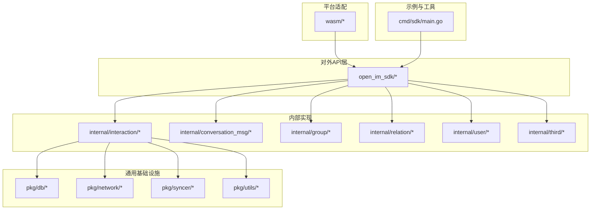
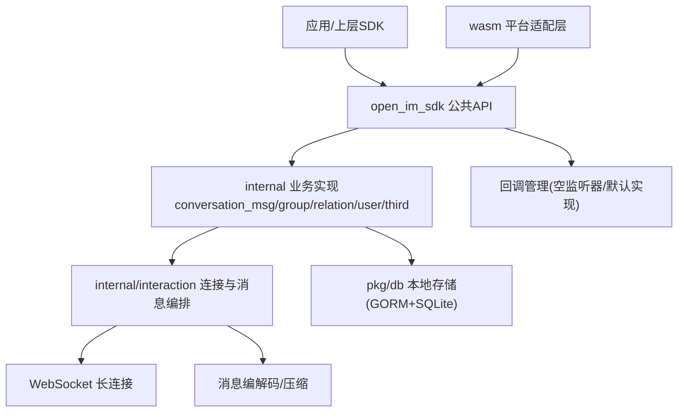
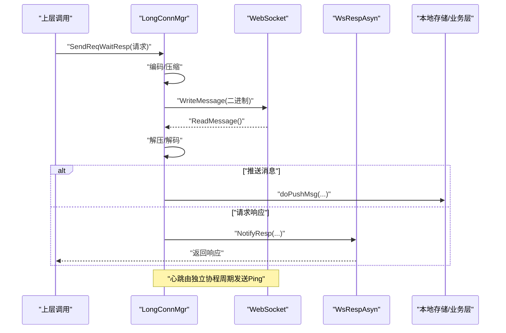
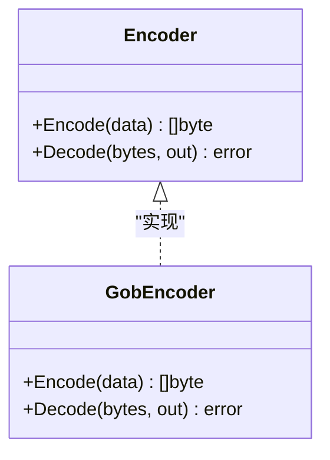
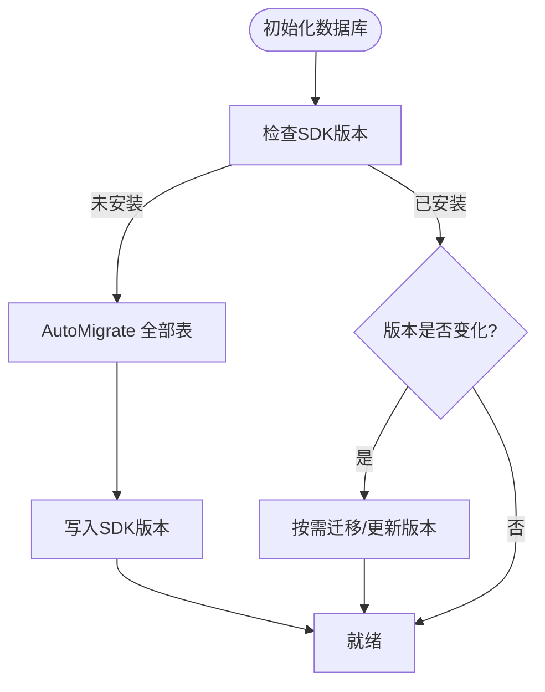
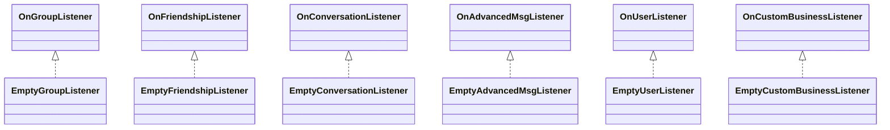
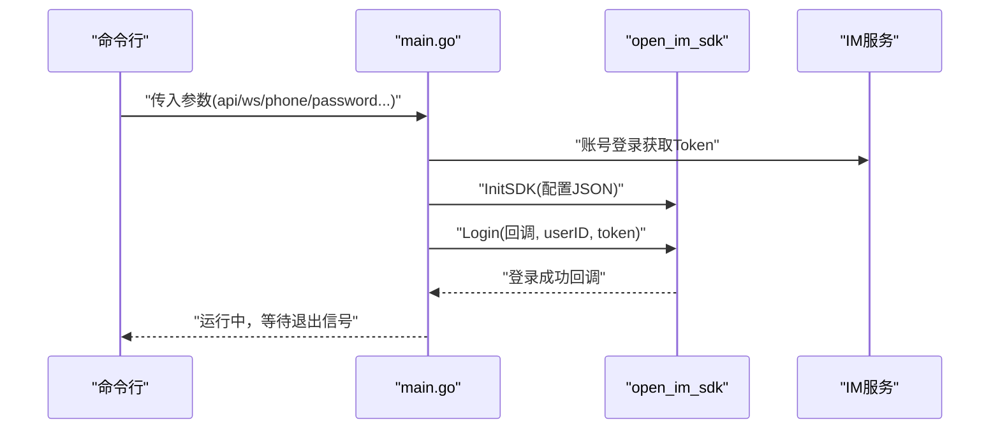
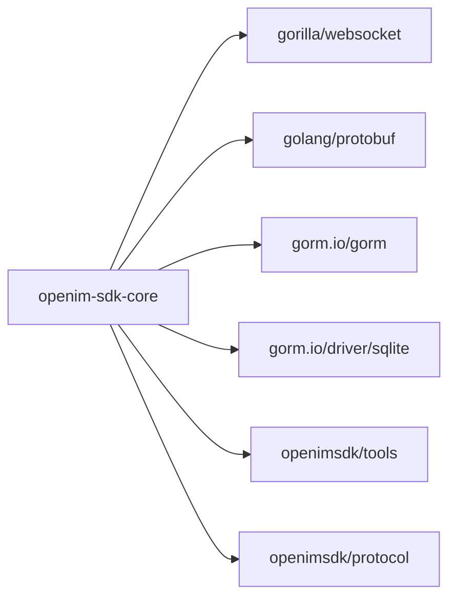

# 项目介绍与价值定位

<cite>
**本文引用的文件**   
- [README.md](file://README.md)
- [go.mod](file://go.mod)
- [cmd/sdk/main.go](file://cmd/sdk/main.go)
- [open_im_sdk/em.go](file://open_im_sdk/em.go)
- [internal/interaction/long_conn_mgr.go](file://internal/interaction/long_conn_mgr.go)
- [internal/interaction/encoder.go](file://internal/interaction/encoder.go)
- [pkg/db/db_init.go](file://pkg/db/db_init.go)
- [pkg/db/model_struct/data_model_struct.go](file://pkg/db/model_struct/data_model_struct.go)
</cite>

## 目录
1. [引言](#引言)
2. [项目结构](#项目结构)
3. [核心组件](#核心组件)
4. [架构总览](#架构总览)
5. [详细组件分析](#详细组件分析)
6. [依赖分析](#依赖分析)
7. [性能考量](#性能考量)
8. [故障排查指南](#故障排查指南)
9. [结论](#结论)

## 引言
OpenIM SDK Core 是 OpenIM 跨平台 IM SDK 的核心基础层，采用 Go 语言实现。所有开源的 OpenIM SDK（除 mini web）均基于此核心构建，统一提供一致、稳定且可无缝跨平台集成的能力，覆盖 iOS、Android、PC 与 Web（WebAssembly）。其核心价值在于：
- 作为“唯一事实来源”的基础层，确保多端行为一致性与稳定性
- 抽象网络、消息、存储、同步、回调等通用能力，屏蔽平台差异
- 通过清晰的模块边界与接口契约，支撑上层各平台 SDK 快速演进

本章节为概念性介绍，不直接分析具体代码文件。

## 项目结构
仓库采用“对外 API 层 + 内部实现 + 平台适配”的分层组织方式：
- open_im_sdk：对外暴露的公共 API 层（初始化、登录、会话消息、群组、关系、用户、第三方服务等）
- internal：内部业务实现（交互、会话消息、群组、关系、用户、第三方等）
- pkg：通用工具与基础设施（数据库、缓存、上下文、常量、错误码、版本、HTTP 客户端等）
- wasm：WebAssembly 平台适配层，将核心能力暴露给 JS 调用
- cmd/sdk：本地联调入口，便于快速验证 SDK 功能

图表来源
- [cmd/sdk/main.go:114-170](file://cmd/sdk/main.go#L114-L170)
- [open_im_sdk/em.go:1-245](file://open_im_sdk/em.go#L1-L245)

章节来源
- [README.md:30-54](file://README.md#L30-L54)
- [go.mod:1-41](file://go.mod#L1-L41)

## 核心组件
- 网络管理与智能心跳
  - 负责 WebSocket 长连接管理、心跳保活、断线重连、消息收发与响应等待、在线状态订阅等
- 消息编解码
  - 对请求/响应进行编码与压缩，支持二进制协议传输
- 本地消息存储
  - 使用 GORM + SQLite 持久化消息、会话、关系、通知序列等数据，并维护版本迁移
- 关系数据同步
  - 好友、黑名单、群组及成员等关系数据的增量/全量同步
- IM 消息同步
  - 会话消息的增量拉取、离线补发、已读回执、撤回、编辑等
- 跨平台通信与回调管理
  - 统一的回调接口与空实现监听器，保证不同平台接入体验一致

章节来源
- [internal/interaction/long_conn_mgr.go:85-156](file://internal/interaction/long_conn_mgr.go#L85-L156)
- [internal/interaction/encoder.go:23-51](file://internal/interaction/encoder.go#L23-L51)
- [pkg/db/db_init.go:98-168](file://pkg/db/db_init.go#L98-L168)
- [pkg/db/model_struct/data_model_struct.go:172-223](file://pkg/db/model_struct/data_model_struct.go#L172-L223)
- [open_im_sdk/em.go:123-208](file://open_im_sdk/em.go#L123-L208)

## 架构总览
OpenIM SDK Core 的整体架构围绕“连接层—业务层—存储层—平台适配层”展开。连接层负责与服务器建立并维护 WebSocket 长连接；业务层封装会话、群组、关系、用户等能力；存储层提供本地持久化；平台适配层（WASM）将核心能力桥接到 JS 环境。

图表来源
- [internal/interaction/long_conn_mgr.go:138-171](file://internal/interaction/long_conn_mgr.go#L138-L171)
- [internal/interaction/encoder.go:23-51](file://internal/interaction/encoder.go#L23-L51)
- [pkg/db/db_init.go:113-168](file://pkg/db/db_init.go#L113-L168)
- [open_im_sdk/em.go:123-208](file://open_im_sdk/em.go#L123-L208)

## 详细组件分析

### 网络连接与心跳管理（LongConnMgr）
- 职责
  - 维护 WebSocket 连接生命周期（连接、读写、关闭）
  - 周期性发送心跳，保障连接存活
  - 处理服务端推送、踢下线、退出等事件
  - 管理上行消息的发送与响应等待
  - 维护用户在线状态订阅
- 关键流程
  - 启动后分派 readPump/writePump/heartbeat 三个协程
  - 读取消息后进行解压、解码与路由分发
  - 写入消息前进行编码与可选压缩，带超时控制
  - 心跳定时发送 Ping，配合 ReadDeadline 检测对端存活
  - 收到特定标识的消息时触发对应逻辑（如推送消息、退出、踢下线、在线状态变更）

图表来源
- [internal/interaction/long_conn_mgr.go:178-211](file://internal/interaction/long_conn_mgr.go#L178-L211)
- [internal/interaction/long_conn_mgr.go:219-283](file://internal/interaction/long_conn_mgr.go#L219-L283)
- [internal/interaction/long_conn_mgr.go:436-466](file://internal/interaction/long_conn_mgr.go#L436-L466)
- [internal/interaction/long_conn_mgr.go:649-711](file://internal/interaction/long_conn_mgr.go#L649-L711)

章节来源
- [internal/interaction/long_conn_mgr.go:85-156](file://internal/interaction/long_conn_mgr.go#L85-L156)
- [internal/interaction/long_conn_mgr.go:138-171](file://internal/interaction/long_conn_mgr.go#L138-L171)
- [internal/interaction/long_conn_mgr.go:219-283](file://internal/interaction/long_conn_mgr.go#L219-L283)
- [internal/interaction/long_conn_mgr.go:436-466](file://internal/interaction/long_conn_mgr.go#L436-L466)
- [internal/interaction/long_conn_mgr.go:649-711](file://internal/interaction/long_conn_mgr.go#L649-L711)

### 消息编解码（Encoder/Compressor）
- 职责
  - 定义统一的编码接口，当前实现基于 gob 序列化
  - 在发送路径进行压缩，接收路径进行解压，降低带宽占用
- 关键点
  - 编码失败或解码异常会包装错误并向上返回
  - 与连接层紧密协作，确保二进制协议一致性

图表来源
- [internal/interaction/encoder.go:23-51](file://internal/interaction/encoder.go#L23-L51)

章节来源
- [internal/interaction/encoder.go:23-51](file://internal/interaction/encoder.go#L23-L51)

### 本地消息存储（DB + 模型）
- 职责
  - 初始化 SQLite 数据库，按用户隔离数据文件
  - 自动迁移表结构，记录 SDK 版本，支持升级迁移
  - 提供消息、会话、关系、上传等实体模型
- 关键点
  - 连接池参数可控，日志级别可调
  - 首次安装或版本变化时执行 AutoMigrate，保证向后兼容

图表来源
- [pkg/db/db_init.go:113-168](file://pkg/db/db_init.go#L113-L168)
- [pkg/db/db_init.go:170-213](file://pkg/db/db_init.go#L170-L213)
- [pkg/db/model_struct/data_model_struct.go:172-223](file://pkg/db/model_struct/data_model_struct.go#L172-L223)

章节来源
- [pkg/db/db_init.go:98-168](file://pkg/db/db_init.go#L98-L168)
- [pkg/db/db_init.go:170-213](file://pkg/db/db_init.go#L170-L213)
- [pkg/db/model_struct/data_model_struct.go:172-223](file://pkg/db/model_struct/data_model_struct.go#L172-L223)

### 回调管理与空监听器
- 职责
  - 为群组、好友、会话、消息、用户、自定义业务等场景提供统一回调接口
  - 提供空实现监听器，避免上层必须实现所有回调，简化接入
- 关键点
  - 空实现中仅记录告警日志，不影响主流程
  - 上层可按需替换为真实监听器以处理业务事件

图表来源
- [open_im_sdk/em.go:27-77](file://open_im_sdk/em.go#L27-L77)
- [open_im_sdk/em.go:79-122](file://open_im_sdk/em.go#L79-L122)
- [open_im_sdk/em.go:123-161](file://open_im_sdk/em.go#L123-L161)
- [open_im_sdk/em.go:163-208](file://open_im_sdk/em.go#L163-L208)
- [open_im_sdk/em.go:218-244](file://open_im_sdk/em.go#L218-L244)

章节来源
- [open_im_sdk/em.go:27-244](file://open_im_sdk/em.go#L27-L244)

### 快速启动与集成示例（cmd/sdk）
- 作用
  - 提供本地联调入口，模拟应用初始化、登录与连接
  - 通过命令行参数配置 API/WSS 地址、账号信息、数据目录与日志级别
- 典型流程
  - 解析参数 → 获取 Token → 初始化 SDK → 登录 → 等待信号退出

图表来源
- [cmd/sdk/main.go:114-170](file://cmd/sdk/main.go#L114-L170)

章节来源
- [cmd/sdk/main.go:114-170](file://cmd/sdk/main.go#L114-L170)

## 依赖分析
- 运行时依赖
  - WebSocket 库：gorilla/websocket、coder/websocket
  - 序列化：golang/protobuf、google.golang.org/protobuf
  - 数据库：gorm.io/gorm、gorm.io/driver/sqlite
  - 工具与协议：github.com/openimsdk/tools、github.com/openimsdk/protocol
- 设计要点
  - 通过 go.mod 明确版本约束，保持生态一致性
  - 核心能力与外部依赖解耦，便于替换与测试

图表来源
- [go.mod:1-41](file://go.mod#L1-L41)

章节来源
- [go.mod:1-41](file://go.mod#L1-L41)

## 性能考量
- 连接与心跳
  - 合理设置写超时、读超时与心跳周期，避免频繁重连与资源泄露
- 编解码与压缩
  - 启用压缩可降低带宽占用，但需权衡 CPU 开销；建议根据网络环境与设备能力动态调整
- 数据库
  - 控制连接池大小与空闲时间，避免过多并发导致锁竞争
  - 利用索引字段（如会话最新时间、消息类型、发送时间等）提升查询效率
- 消息排序与批量
  - 对有序消息采用队列与超时兜底策略，防止死锁与阻塞
- 回调与日志
  - 空监听器仅记录告警日志，生产环境建议按需开启更细粒度日志

[本节为通用指导，不直接分析具体文件]

## 故障排查指南
- 连接问题
  - 检查 API/WSS 地址与 Token 是否正确
  - 观察心跳与重连日志，确认网络连通性与防火墙策略
- 消息丢失或乱序
  - 核对有序消息的 lane 与 seq 策略，关注超时与跳号处理
  - 检查编解码与压缩链路是否出现异常
- 本地存储异常
  - 查看数据库文件路径与权限，确认 AutoMigrate 是否成功
  - 对比 SDK 版本与迁移脚本，必要时清理旧数据重新初始化
- 回调未触发
  - 确认上层是否注册了对应监听器，空实现不会执行业务逻辑

章节来源
- [internal/interaction/long_conn_mgr.go:219-283](file://internal/interaction/long_conn_mgr.go#L219-L283)
- [internal/interaction/long_conn_mgr.go:649-711](file://internal/interaction/long_conn_mgr.go#L649-L711)
- [pkg/db/db_init.go:113-168](file://pkg/db/db_init.go#L113-L168)
- [open_im_sdk/em.go:123-208](file://open_im_sdk/em.go#L123-L208)

## 结论
OpenIM SDK Core 作为跨平台 IM SDK 的统一基础层，通过清晰的分层与稳定的接口契约，为多端 SDK 提供一致的网络、消息、存储与同步能力。其智能心跳、消息编解码、本地持久化、关系与消息同步、跨平台回调管理等特性，共同保障了端到端的可靠性与可扩展性。对于初学者而言，理解这些核心组件的职责与交互，有助于快速上手并高效集成到各类平台应用中。