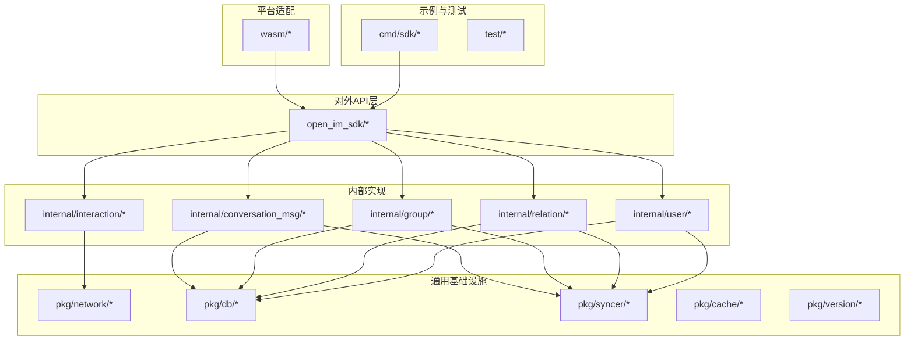
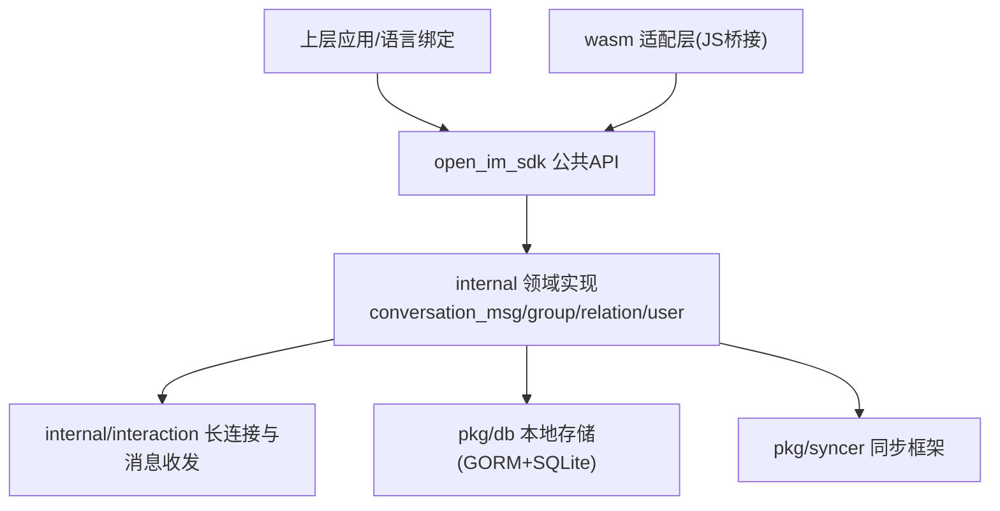
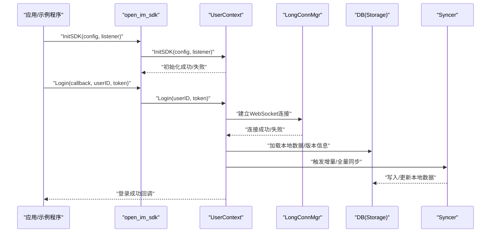
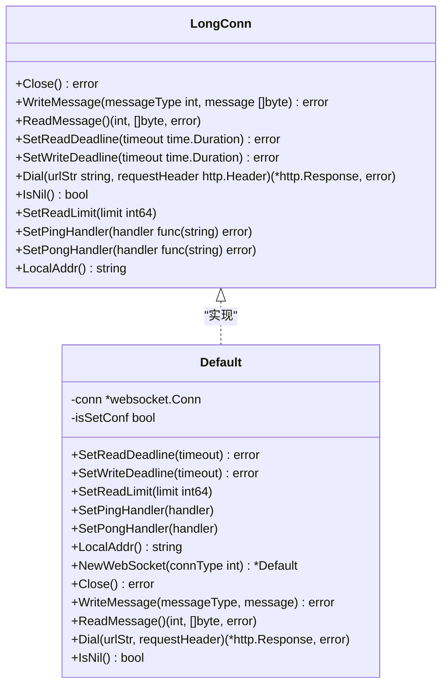
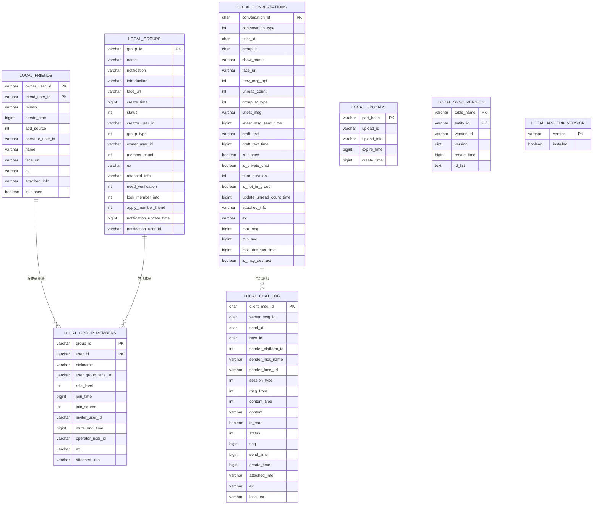
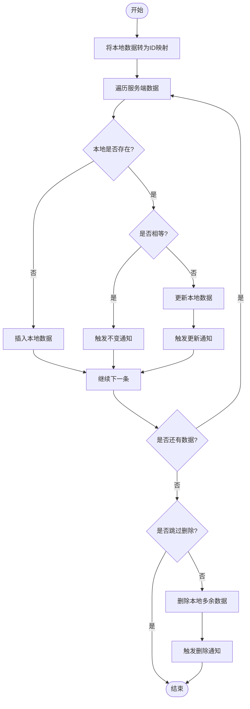
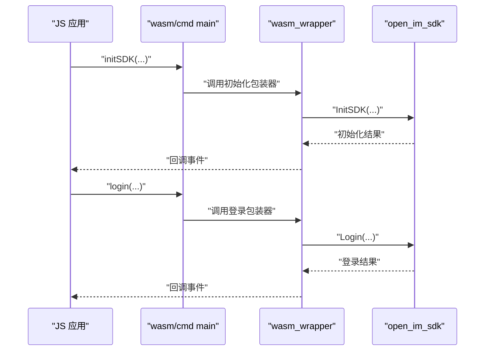
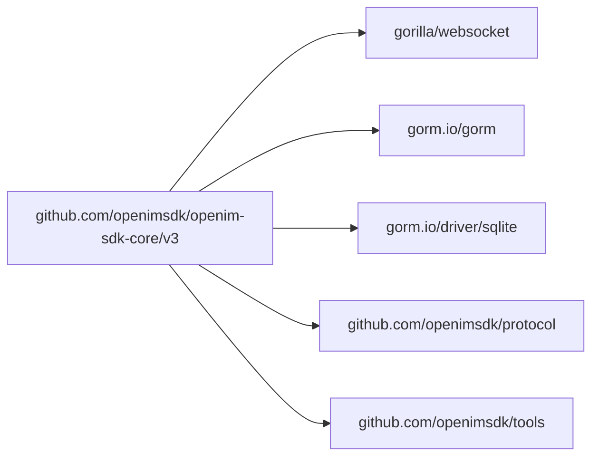

# 项目概述

<cite>
**本文引用的文件列表**
- [README.md](file://README.md)
- [go.mod](file://go.mod)
- [cmd/sdk/main.go](file://cmd/sdk/main.go)
- [open_im_sdk/em.go](file://open_im_sdk/em.go)
- [open_im_sdk/init_login.go](file://open_im_sdk/init_login.go)
- [internal/interaction/long_connection.go](file://internal/interaction/long_connection.go)
- [internal/interaction/ws_default.go](file://internal/interaction/ws_default.go)
- [pkg/db/db_init.go](file://pkg/db/db_init.go)
- [pkg/syncer/syncer.go](file://pkg/syncer/syncer.go)
- [wasm/cmd/main.go](file://wasm/cmd/main.go)
- [pkg/db/model_struct/data_model_struct.go](file://pkg/db/model_struct/data_model_struct.go)
</cite>

## 目录
1. [简介](#简介)
2. [项目结构](#项目结构)
3. [核心组件](#核心组件)
4. [架构总览](#架构总览)
5. [详细组件分析](#详细组件分析)
6. [依赖关系分析](#依赖关系分析)
7. [性能考量](#性能考量)
8. [故障排查指南](#故障排查指南)
9. [结论](#结论)
10. [附录：快速开始](#附录快速开始)

## 简介
OpenIM SDK Core 是 OpenIM 跨平台 IM SDK 的核心基础层，所有开源 OpenIM SDK（除 mini web）均基于此构建。它提供统一的网络管理、消息编解码、本地存储与关系同步等能力，支撑 iOS、Android、PC、Web（WASM）等多端一致体验。作为“一次实现、多端复用”的基石，Core 屏蔽了底层平台差异，对外暴露稳定一致的 API，并通过回调机制将事件统一回传给上层应用或语言绑定层。

核心价值与定位
- 跨平台基础层：Go 实现，通过原生封装与 WASM 适配，覆盖移动端、桌面端与浏览器端。
- 一致性保障：统一的协议、数据模型与同步策略，确保各端行为一致。
- 高内聚低耦合：以模块划分职责（网络、存储、同步、业务域），便于扩展与维护。
- 可观测与可调试：完善的日志与错误码体系，便于问题定位与性能优化。

支持平台
- Windows、macOS、Linux
- iOS、Android
- Web（WebAssembly）
- Mini Web 不在当前范围

关键特性
- 智能心跳与长连接管理
- 消息编码/解码与发送队列
- 本地消息与关系数据存储（SQLite/GORM）
- 增量/全量数据同步框架
- 跨平台通信与回调管理

章节来源
- [README.md:30-53](file://README.md#L30-L53)

## 项目结构
整体采用分层与按领域划分的组织方式：
- open_im_sdk：对外公共 API 层（初始化、登录、会话消息、群组、好友关系、用户、第三方能力等）
- internal：内部业务实现（会话消息、群组、关系、交互网络、用户等）
- pkg：通用基础设施（网络、数据库、缓存、版本、工具等）
- wasm：WebAssembly 平台适配层，将核心能力暴露给 JS 调用
- cmd：示例与联调入口程序
- test：测试用例与模拟环境

图表来源
- [open_im_sdk/em.go:1-245](file://open_im_sdk/em.go#L1-L245)
- [internal/interaction/long_connection.go:1-62](file://internal/interaction/long_connection.go#L1-L62)
- [pkg/db/db_init.go:1-214](file://pkg/db/db_init.go#L1-L214)
- [pkg/syncer/syncer.go:1-380](file://pkg/syncer/syncer.go#L1-L380)
- [wasm/cmd/main.go:1-182](file://wasm/cmd/main.go#L1-L182)
- [cmd/sdk/main.go:1-209](file://cmd/sdk/main.go#L1-L209)

章节来源
- [README.md:1-24](file://README.md#L1-L24)
- [go.mod:1-41](file://go.mod#L1-L41)

## 核心组件
- 初始化与登录
  - InitSDK：解析配置、初始化日志、校验参数并启动上下文；对外暴露统一入口。
  - Login/Logout：完成鉴权、建立长连接、触发后续同步流程。
- 网络与长连接
  - LongConn 接口抽象 WebSocket 能力，默认实现使用 gorilla/websocket，支持读写超时、Ping/Pong、读限制等。
  - 心跳与重连由交互层统一管理，保证连接健壮性。
- 本地存储
  - 基于 GORM + SQLite，按用户维度生成独立数据库文件，自动迁移表结构，维护版本信息。
  - 模型涵盖好友、群组、成员、聊天日志、会话、上传、版本同步等。
- 数据同步
  - Syncer 泛型同步器，提供插入、更新、删除、通知、分页拉取与全量同步能力，被关系与消息同步广泛复用。
- 回调与监听
  - 空监听器实现为默认无操作回调，避免上层未注册监听导致崩溃；具体业务在对应模块注入真实监听。
- WebAssembly 适配
  - 将核心 API 暴露到 JS 全局，供浏览器端直接调用，包括会话消息、群组、好友、用户与第三方能力。

章节来源
- [open_im_sdk/init_login.go:44-84](file://open_im_sdk/init_login.go#L44-L84)
- [internal/interaction/long_connection.go:24-61](file://internal/interaction/long_connection.go#L24-L61)
- [internal/interaction/ws_default.go:26-87](file://internal/interaction/ws_default.go#L26-L87)
- [pkg/db/db_init.go:98-168](file://pkg/db/db_init.go#L98-L168)
- [pkg/syncer/syncer.go:40-69](file://pkg/syncer/syncer.go#L40-L69)
- [open_im_sdk/em.go:123-161](file://open_im_sdk/em.go#L123-L161)
- [wasm/cmd/main.go:40-181](file://wasm/cmd/main.go#L40-L181)

## 架构总览
OpenIM SDK Core 采用“API 层 + 领域实现 + 基础设施 + 平台适配”的分层架构。API 层仅暴露稳定接口，内部实现负责业务编排，基础设施提供网络、存储、同步等通用能力，平台适配层负责与宿主环境（如浏览器）交互。

图表来源
- [open_im_sdk/init_login.go:98-139](file://open_im_sdk/init_login.go#L98-L139)
- [internal/interaction/long_connection.go:24-61](file://internal/interaction/long_connection.go#L24-L61)
- [pkg/db/db_init.go:113-168](file://pkg/db/db_init.go#L113-L168)
- [pkg/syncer/syncer.go:240-345](file://pkg/syncer/syncer.go#L240-L345)
- [wasm/cmd/main.go:40-181](file://wasm/cmd/main.go#L40-L181)

## 详细组件分析

### 初始化与登录流程
- 初始化阶段
  - 解析 JSON 配置，校验平台 ID、API/WS 地址格式，初始化日志系统，创建上下文。
  - 调用 UserContext.InitSDK 完成内部资源准备。
- 登录阶段
  - 调用 Login 完成鉴权，建立长连接，进入在线状态。
  - 后台触发各类数据的增量/全量同步。

图表来源
- [open_im_sdk/init_login.go:44-84](file://open_im_sdk/init_login.go#L44-L84)
- [open_im_sdk/init_login.go:98-139](file://open_im_sdk/init_login.go#L98-L139)
- [pkg/db/db_init.go:113-168](file://pkg/db/db_init.go#L113-L168)
- [pkg/syncer/syncer.go:240-345](file://pkg/syncer/syncer.go#L240-L345)

章节来源
- [open_im_sdk/init_login.go:44-84](file://open_im_sdk/init_login.go#L44-L84)
- [open_im_sdk/init_login.go:98-139](file://open_im_sdk/init_login.go#L98-L139)

### 网络与长连接
- 接口抽象
  - LongConn 定义连接生命周期、读写、超时、Ping/Pong、读限制等能力。
- 默认实现
  - 基于 gorilla/websocket，提供 Dial、WriteMessage、ReadMessage、SetReadDeadline、SetWriteDeadline、SetPingHandler、SetPongHandler 等方法。
- 设计要点
  - 通过 SetReadLimit 控制单条消息大小，防止内存压力。
  - 通过 Ping/Pong 维持心跳，配合上层重连逻辑提升稳定性。

图表来源
- [internal/interaction/long_connection.go:24-61](file://internal/interaction/long_connection.go#L24-L61)
- [internal/interaction/ws_default.go:26-87](file://internal/interaction/ws_default.go#L26-L87)

章节来源
- [internal/interaction/long_connection.go:24-61](file://internal/interaction/long_connection.go#L24-L61)
- [internal/interaction/ws_default.go:26-87](file://internal/interaction/ws_default.go#L26-L87)

### 本地存储与数据模型
- 初始化与迁移
  - 根据用户 ID 与 SDK 大版本号生成数据库文件名，设置连接池参数，执行 AutoMigrate 建表。
  - 记录并比较 SDK 版本，必要时进行增量迁移。
- 数据模型
  - 包含好友、群组、成员、聊天日志、会话、上传、版本同步等实体，字段与索引满足常见查询场景。

图表来源
- [pkg/db/model_struct/data_model_struct.go:24-322](file://pkg/db/model_struct/data_model_struct.go#L24-L322)
- [pkg/db/db_init.go:113-168](file://pkg/db/db_init.go#L113-L168)

章节来源
- [pkg/db/db_init.go:98-168](file://pkg/db/db_init.go#L98-L168)
- [pkg/db/model_struct/data_model_struct.go:24-322](file://pkg/db/model_struct/data_model_struct.go#L24-L322)

### 数据同步框架
- 设计目标
  - 以泛型方式抽象增删改与通知，降低重复代码，提高一致性。
- 核心能力
  - 增量同步：对比服务端与本地数据，执行插入、更新、删除，并可选跳过删除与通知。
  - 全量同步：清空本地后分页拉取服务端数据，批量插入。
  - 通知钩子：在插入、不变、更新、删除时触发回调，便于 UI 刷新或统计。
- 典型用法
  - 关系数据（好友、群组、成员）、消息序列号、版本信息等均可复用该框架。

图表来源
- [pkg/syncer/syncer.go:240-345](file://pkg/syncer/syncer.go#L240-L345)

章节来源
- [pkg/syncer/syncer.go:40-69](file://pkg/syncer/syncer.go#L40-L69)
- [pkg/syncer/syncer.go:240-345](file://pkg/syncer/syncer.go#L240-L345)
- [pkg/syncer/syncer.go:347-379](file://pkg/syncer/syncer.go#L347-L379)

### WebAssembly 适配层
- 作用
  - 将 Go 实现的 SDK 能力暴露为 JS 全局函数，使浏览器可直接调用。
- 主要功能
  - 初始化与登录、会话消息创建与发送、群组与好友管理、用户信息与状态订阅、第三方能力（上传、推送 Token 更新）。
- 事件通道
  - 通过全局事件函数将 Go 侧回调转发至 JS，实现异步事件驱动。

图表来源
- [wasm/cmd/main.go:40-181](file://wasm/cmd/main.go#L40-L181)
- [open_im_sdk/init_login.go:44-84](file://open_im_sdk/init_login.go#L44-L84)

章节来源
- [wasm/cmd/main.go:40-181](file://wasm/cmd/main.go#L40-L181)

### 回调与监听
- 空监听器
  - 为群组、好友、会话、消息、用户、自定义业务等提供默认空实现，避免未注册监听导致的异常。
- 用途
  - 上层可选择注入真实监听器处理业务事件，或使用默认实现忽略。

章节来源
- [open_im_sdk/em.go:27-121](file://open_im_sdk/em.go#L27-L121)
- [open_im_sdk/em.go:123-245](file://open_im_sdk/em.go#L123-L245)

## 依赖关系分析
- 外部依赖
  - 网络：gorilla/websocket、coder/websocket
  - 序列化：golang/protobuf、google.golang.org/protobuf
  - 数据库：gorm.io/gorm、gorm.io/driver/sqlite
  - 工具：openimsdk/protocol、openimsdk/tools
- 模块耦合
  - open_im_sdk 依赖 internal 领域实现与 pkg 基础设施
  - internal 领域实现依赖 network、db、syncer
  - wasm 适配层依赖 open_im_sdk 暴露的 API

图表来源
- [go.mod:1-41](file://go.mod#L1-L41)

章节来源
- [go.mod:1-41](file://go.mod#L1-L41)

## 性能考量
- 连接与并发
  - 数据库连接池上限与空闲时间已做合理配置，避免过多连接造成资源占用。
- 消息大小限制
  - 通过 SetReadLimit 控制单条消息大小，防止恶意或异常大包导致内存暴涨。
- 同步效率
  - 全量同步采用分页拉取与批量插入，减少往返次数与事务开销。
  - 增量同步利用本地映射与比较，避免不必要的写操作。
- 日志级别
  - 可通过配置调整日志级别与输出位置，生产环境建议关闭 SQL 日志以提升性能。

[本节为通用指导，不直接分析具体文件]

## 故障排查指南
- 初始化失败
  - 检查 PlatformID 是否为 0、ApiAddr 是否包含 http、WsAddr 是否包含 ws。
  - 确认日志初始化是否成功，查看日志路径与级别。
- 登录失败
  - 确认账号服务返回的 imToken 与 userID 是否正确。
  - 观察 OnError 回调的错误码与消息。
- 连接异常
  - 检查 OnConnectFailed、OnKickedOffline、OnUserTokenExpired 回调，确认网络与 Token 有效性。
- 数据不同步
  - 查看 Syncer 的日志输出，确认插入/更新/删除是否执行成功。
  - 核对本地数据库版本与 SDK 版本是否一致，必要时清理数据目录重新初始化。

章节来源
- [open_im_sdk/init_login.go:44-84](file://open_im_sdk/init_login.go#L44-L84)
- [open_im_sdk/em.go:171-245](file://open_im_sdk/em.go#L171-L245)
- [pkg/syncer/syncer.go:240-345](file://pkg/syncer/syncer.go#L240-L345)

## 结论
OpenIM SDK Core 以清晰的层次化设计与稳定的 API 边界，为多端 IM 能力提供了统一的基础设施。其网络、存储、同步与回调机制共同构成了高可用、可扩展的 SDK 内核。通过 WASM 适配，Core 进一步打通了浏览器端生态，形成“一次实现、多端复用”的完整方案。对于初学者，可从初始化与登录入手逐步理解；对于有经验的开发者，可深入网络、同步与存储细节进行定制与优化。

[本节为总结性内容，不直接分析具体文件]

## 附录：快速开始
- 环境要求
  - Go 1.24+
  - 依赖 openimsdk/protocol 与 openimsdk/tools
- 运行示例
  - 使用 cmd/sdk 示例程序进行联调，支持命令行参数覆盖默认配置。
  - 参考 README 中的 Quickstart 步骤，修改测试配置后运行指定测试函数。
- 构建与打包
  - Android/iOS：参考 docs 中 gomobile 说明
  - WebAssembly：在 wasm/cmd 下执行 make wasm
  - Windows/macOS/Linux：参考 openim-sdk-cpp 仓库的平台构建说明

章节来源
- [README.md:55-119](file://README.md#L55-L119)
- [cmd/sdk/main.go:114-171](file://cmd/sdk/main.go#L114-L171)
- [go.mod:1-10](file://go.mod#L1-L10)