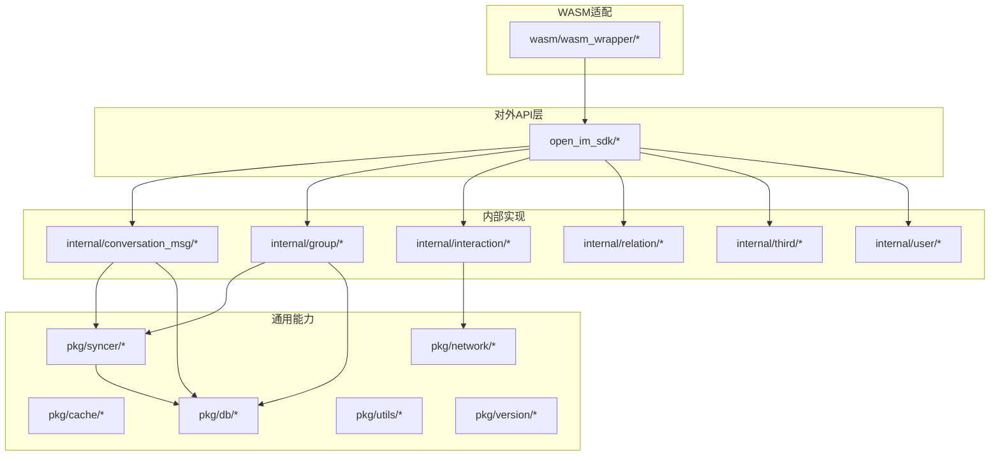
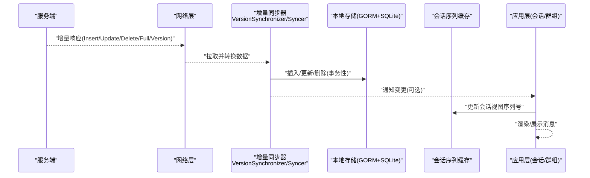
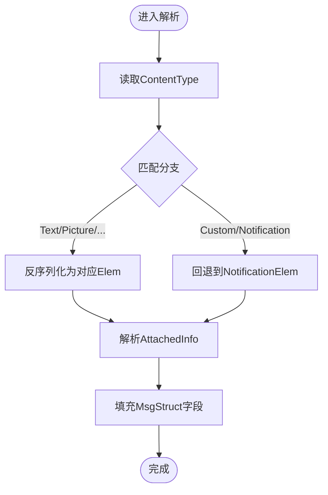
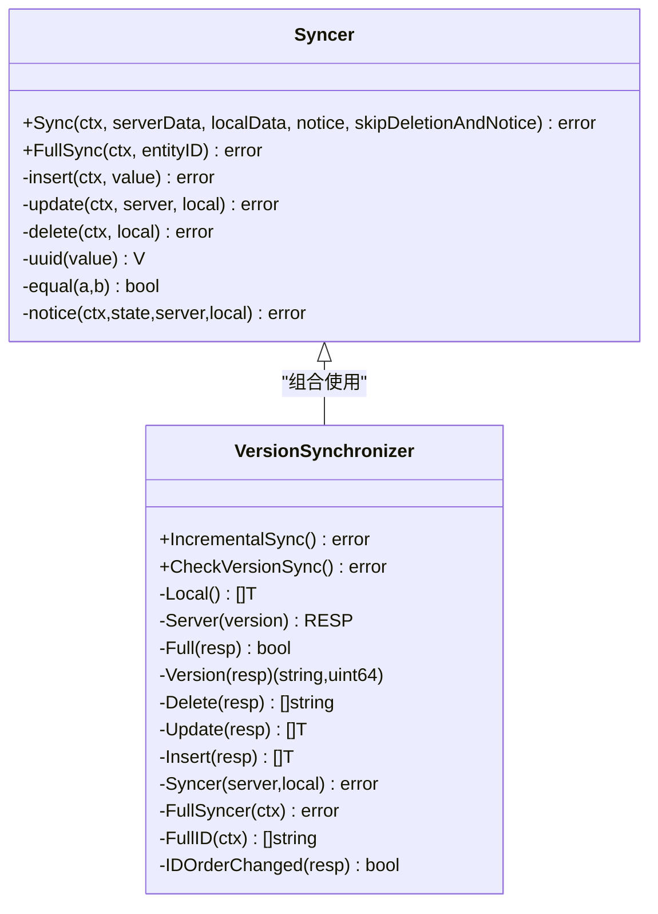
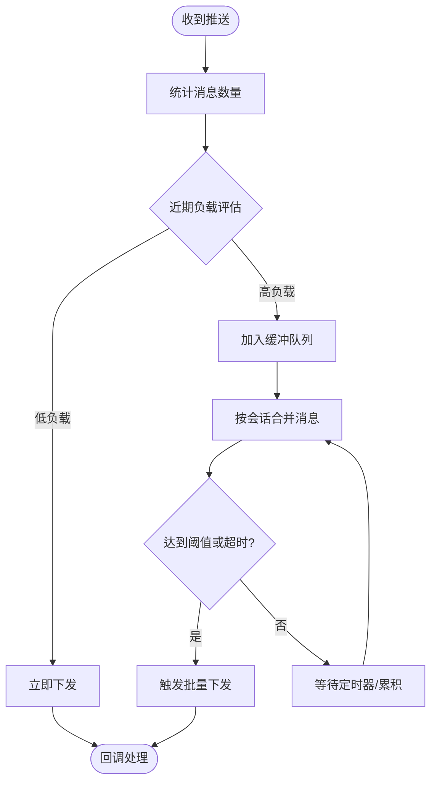
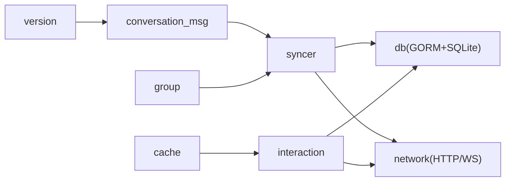

# 高级特性

<cite>
**本文引用的文件**   
- [README.md](file://README.md)
- [go.mod](file://go.mod)
- [internal/conversation_msg/conversion.go](file://internal/conversation_msg/conversion.go)
- [internal/conversation_msg/incremental_sync.go](file://internal/conversation_msg/incremental_sync.go)
- [internal/group/incremental_sync.go](file://internal/group/incremental_sync.go)
- [pkg/syncer/syncer.go](file://pkg/syncer/syncer.go)
- [internal/interaction/compressor.go](file://internal/interaction/compressor.go)
- [internal/interaction/message_batcher.go](file://internal/interaction/message_batcher.go)
- [pkg/cache/conversation_seq_cache.go](file://pkg/cache/conversation_seq_cache.go)
- [pkg/version/version.go](file://pkg/version/version.go)
</cite>

## 目录
1. [简介](#简介)
2. [项目结构](#项目结构)
3. [核心组件](#核心组件)
4. [架构总览](#架构总览)
5. [详细组件分析](#详细组件分析)
6. [依赖关系分析](#依赖关系分析)
7. [性能考量](#性能考量)
8. [故障排查指南](#故障排查指南)
9. [结论](#结论)
10. [附录](#附录)

## 简介
本章节聚焦 OpenIM SDK Core 的高级特性，围绕以下主题展开：
- 自定义消息类型的扩展机制与内容解析流程
- 插件化同步器（Syncer）与增量同步算法、版本管理与冲突解决
- 消息压缩、批量处理与缓存优化等高性能能力
- 监控与调试、日志分析与性能分析实践
- 扩展开发与定制指南（最佳实践）

OpenIM-SDK-core 是跨平台 IM SDK 的核心层，为 iOS/Android/PC/Web(WASM) 提供一致的协议、网络、存储与同步能力。

**章节来源**
- [README.md:1-189](file://README.md#L1-L189)

## 项目结构
- open_im_sdk/：对外暴露的公共 API 层（登录、会话、群组、关系、用户、第三方服务等）
- internal/：内部业务实现（会话消息、群组、交互、关系、第三方、用户等）
- pkg/：通用能力（缓存、数据库模型、HTTP 客户端、同步器、工具、版本等）
- wasm/：WebAssembly 适配层，通过 wasm_wrapper 将核心能力暴露给 JS

**图表来源**
- [README.md:1-189](file://README.md#L1-L189)

**章节来源**
- [README.md:1-189](file://README.md#L1-L189)

## 核心组件
- 消息内容与类型扩展：基于 ContentType 的解析与序列化，支持文本、图片、音视频、文件、@、位置、引用、合并卡片、表情、名片、Markdown、自定义与通知等类型。
- 增量同步与版本管理：VersionSynchronizer 统一封装“拉取差异—比对—插入/更新/删除—版本落盘”的流程，支持全量与增量两种模式。
- 批量与压缩：MessageBatcher 按负载自适应聚合推送消息；GzipCompressor 提供带对象池的压缩/解压能力。
- 缓存与上下文：ConversationSeqContextCache 维护会话维度的视图级序列号缓存，减少重复查询与渲染开销。
- 版本信息：统一的版本获取接口，便于问题定位与兼容性检查。

**章节来源**
- [internal/conversation_msg/conversion.go:137-213](file://internal/conversation_msg/conversion.go#L137-L213)
- [pkg/syncer/syncer.go:240-345](file://pkg/syncer/syncer.go#L240-L345)
- [internal/interaction/compressor.go:31-106](file://internal/interaction/compressor.go#L31-L106)
- [internal/interaction/message_batcher.go:11-18](file://internal/interaction/message_batcher.go#L11-L18)
- [pkg/cache/conversation_seq_cache.go:14-49](file://pkg/cache/conversation_seq_cache.go#L14-L49)
- [pkg/version/version.go:10-24](file://pkg/version/version.go#L10-L24)

## 架构总览
下图展示了从服务端增量响应到本地落库、再到上层消费的关键路径，以及压缩、批处理与缓存的协同。

**图表来源**
- [internal/conversation_msg/incremental_sync.go:26-89](file://internal/conversation_msg/incremental_sync.go#L26-L89)
- [pkg/syncer/syncer.go:240-345](file://pkg/syncer/syncer.go#L240-L345)
- [pkg/cache/conversation_seq_cache.go:22-49](file://pkg/cache/conversation_seq_cache.go#L22-L49)

## 详细组件分析

### 自定义消息类型扩展机制
- 设计要点
  - 以 ContentType 作为分发键，将 Content JSON 反序列化为具体 Elem 结构体，填充到 MsgStruct 对应字段。
  - 新增类型时，仅需在 switch 分支中注册新的 Elem 类型与反序列化逻辑，保持对外的 MsgStruct 稳定。
  - 对于 AttachedInfo 等附加信息，采用独立字段与结构体进行解析，避免污染主内容。
- 扩展步骤
  - 定义新 Elem 结构体
  - 在解析函数中增加对应 ContentType 分支
  - 在持久化时将 Elem 序列化为 Content 字符串
- 注意事项
  - 保证向后兼容：未知类型回退到 NotificationElem，避免崩溃
  - 控制 Content 大小，必要时结合压缩与分片策略

**图表来源**
- [internal/conversation_msg/conversion.go:137-213](file://internal/conversation_msg/conversion.go#L137-L213)

**章节来源**
- [internal/conversation_msg/conversion.go:67-135](file://internal/conversation_msg/conversion.go#L67-L135)
- [internal/conversation_msg/conversion.go:137-213](file://internal/conversation_msg/conversion.go#L137-L213)
- [internal/conversation_msg/conversion.go:291-349](file://internal/conversation_msg/conversion.go#L291-L349)

### 增量同步算法与版本管理
- 核心思想
  - 使用 VersionSynchronizer 抽象“实体维度”的增量同步：记录每个实体的 versionID 与 version，服务端返回差异集（Insert/Update/Delete），客户端对比本地状态后执行幂等操作。
  - Full 标志触发全量覆盖；SortVersion 用于处理排序变化。
- 关键流程
  - 拉取增量：根据本地版本向服务端请求差异
  - 转换映射：Server→Local 的批量转换
  - 同步执行：insert/update/delete 三态操作，支持跳过删除或通知
  - 版本落盘：成功后更新本地版本记录
- 冲突解决
  - 以服务端为准（server-first），本地仅做幂等更新
  - 相等判断优先使用自定义 equal，否则回退到深度比较
  - 排序变化通过 SortVersion 触发重排

**图表来源**
- [pkg/syncer/syncer.go:74-88](file://pkg/syncer/syncer.go#L74-L88)
- [pkg/syncer/syncer.go:240-345](file://pkg/syncer/syncer.go#L240-L345)
- [internal/conversation_msg/incremental_sync.go:26-89](file://internal/conversation_msg/incremental_sync.go#L26-L89)
- [internal/group/incremental_sync.go:111-191](file://internal/group/incremental_sync.go#L111-L191)

**章节来源**
- [pkg/syncer/syncer.go:240-345](file://pkg/syncer/syncer.go#L240-L345)
- [pkg/syncer/syncer.go:347-379](file://pkg/syncer/syncer.go#L347-L379)
- [internal/conversation_msg/incremental_sync.go:26-89](file://internal/conversation_msg/incremental_sync.go#L26-L89)
- [internal/group/incremental_sync.go:306-377](file://internal/group/incremental_sync.go#L306-L377)

### 消息压缩与批量处理
- 压缩
  - GzipCompressor 提供 Compress/DeCompress 与带对象池的版本，降低 GC 压力
  - 适用于大消息体或批量拉取场景，需权衡 CPU 与带宽
- 批量
  - MessageBatcher 按时间窗口与消息量自适应聚合推送消息
  - 低负载即时下发，高负载延迟聚合，上限阈值触发立即刷新
  - 合并同一会话的消息以减少 UI 抖动

**图表来源**
- [internal/interaction/message_batcher.go:185-238](file://internal/interaction/message_batcher.go#L185-L238)
- [internal/interaction/compressor.go:46-106](file://internal/interaction/compressor.go#L46-L106)

**章节来源**
- [internal/interaction/compressor.go:31-106](file://internal/interaction/compressor.go#L31-L106)
- [internal/interaction/message_batcher.go:11-18](file://internal/interaction/message_batcher.go#L11-L18)
- [internal/interaction/message_batcher.go:185-238](file://internal/interaction/message_batcher.go#L185-L238)

### 缓存优化
- ConversationSeqContextCache
  - 以 conversationID::viewType 为键，缓存当前视图已读/搜索到的最大序列号
  - 支持按 viewType 批量清理，避免脏数据影响分页与渲染
- 适用场景
  - 列表页滚动加载、搜索去重、避免重复拉取
  - 与增量同步配合，确保 UI 与本地数据一致

**章节来源**
- [pkg/cache/conversation_seq_cache.go:14-49](file://pkg/cache/conversation_seq_cache.go#L14-L49)

### 版本管理与发布
- 版本信息获取
  - 通过统一接口获取 Major/Minor/GitVersion/GitCommit/BuildDate/GoVersion/Compiler/Platform
  - 便于问题追踪、兼容性校验与灰度发布
- 建议
  - 在错误上报与日志中附带版本信息
  - 结合服务端版本号进行功能开关与降级

**章节来源**
- [pkg/version/version.go:10-24](file://pkg/version/version.go#L10-L24)

## 依赖关系分析
- Go 模块与关键依赖
  - 网络：gorilla/websocket、coder/websocket
  - 数据库：gorm.io/gorm + gorm.io/driver/sqlite
  - 工具：openimsdk/tools（日志、错误、数据结构工具）、hashicorp/golang-lru（LRU 缓存）
  - Protobuf：google.golang.org/protobuf、github.com/golang/protobuf
- 耦合与内聚
  - syncer 与 db/network 解耦良好，通过函数注入实现高内聚
  - conversion 与 content_type 强相关，新增类型需集中维护
  - interaction 层压缩与批处理可独立替换与扩展

**图表来源**
- [go.mod:1-41](file://go.mod#L1-L41)

**章节来源**
- [go.mod:1-41](file://go.mod#L1-L41)

## 性能考量
- 增量同步
  - 优先使用增量接口，避免全量拉取；合理设置 fullSyncLimit 控制单次全量规模
  - 自定义 equal 函数减少不必要的更新
- 压缩与批处理
  - 大消息启用 gzip，小消息直接传输；批处理窗口按负载动态调整
  - 注意 CPU 与内存峰值，避免频繁分配
- 缓存
  - 合理使用会话级缓存，及时清理过期键
  - 与数据库索引配合，提升查询效率
- 并发与锁
  - 群组/会话同步加锁避免竞态；批量任务使用协程池控制并发度

[本节为通用指导，不直接分析具体文件]

## 故障排查指南
- 常见问题
  - 同步失败：检查网络连通、服务端版本是否一致、本地版本记录是否损坏
  - 消息解析异常：确认 ContentType 与 Content 格式一致性，关注 Unknown Type 回退路径
  - 性能抖动：检查批处理阈值、压缩开关、缓存命中率
- 诊断手段
  - 开启详细日志，关注 sync insert/update/delete 与 full sync 过程
  - 收集版本信息与错误堆栈，复现环境对齐
  - 压测不同负载下的批处理行为与压缩收益

**章节来源**
- [pkg/syncer/syncer.go:240-345](file://pkg/syncer/syncer.go#L240-L345)
- [internal/conversation_msg/conversion.go:137-213](file://internal/conversation_msg/conversion.go#L137-L213)
- [internal/interaction/message_batcher.go:185-238](file://internal/interaction/message_batcher.go#L185-L238)

## 结论
OpenIM SDK Core 通过“可扩展的消息类型体系 + 通用增量同步器 + 自适应批处理与压缩 + 细粒度缓存”的组合，实现了高性能、高可靠的跨平台 IM 能力。遵循本文的最佳实践，可在保障一致性的前提下显著提升吞吐与用户体验。

[本节为总结性内容，不直接分析具体文件]

## 附录
- 扩展开发最佳实践
  - 新增消息类型：在解析与持久化两处保持一致；做好默认回退与日志埋点
  - 自定义同步器：明确 Key/Equal/UUID，尽量复用 Syncer 的通用能力
  - 压缩策略：按消息体积与设备能力动态选择；压测验证 CPU/内存占用
  - 缓存策略：明确失效条件与清理时机，避免脏读
- 定制开发指南
  - 通过 Option 模式配置 Syncer，最小侵入地接入业务逻辑
  - 利用 VersionSynchronizer 的 ExtraDataProcessor 处理关联数据（如群信息）
  - 结合版本信息与服务端特性进行功能开关与降级

[本节为通用指导，不直接分析具体文件]